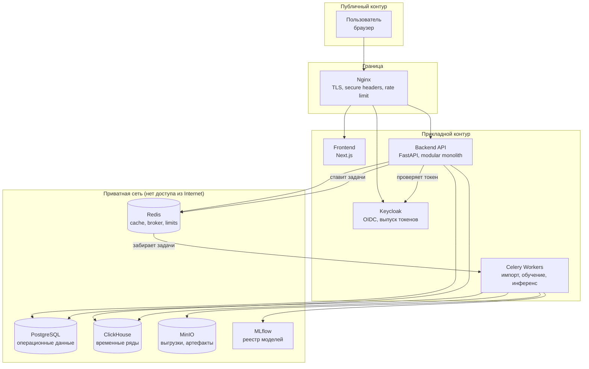

> **Модель v2:** [сравнение до/после и повторное обучение](docs/MODEL_IMPROVEMENT_V2.md).

> **Отдельный исторический исследовательский пилот:** [запуск, демонстрация и честные результаты проверки](docs/LOCAL_PILOT.md).

> **Локальный пилот с реальным обучением:** [запуск, демонстрация и честные результаты проверки](docs/LOCAL_PILOT.md).

# MedSignal

**Аналитика плановой госпитализации, объяснимые сигналы и контроль действий человека.**

Кейс 1 GovTech Camp: «Нагрузка на стационары и очереди на госпитализацию».

> MedSignal — это Decision Support System. Система не принимает медицинских и управленческих решений, не ставит диагнозы и не даёт рекомендаций пациентам. Все расчёты предназначены для уполномоченного сотрудника, который принимает решение самостоятельно. Human-in-the-loop обязателен.

---

## Границы текущего результата — 23.09.2026

Основной продукт использует Keycloak/OIDC, RBAC и области данных, PostgreSQL
для статусов и аудита, ClickHouse для аналитики. В Phase 5A выбран baseline
`weekly_naive` для экспериментального глобального прогноза направлений на семь
дней. Реализованный прогноз роста направлений не является доказанной перегрузкой.

[Local pilot](docs/LOCAL_PILOT.md) — отдельное воспроизведение Q1 2025 на localhost
с `HistGradientBoostingRegressor` (Poisson loss), отдельным API и JSON состояния.
Его модель и предупреждения не допущены к operational hospital alerts; этот режим
не заменяет защищённый продукт. Исторические precision 42,86%, recall 4,05% и
WAPE 84,286% на двух тестовых неделях не подтверждают пригодность к эксплуатации.

Прогноз очереди отложен до подтверждённых повторных срезов; доля отказов — до
доказанной общей популяции, периода и знаменателя. Один waiting snapshot
остаётся пригоден для описательного подсчёта. Подтверждённые mappings организаций,
регулярные поставки, новый нетронутый период и утверждённая политика качества
нужны для допуска модели. Нет подтверждённого прогноза освобождения коек.
Актуальные ограничения: [roadmap](docs/ROADMAP.md),
[target audit](docs/data/TARGET_FEASIBILITY.md) и
[дизайн проверяемого пилота](docs/superpowers/specs/2026-09-23-pilot-consolidation-design.md).

## Проблема

Данные о направлениях на плановую госпитализацию, ожидающих пациентах, отказах и пролеченных случаях распределены между разными информационными системами (ИС БГ, ЭРСБ, ЕИП). Управленец видит ситуацию постфактум и фрагментарно.

Из-за этого невозможно вовремя ответить на пять вопросов:

1. Где растёт очередь?
2. Какие организации под риском перегрузки?
3. Какие именно показатели вызвали тревогу?
4. Как ситуация может измениться в ближайшие недели?
5. К чему приведёт выбранный управленческий сценарий?

## Пользователи

| Роль | Задача | Область видимости |
|---|---|---|
| Сотрудник регионального управления здравоохранения | Контроль ситуации по региону, распределение нагрузки | Свой регион |
| Руководитель медицинской организации | Реакция на сигналы по своей организации | Своя организация |
| Аналитик медицинской организации | Разбор показателей и динамики | Своя организация |
| Координатор плановой госпитализации | Работа с очередью и направлениями | Назначенный контур |
| Системный администратор | Пользователи, роли, импорты, конфигурация | Вся система |

## Продуктовый цикл

```
DATA → MONITORING → RISK DETECTION → SIGNAL → EXPLANATION
     → WHAT-IF SIMULATION → HUMAN DECISION → ACTION → CONTROL
```

Система ведёт пользователя от обнаружения проблемы до контроля последствий принятого решения. Каждый шаг фиксируется в Audit Log.

## Возможности MVP

- Загрузка исторических выгрузок, валидация и отчёт о качестве данных
- Псевдонимизация на входе: персональные идентификаторы не попадают в хранилище
- Обзор регионов и медицинских организаций, историческая динамика показателей
- Аналитика очередей, направлений, отказов, пролеченных случаев
- Экспериментальный прогноз входящего потока с метрикой ошибки и baseline; прогноз очереди отложен
- Signal Engine: правила, статистика и ML как три независимых источника сигналов
- Лента предупреждений, карточка ситуации, объяснение в человекочитаемом виде
- What-if симулятор: сравнение базового и расчётного сценария
- Жизненный цикл сигнала `NEW → IN_PROGRESS → CLOSED`, назначение ответственного
- RBAC с областями данных (регион / организация), сквозной Audit Log
- Situation Center как главный дашборд

Что **не** входит в MVP и почему — см. [docs/PROJECT.md](docs/PROJECT.md#6-за-пределами-mvp).

## Архитектура



Подробно: [docs/ARCHITECTURE.md](docs/ARCHITECTURE.md).

## Технологический стек

| Слой | Технологии |
|---|---|
| Frontend | Next.js, React, TypeScript, Tailwind CSS, shadcn/ui, Apache ECharts, TanStack Query, React Hook Form, Zod |
| Backend | Python, FastAPI, Pydantic, SQLAlchemy, Alembic |
| Аутентификация | Keycloak, OpenID Connect |
| Операционная БД | PostgreSQL |
| Аналитическая БД | ClickHouse |
| Кэш и брокер | Redis |
| Фоновые задачи | Celery |
| ML | scikit-learn, LightGBM, XGBoost, statsmodels, SHAP, MLflow, Polars |
| Объектное хранилище | MinIO (S3-совместимое) |
| Инфраструктура | Docker, Docker Compose, Nginx, GitHub Actions |
| Наблюдаемость | Prometheus, Grafana, структурированные логи (готовность к Loki) |

## Статус

| Этап | Содержание | Состояние |
|---|---|---|
| PHASE 0 | Архитектура, документация, ADR, границы модулей | Завершён |
| PHASE 1 | Запускаемое окружение: сервисы, аутентификация, журналирование, тесты, CI | Завершён |
| PHASE 2 | Предметная область: регионы, организации, сигналы, инциденты, права, области данных, аудит | Завершён |
| PHASE 3A | Data Audit: опись выгрузок, схемы, качество, приватность, связуемость | Завершён |
| PHASE 3B | Конвейер загрузки: контракты, проверки, псевдонимизация, витрины ClickHouse | Завершён |
| PHASE 4 | Situation Center: описательные KPI, динамика событий, возраст очереди, аналитика организаций | Завершён |
| PHASE 5A | Экспериментальный 7-дневный прогноз глобального потока направлений | Реализован; ограничен историей Q1 2025 |
| PHASE 6 | GLOBAL Signal Engine, evidence, human workflow и Incident | Реализован; пороги — первоначальная аналитическая политика |
| PHASE 7 | Immutable Scenario Analysis: observed/forecast baseline, preview/save, audit | Завершён |
| PHASE 8 | Compose hardening, clean deployment, recovery, security и real-data acceptance | Исторический acceptance от 18.09.2026; TLS, corporate SSO и production E2E требуют отдельной проверки |

Реальные выгрузки загружаются конвейером PHASE 3B; в репозиторий они не
попадают. Синтетические справочники и сигналы для разработки помечены как
вымышленные. Реализованы экспериментальный глобальный прогноз потока
направлений на семь дней и Phase 6 Signal Engine с rule/statistical/forecast
evaluators. Все реальные Signals пока имеют GLOBAL scope. Реализован один
расчётный сценарий `REFERRAL_INFLOW_CHANGE`; он не является прогнозом
перегрузки или рекомендацией.

Исторический отчёт для другого baseline commit: [docs/PHASE_8_ACCEPTANCE.md](docs/PHASE_8_ACCEPTANCE.md). Он не подтверждает production readiness текущей ветки.
Runbooks: [operator](docs/runbooks/OPERATOR.md),
[administrator](docs/runbooks/ADMINISTRATOR.md),
[backup/restore](docs/runbooks/BACKUP_RESTORE.md) и
[demo](docs/runbooks/DEMO.md).

Текущая feature-ветка добавляет HTTP 429 контракт, ограниченный cache списка
организаций, MinIO service identities, CI Trivy gate и операторский просмотр
mapping. Результаты проверки образов и нерешённые HIGH findings:
[image security](docs/security/IMAGE_RISK_ACCEPTANCE.md). Сравнимый benchmark
на реальном масштабе **ещё не выполнен**; synthetic probe отделён от
[исторического real-data baseline](docs/analytics/PERFORMANCE_RECHECK.md).

Цель PHASE 5A — ежедневное число направлений на глобальном уровне ([ADR-0016](docs/ADR/0016-experimental-short-horizon-referral-forecast.md)). Три месяца истории не позволяют подтвердить годовую сезонность и прогноз перегрузки; метрики относятся только к walk-forward проверке внутри доступного квартала.

## Быстрый старт

Требуется Docker с Compose v2 и около 8 ГБ оперативной памяти. Свободный порт 80.

```bash
git clone <repository-url> medsignal && cd medsignal
```

```bash
cp .env.example .env
```

```bash
docker compose up -d
```

Значения в `.env.example` работают сразу и предназначены только для локальной разработки. Каждый секрет помечен маркером `local_dev_only`: backend отказывается стартовать с таким значением при любом `APP_ENV`, кроме `local`.

Проверить, что всё поднялось:

```bash
make smoke
```

После запуска доступны:

| Адрес | Что это |
|---|---|
| http://localhost | Frontend |
| http://localhost/api/v1/health | Живость приложения |
| http://localhost/api/v1/ready | Готовность зависимостей |
| http://localhost/api/v1/docs | OpenAPI |
| http://localhost/auth | Keycloak |

Наружу публикуется единственный порт — 80 на обратном прокси. PostgreSQL, ClickHouse, Redis, MinIO и MLflow доступны только внутри сети контейнеров. Для диагностики их порты открываются явным наложением на адрес 127.0.0.1:

```bash
make up-devtools
```

## Структура репозитория

| Каталог | Назначение |
|---|---|
| `frontend/` | Next.js-приложение. Представление и работа с состоянием запросов, без бизнес-правил. |
| `backend/` | FastAPI. Модульный монолит: API, бизнес-сервисы, репозитории, безопасность, воркеры. |
| `ml/` | Обучение, оценка, инференс, объяснимость. Не знает про HTTP и про базы приложения. |
| `data_pipeline/` | Приём, профилирование, валидация, очистка, псевдонимизация, трансформация, признаки. |
| `database/` | Миграции Alembic, DDL PostgreSQL и ClickHouse, справочные seed-данные. |
| `infrastructure/` | Nginx, Docker, заготовка Kubernetes, мониторинг, материалы по безопасности. |
| `tests/` | Кросс-сервисные проверки: интеграционные, E2E, нагрузочные, безопасности. |
| `scripts/` | Служебные скрипты разработки: получение токена, сквозная проверка. |
| `docs/` | Проектная документация, ADR, диаграммы. |

Границы модулей и правила зависимостей: [docs/ARCHITECTURE.md](docs/ARCHITECTURE.md#5-границы-модулей).

## Команды разработки

| Команда | Действие |
|---|---|
| `make up` / `make down` | Поднять и остановить окружение |
| `make up-devtools` | То же с портами диагностики на 127.0.0.1 |
| `make logs` / `make ps` | Логи и состояние сервисов |
| `make migrate` | Применить миграции PostgreSQL |
| `make migration name="..."` | Создать миграцию |
| `make test` | Тесты backend и frontend |
| `make lint` | Линтеры, типы и проверка архитектурных границ |
| `make smoke` | Сквозная проверка запущенного окружения |
| `make token` | Получить токен Keycloak для ручной проверки |
| `make ml-train-referrals` | Оценить кандидатов и сохранить новый 7-дневный прогноз |
| `make test-ml` | Проверить dataset, baseline, walk-forward, selection и MLflow |
| `make clean` | Остановить окружение и удалить данные |

Все команды выполняются в контейнерах: версии инструментов одинаковы у всех разработчиков и в CI. Полный список — `make help`.

`make` не обязателен. Если его нет в системе, те же действия выполняются напрямую:

| Вместо | Выполнить |
|---|---|
| `make up` | `docker compose up -d --build` |
| `make down` | `docker compose down --remove-orphans` |
| `make migrate` | `docker compose run --rm migrate` |
| `make test` | `docker compose run --rm --no-deps backend python -m pytest` |
| `make smoke` | `bash scripts/smoke-test.sh` |
| `make token` | `bash scripts/dev-token.sh` |

### Аутентификация при разработке

MedSignal не хранит пароли. Токены выпускает Keycloak, backend их только проверяет ([ADR-0009](docs/ADR/0009-keycloak-oidc-authentication.md)).

```bash
curl -H "Authorization: Bearer $(make -s token)" http://localhost/api/v1/system/whoami
```

Автоматические тесты используют подставной адаптер аутентификации, чтобы не требовать работающего Keycloak. Он включается только переменной `AUTH_TEST_MODE` и приводит к отказу старта вне локальной среды.

## Документация

| Документ | О чём |
|---|---|
| [PROJECT.md](docs/PROJECT.md) | Проблема, видение, пользователи, сценарии, границы MVP, ограничения |
| [ARCHITECTURE.md](docs/ARCHITECTURE.md) | Компоненты, потоки запросов, границы модулей, масштабирование |
| [BUSINESS_LOGIC.md](docs/BUSINESS_LOGIC.md) | Signal, Incident, Forecast, Scenario, Action, Risk и их правила |
| [DATA_ARCHITECTURE.md](docs/DATA_ARCHITECTURE.md) | Источники, ingestion, качество, псевдонимизация, lineage |
| [ML_ARCHITECTURE.md](docs/ML_ARCHITECTURE.md) | Выбор цели, baseline, временная валидация, метрики, объяснимость |
| [API.md](docs/API.md) | Контракты REST API |
| [DATABASE.md](docs/DATABASE.md) | ER-модель, назначение таблиц, разделение PostgreSQL/ClickHouse |
| [SECURITY.md](docs/SECURITY.md) | Модель угроз, аутентификация, RBAC, data scope, сеть, секреты, аудит |
| [DEPLOYMENT.md](docs/DEPLOYMENT.md) | Локальный запуск и целевая production-схема |
| [DEVELOPMENT.md](docs/DEVELOPMENT.md) | Рабочий процесс, стандарты кода, соглашения |
| [TESTING.md](docs/TESTING.md) | Стратегия тестирования по уровням |
| [ROADMAP.md](docs/ROADMAP.md) | MVP → Pilot → Production |
| [ADR/](docs/ADR/) | Architecture Decision Records |
| [data/](docs/data/) | Результаты Data Audit: опись выгрузок, схемы, качество, приватность, связуемость, кандидаты на целевую переменную |
| [analytics/](docs/analytics/) | Архитектура аналитики, определения метрик, семантика ожидания, privacy, cache и Situation Center |
| [ml/](docs/ml/) | Цель PHASE 5A, признаки, валидация, сравнение моделей и воспроизведение |

## Data Audit

Разведочный аудит исходных выгрузок запускается отдельной командой. Каталог
с данными задаётся снаружи и открывается только на чтение.

```bash
make data-audit DATA_DIR=~/Downloads/data
```

Результаты: машиночитаемые сводки в `data/audit/`, отчёты для человека
в [docs/data/](docs/data/). Главный документ —
[DATA_AUDIT_REPORT.md](docs/data/DATA_AUDIT_REPORT.md). Исходные выгрузки
в репозиторий не попадают и для проверки отчётов не требуются.

## Загрузка данных

Конвейер загрузки работает с каталогом выгрузок, который монтируется
только на чтение. Путь задаётся снаружи.

```bash
make pipeline-build
make clickhouse-migrate
make data-dry-run DATA_DIR=~/Downloads/data
make data-import-core DATA_DIR=~/Downloads/data
```

Загружаются только четыре набора MedSignal Case 1: направления, очередь,
отказы и пролеченные случаи. Реестр наборов является разрешающим списком,
поэтому выгрузки о вакцинации и онкологии в систему попасть не могут.

Порядок действий — в [PHASE3B_RUNBOOK.md](docs/data/PHASE3B_RUNBOOK.md),
устройство — в [DATA_PIPELINE.md](docs/data/DATA_PIPELINE.md).

## Ограничения и ответственность

- MedSignal работает с агрегированными операционными показателями, а не с клиническими данными пациента.
- Прогноз — это расчётная оценка с известной ошибкой, а не утверждение о будущем. Каждый прогноз сопровождается горизонтом, версией модели, метрикой ошибки и периодом входных данных.
- Результат симуляции называется **расчётным сценарием**, а не рекомендацией.
- Качество прогноза ограничено качеством и глубиной исходных выгрузок. При недостатке истории система обязана отказаться от прогноза, а не выдать недостоверный.

## Лицензия и статус

Прототип для GovTech Camp. Не предназначен для эксплуатации с реальными персональными данными без отдельной оценки защищённости и согласования с владельцами информационных систем.

## Pilot consolidation: D / M / R

Implementation, verification and outstanding release gates are recorded in
[the consolidation report](docs/acceptance/PILOT_CONSOLIDATION_IMPLEMENTATION.md).
Operational organization forecasting remains disabled by default. New imports
require a [reviewed supply manifest](docs/data/DATA_SUPPLY_CONTRACT.md);
owner approvals, independent model evidence and runtime acceptance are still required.
