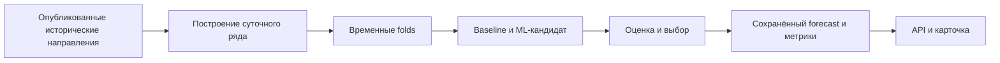
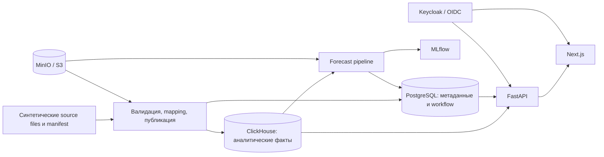

# MedSignal

Система поддержки управленческих решений для мониторинга и анализа потоков направлений в здравоохранении.

MedSignal связывает исторические показатели, краткосрочный прогноз и объяснимые операционные сигналы. Сотрудник может перейти от общей картины к организации, проверить основание сигнала и зафиксировать своё решение. Прогноз и Copilot помогают интерпретировать данные, но не принимают решение за человека.

| Статус | Контур | Доступ | Аналитика | Прогноз | Объекты |
|---|---|---|---|---|---|
| Pre-release прототип; **не production-ready** | Контейнеризированное синтетическое демо | Keycloak / OIDC, серверный scope | PostgreSQL + ClickHouse | Python pipeline, MLflow | MinIO / S3-совместимый API |

Реальные медицинские данные и эксплуатация в production **не разрешены**. `SECURITY_ADMISSION=FAIL`: успешный демонстрационный маршрут не отменяет открытые замечания к образам и среде. [Ограничения и evidence](#статус-проверок-и-ограничения).

## Why MedSignal

Управленцу нужно сопоставить направления, записи ожидания и отказы по времени, региону и организации. Отдельное число не показывает, где именно требуется внимание, откуда оно получено и что уже сделал ответственный сотрудник.

MedSignal проводит пользователя по цепочке **опубликованные данные → историческая аналитика → отдельный прогноз → сигнал и его evidence → решение человека → история действий**. Прогноз сам по себе не создаёт сигнал: связь показывается только тогда, когда она сохранена сервером. Система не устанавливает клиническую причину отклонения и не выдаёт медицинских рекомендаций.

## Product flow

| Шаг | Что видит и делает сотрудник |
|---|---|
| 1. Situation Center (`/command-center`) | После OIDC-входа видит исторические KPI, период и scope, динамику, карту регионов, организации, сигналы и доступный семидневный прогноз. Значения карты поступают из защищённого API, а не из локального массива в браузере. |
| 2. Список организаций (`/hospitals`) | Ищет доступную организацию, фильтрует по региону и статусу, сортирует и открывает детализацию. |
| 3. Организация (`/organizations/[ref]`) | Сопоставляет направления, ожидание, отказы, динамику и связанные сигналы. Возврат к аналитике сохраняет выбранный период и фильтры в URL. |
| 4. Прогноз (`/monitor`) | Сравнивает исторический ряд и семь прогнозных точек, период валидации, MAE, baseline MAE, версию модели и статус актуальности. |
| 5. Сигнал (`/signals`) | Открывает операционный сигнал с типом, организацией или scope, статусом, периодом и происхождением. Сигнал не называется прогнозом. |
| 6. Evidence | Проверяет доступные исходные показатели, правило и алгоритмическое объяснение. Фактическое значение, baseline и отклонение выводятся только при наличии в evidence; при недоступном Copilot карточка остаётся читаемой. |
| 7. Действие человека | Уполномоченный сотрудник принимает сигнал в работу или закрывает его с причиной. После перезагрузки видны сохранённое состояние и история. |
| 8. Copilot | По отдельному нажатию открывает пояснение подтверждённых фактов либо честное disabled-состояние. Открытие страницы само по себе не вызывает платную модель. |

Короткий [сценарий показа](docs/demo-readiness/DEMO_SCRIPT.md) описывает прежний synthetic seed `SYNTHETIC_DEV_SEED`, а не только что созданный локальный профиль. Его шаг с числовыми actual/baseline/deviation не переносится на локальные `SYNTHETIC_LOCAL_DEMO` сигналы типа `DATA_STALE`: эти поля там отсутствуют. Для нового стенда показывайте фактически сохранённые evidence и provenance. Скриншоты намеренно не включены: в репозитории нет проверенного набора актуальных снимков этого маршрута.

## Core capabilities

### Situation Center и аналитика

Ситуационный центр показывает исторические агрегаты направлений, ожидания и отказов с единицами измерения, периодом, областью видимости и отметкой происхождения. Синтетический контур не представляется как текущая статистика больниц. Карта использует канонические регионы и значения, возвращённые API; ошибка загрузки даёт unavailable-состояние, а не выдуманные значения.

Аналитические чтения идут по опубликованным данным ClickHouse. API применяет ограничения роли и области доступа, правила видимости публикации и подавления малых ячеек; Redis может кэшировать разрешённые агрегаты. Поиск и фильтры организации не заменяют серверный scope. Пустое или неподтверждённое значение не подменяется нулём. [Архитектура аналитики](docs/analytics/ANALYTICS_ARCHITECTURE.md) · [семантика ожидания](docs/analytics/WAITING_SEMANTICS.md).

### Organizations

Каталог и карточка организации связывают название и регион с направлениями, ожиданием, отказами, динамикой и доступными сигналами. Навигационный контекст аналитики передаётся через URL, поэтому возврат не сбрасывает выбранные период, группировку и регион. Forecast уровня отдельной организации здесь нет: проверенный forecast contract имеет только `GLOBAL` scope.

### Forecasting

Реализован экспериментальный краткосрочный прогноз **суточного числа входящих направлений** (`DAILY_REFERRAL_COUNT`) для `GLOBAL` scope на **7 дней**. Pipeline строит ряд из опубликованных данных, использует временные folds, сравнивает baseline и ML-кандидата, сохраняет выбранный результат, метрики и точки прогноза в БД и отдаёт их через API. Интерфейс показывает исторический и прогнозный периоды, validation period, MAE и baseline MAE в *направлениях/день*, версию модели и historical/stale status. [Технический контракт](docs/ml/REFERRAL_FORECASTING.md).

MAE — средняя абсолютная ошибка на исторической временной проверке, **не процент точности**. Прогноз не описывает свободные койки, дату выписки, ожидание в очереди или медицинскую рекомендацию.

### Signals и human-in-the-loop

Signal Engine хранит тип, scope, период, evidence, правило и происхождение сигнала. Набор числовых фактов зависит от типа сигнала: отсутствующие actual/baseline/deviation не вычисляются интерфейсом. Карточка отделяет алгоритмическое объяснение от необязательного AI-пояснения. Для действий сотрудника реализованы переходы `NEW → IN_PROGRESS → CLOSED`, причина/комментарий, actor и время в истории, а также проверка версии для защиты от перезаписи устаревшей карточкой. AI не меняет статус автоматически. [Бизнес-логика](docs/BUSINESS_LOGIC.md) · [API](docs/API.md).

### Copilot

Copilot — необязательное пояснение уже существующего сигнала. Backend проверяет доступ, собирает разрешённые факты и валидирует ссылки на них и числовые утверждения ответа. Включённая конфигурация использует OpenAI Responses API; ключ остаётся на сервере. Запрос выполняется только по действию пользователя. При `COPILOT_DISABLED` карточка и её алгоритмическое объяснение продолжают работать. Использование внешнего LLM с реальными медицинскими данными не разрешено. [Контракт](docs/copilot/API_V1.md) · [режим показа](docs/copilot/DEMO_CHECKLIST.md).

## AI & forecasting



Выбор модели определяется временной проверкой, а не желанием показать более сложный алгоритм. В **отдельном историческом синтетическом прогоне** с 2 019 направлениями за 90 дней, шестью folds и 42 validation pairs был выбран `weekly_naive`: его MAE и baseline MAE составили **1,5714285714 направления/день**. ML-кандидат не показал подтверждённого преимущества. Это результат конкретного прогона и SHA, описанных в [forecast verification](docs/acceptance/FORECAST_DEMO_VERIFICATION.md), **не автоматически метрика текущей локальной базы**. Новый synthetic profile и повторный pipeline дают собственный forecast ID и требуют отдельной проверки. Отдельный [исследовательский pilot](docs/LOCAL_PILOT.md) не смешивается с этим контрактом.

## Архитектура и жизненный цикл данных



| Слой | Реализация и граница |
|---|---|
| Вход | Keycloak / OIDC; проверка роли и scope на сервере, не только скрытие элементов UI. |
| Поставка | Manifest, hash/schema validation, mapping, карантин и идемпотентная публикация. Загрузка файла не равна разрешённой публикации. |
| Хранение | PostgreSQL — сущности, статусы, аудит и forecast metadata; ClickHouse — опубликованные аналитические факты; MinIO — объекты и артефакты. |
| API и задачи | FastAPI, фоновые задачи и Redis. Ошибка кэша не должна превращаться в новые данные. |
| UI | Next.js/React с защищённой навигацией и состояниями загрузки, отсутствия данных и отказа сервера. |
| Контроль качества | pytest, Vitest, Playwright, lint/types, миграции, проверка секретов и сканирование образов в CI. Наличие gate не означает, что он сейчас проходит. |

Подробности: [ARCHITECTURE.md](docs/ARCHITECTURE.md), [схема pipeline](docs/data/DATA_PIPELINE.md), [модель доступа](docs/SECURITY.md), [CI workflow](.github/workflows/ci.yml).

## Синтетические данные и локальный запуск

Локальный профиль создаёт детерминированные вымышленные поставки `REFERRALS`, `WAITING`, `REFUSALS` для 12 канонических регионов Казахстана. Они проходят штатный pipeline и затем читаются тем же API, что использует интерфейс; браузер не получает подставных API-ответов. Данные относятся к историческому I кварталу 2025 года. Generated CSV, manifest, realm и volumes — локальные runtime-артефакты, **не файлы для Git**. [Источник профиля](scripts/local_demo/dataset.py) · [bootstrap](scripts/local_demo/bootstrap.py) · [проверка](scripts/local_demo/verify.py).

Нужны работающий Docker Engine/Compose и Python с зависимостями проекта. На Windows команды ниже выполняются из PowerShell в корне репозитория. Используйте **новое** имя проекта: launcher создаёт отдельные volumes, тестовые учётные записи и свободный loopback-порт. Не удаляйте чужие проекты или volumes.

```powershell
python -m pip install -r backend/requirements-dev.txt
python -m pip install -r ml/requirements.txt
$project = 'phase8-local-demo-' + [guid]::NewGuid().ToString('N').Substring(0, 8)
python -m scripts.operations.prepare_acceptance prepare --project $project
python -m scripts.operations.prepare_acceptance start --project $project
python -m scripts.local_demo.bootstrap --project $project
```

`start` должен завершиться `READY`; failure preflight/миграции нельзя объявлять готовностью. Launcher собирает frontend с `NEXT_PUBLIC_APP_ENV=test`, `NEXT_PUBLIC_SYNTHETIC_DEMO=true` и issuer данного проекта — runtime-подстановка `.env` не заменяет эту сборку. Адрес берите из `tmp/acceptance/$project/manifest.json`. Базовый `docker compose up -d` не выполняет подготовку изолированного synthetic-контура.

После bootstrap запустите **существующий** forecast pipeline и verifier в том же проекте:

```powershell
$projectDir = Join-Path (Get-Location).Path "tmp/acceptance/$project"
$compose = @('--project-name', $project, '--env-file', (Join-Path $projectDir '.env'), '--file', (Join-Path (Get-Location).Path 'docker-compose.yml'), '--file', (Join-Path $projectDir 'compose.override.yml'))
docker compose @compose --profile tools run --rm ml-runner
python -m scripts.local_demo.verify --project-dir $projectDir
```

`verify` сопоставляет source manifest, региональные и организационные totals, scope, signal evidence и сохранённые forecast fields с API. Это **проверка выполненного конкретного проекта**, не готовый PASS до запуска команд. Не добавляйте вручную прогнозные числа или MAE. Realm, `.env`, cookies, storageState и ключи не публикуются. Copilot для такого запуска не требует платного вызова.

## Проверки для разработки

```powershell
npm --prefix frontend ci
npm --prefix frontend run lint
npm --prefix frontend run typecheck
npm --prefix frontend test
npm --prefix frontend run build
python -m pytest tests/operations
python -m scripts.security.scan_secrets --root . --history
```

Browser tests требуют запущенного synthetic-контура, реального Keycloak и API. `--list`, skipped и ноль выполненных тестов не считаются PASS. Команды CI и остальные проверки описаны в [.github/workflows/ci.yml](.github/workflows/ci.yml) и [Makefile](Makefile).

## Статус проверок и ограничения

| Область | Что подтверждено и что нельзя из этого выводить |
|---|---|
| Продуктовый маршрут | В отчётах есть успешные локальные synthetic/OIDC/API/browser прогоны на указанных там SHA. Они не переносятся автоматически на новый commit. [Матрица](docs/demo-readiness/TEST_MATRIX.md). |
| Frontend unit | Локально на этой ветке: 148 PASS, 7 FAIL из 155 Vitest tests. Все 7 отказов в `monitor-page.test.tsx`: тесты ожидают кнопку входа, а AuthGate ещё показывает восстановление сессии. Targeted-тесты изменённых экранов проходят; полный suite **не PASS**. |
| Forecast | Исторический fixture проверен по DB/API и независимым validation pairs; его MAE относится только к тому набору. Новый профиль должен пройти свой pipeline/verifier. |
| Общий browser suite | В предыдущем общем прогоне были отказы auth-rate `429`; отдельные успешные сценарии не превращают его в PASS. [Интеграционный отчёт](docs/demo-readiness/INTEGRATED_RESULT.md). |
| Image security | Историческая проверка backend/worker/MLflow обнаружила по 44 HIGH и 0 CRITICAL в Debian OS packages; исправленных версий тогда не было. Это не повторное сканирование нынешних образов. [Отчёт](docs/security/CURRENT_IMAGE_FINDINGS.md). |
| Production admission | **FAIL**. Нужно отдельно закрыть security findings, эксплуатационные условия и допуск реальных данных; merge исходников в `main` этого не делает. [Blockers](docs/demo-readiness/BLOCKERS.md). |

## Навигация по репозиторию

| Путь | Назначение |
|---|---|
| `backend/`, `database/` | API, бизнес-правила, доступ, PostgreSQL/ClickHouse migrations. |
| `frontend/` | Интерфейс, компонентные и browser tests. |
| `data_pipeline/`, `ml/` | Поставка/публикация данных и прогнозирование. |
| `scripts/`, `tests/` | Изолированный acceptance, bootstrap, verifier и проверки. |
| `infrastructure/`, `docker-compose*.yml` | Контейнерные конфигурации, Keycloak, Nginx, MLflow и объектное хранилище. |
| `docs/` | Архитектура, ADR, контракты, runbooks и исторические evidence. |

Проект разрабатывался в контексте GovTech Camp. Название **MedFlow** встречается в исторических материалах и отдельных элементах бренда; **MedSignal** — текущее имя продукта в интерфейсе и технических компонентах. [Маршрут демонстрации](docs/demo-readiness/DEMO_SCRIPT.md) · [резервный план](docs/demo-readiness/BACKUP_PLAN.md).
