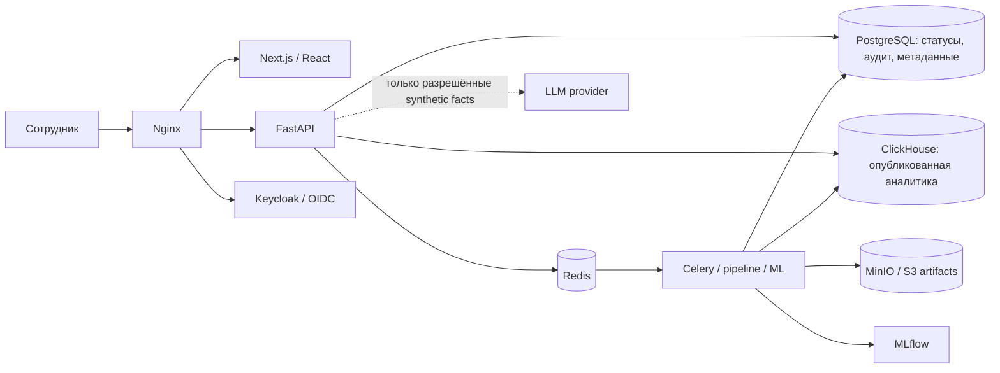

# MedFlow / MedSignal

### Аналитика госпитализации, прогноз потока направлений и объяснимые сигналы

**Команда Claudex · GovTech Camp · Кейс 1**  
Рабочий прототип для сотрудников органов управления здравоохранением и медицинских организаций.

MedFlow объединяет исторические показатели по направлениям, ожиданию и отказам, помогает проверить основания сигнала, сравнить наблюдение с базовым периодом и зафиксировать действие сотрудника. Отдельный Copilot переводит подтверждённые факты сигнала в понятное текстовое пояснение.

> **Статус на 28 сентября 2026 года:** версия для разработки и синтетической демонстрации. Отдельные сквозные сценарии и прогноз проверены на описанных в отчётах версиях. Общий браузерный прогон имеет известные отказы `429`; проверки образов обнаруживают HIGH-уязвимости. Это не production-ready система и не разрешение на обработку реальных медицинских данных во внешнем LLM.

[Возможности](#возможности) · [Архитектура](#архитектура) · [Прогноз и качество](#прогноз-и-качество) · [Запуск](#запуск-синтетического-демо) · [Хронология](#timeline) · [Ограничения](#ограничения-и-следующие-шаги)

## Для кого и зачем

Целевые пользователи — региональные аналитики здравоохранения, уполномоченные сотрудники медицинских организаций и координаторы госпитализации. Разрозненные выгрузки не дают удобного общего представления о потоках: показатели нужно сопоставлять по времени, организации, области доступа и происхождению данных.

Прототип отвечает на проверяемые вопросы: что изменилось, где наблюдается отклонение, какие показатели его подтверждают, каким был прогноз и что сделал ответственный сотрудник. Он не устанавливает неизвестную причину изменения и не отдаёт медицинских распоряжений.

**Рабочий маршрут:** вход → аналитика → исторический прогноз и его ошибка → карточка сигнала → проверка фактов → действие сотрудника → необязательное AI-пояснение.

## Возможности

| Модуль | Что реализовано | Важная граница |
|---|---|---|
| Ситуационный центр | Показатели, динамика, карта и переходы к организациям | Период и свежесть относятся к источнику, не к времени открытия страницы |
| Аналитика | Направления, ожидание, отказы; фильтры и ограничения области данных | Неизвестное значение не заменяется нулём; малые ячейки могут подавляться |
| Поставка данных | Манифесты, валидация, псевдонимизация, карантин, публикация и mappings | Загрузка файла не равна подтверждённой публикации |
| Сигналы и работа сотрудника | Основания, периоды, объяснение, `NEW → IN_PROGRESS → CLOSED`, история действий | Правило и действие человека — разные сущности; устаревшая версия карточки не должна перезаписывать новую |
| Прогноз | Экспериментальный семидневный прогноз числа направлений и сохранённая MAE | Проверенный демонстрационный прогноз — GLOBAL и исторический |
| Copilot | `POST /api/v1/copilot/explain-signal`, панель по нажатию, серверные факты и ограничения | Только подтверждённые синтетические сигналы; по умолчанию выключен |
| Сценарии | Расчёт изменения входящего потока `REFERRAL_INFLOW_CHANGE` | Это what-if расчёт, не доказательство доступности коек |
| Доступ | Настоящий Keycloak/OIDC, роли, региональная/организационная область | Скрытие меню не заменяет серверную авторизацию |

**MedFlow** используется как визуальное название; **MedSignal** сохраняется в коде, API-документации и именах технических компонентов. Это один проект, а не две отдельные платформы.

## Архитектура



| Слой | Технологии |
|---|---|
| Интерфейс | Next.js, React, TypeScript, Tailwind CSS, ECharts, TanStack Query |
| API и бизнес-логика | Python, FastAPI, Pydantic, SQLAlchemy, Alembic |
| Доступ | Keycloak, OpenID Connect, серверные роли и scope |
| Данные и задачи | PostgreSQL, ClickHouse, Redis, Celery, data pipeline |
| Прогноз | Временные baseline и ML-кандидаты, временная валидация, MLflow |
| Объекты | MinIO / S3-совместимый API; конкретное подключение определяется конфигурацией |
| Проверки | pytest, Vitest, Playwright, Ruff, mypy, import-linter, Trivy, GitHub Actions |

Подробности: [архитектура](docs/ARCHITECTURE.md), [бизнес-логика](docs/BUSINESS_LOGIC.md), [API](docs/API.md), [ML](docs/ML_ARCHITECTURE.md).

## Прогноз и качество

В проверенном синтетическом эксперименте существующий pipeline обработал **2 019 направлений за 90 дней**. Предсказания и метрика не вставлялись в базу вручную.

| Параметр | Проверенный результат |
|---|---|
| Целевая величина | `DAILY_REFERRAL_COUNT` — направления за день |
| Область | `GLOBAL` — весь опубликованный ряд |
| История | 1 января — 31 марта 2025 года |
| Валидация | Expanding-window rolling origin; 6 последовательных непересекающихся семидневных окон |
| Число проверочных пар | 42 |
| Выбранный алгоритм | `weekly_naive` |
| MAE выбранного алгоритма | **1,5714285714 направления в день** |
| MAE baseline | **1,5714285714 направления в день** |
| Горизонт | 1–7 апреля 2025 года |
| Структурный статус / свежесть | `VALID` / `STALE` |

MAE независимо пересчитана по исходным синтетическим файлам и сохранённым данным. Это среднее абсолютное расхождение на validation-окнах, **не процент точности**, не результат отдельного финального holdout и не оценка на медицинских выгрузках. Преимущество более сложного ML-кандидата над недельным baseline в этом эксперименте не установлено.

Прогноз числа направлений не является прогнозом занятости коек, времени ожидания или даты выписки. Исторический результат нельзя представлять как текущий прогноз сентября 2026 года. При новом запуске pipeline создаётся новый forecast ID.

Доказательства и воспроизведение: [проверка прогноза](docs/acceptance/FORECAST_DEMO_VERIFICATION.md), [integration handoff](docs/acceptance/FORECAST_INTEGRATION_HANDOFF.md).

В проекте также есть **отдельный исторический исследовательский пилот**. Его модель, данные и метрики нельзя смешивать с защищённым основным продуктом и указанным выше синтетическим опытом: [LOCAL_PILOT](docs/LOCAL_PILOT.md), [MODEL_IMPROVEMENT_V2](docs/MODEL_IMPROVEMENT_V2.md).

## Что делает Copilot

Copilot — дополнительное пояснение существующего сигнала, а не автономный агент принятия решений. Backend сначала проверяет доступ через `SignalService`, выбирает допустимые факты и только затем обращается к модели. Числа, единицы и периоды формирует сервер; ссылки на факты и текст модели проверяются перед выдачей.

Первая интеграция использует OpenAI Responses API, модель `gpt-4.1-mini-2025-04-14`, Structured Outputs и `store=false`. Это описание реализации, а не гарантия отсутствия хранения у внешнего провайдера. Ключ доступен только backend; значения ключей не входят в репозиторий. Внешняя передача реальных записей и реальных агрегатов в этой версии не разрешена.

На ранее проверенных синтетических версиях выполнены три настоящих API-запроса и отдельный browser smoke. Это подтверждает работу выбранного пути, но не надёжность для всех сигналов. В обычном CI и неплатном QA Copilot выключен; алгоритмическое объяснение остаётся доступным.

[Контракт](docs/copilot/API_V1.md) · [UI handoff](docs/copilot/UI_HANDOFF.md) · [Live smoke](docs/copilot/LIVE_VERIFICATION_RESULT.md) · [Показ Copilot](docs/copilot/DEMO_CHECKLIST.md)

## Данные и происхождение

Демонстрационный контур создаёт вымышленные поставки: **30 направлений, 22 записи ожидания и 24 отказа**. Для проверки прогноза добавляется ещё **1 989 направлений**; итог — 2 019, а не две независимые базы с одинаковыми ожиданиями.

Waiting использует подтверждённый опубликованный snapshot; дата загрузки не подменяет дату снимка. Публикация `TREATED` в описанном синтетическом прогоне не разрешена из-за неподтверждённого reporting period. Mappings и область доступа учитываются до формирования показателей.

Медицинские выгрузки, учётные данные, `.env` с секретами, SSH/S3/LLM-ключи, cookies, токены и runtime volumes **не должны попадать в Git**. Файлы с тестовыми примерами не означают разрешение на внешний обмен реальными данными.

[Синтетическая аналитика](docs/acceptance/SYNTHETIC_ANALYTICS_RUNTIME.md) · [Семантика ожидания](docs/analytics/WAITING_SEMANTICS.md)

## Запуск синтетического демо

### Предусловия

Используйте отдельный локальный Linux/Docker-контур или подготовленную командой среду. Нужны работающий Docker Engine, Compose с поддержкой используемых overlays, Python 3.12, Node.js 22, Git, GnuPG и доступная на Linux команда `setfacl`. Права, квоты диска и память проверяются до сборки. На общем VPS нельзя самостоятельно менять Docker daemon, чужие контейнеры и системные ограничения.

Сборка исходников MinIO, запуск стека и Playwright — разные нагрузки. Доступного места всей файловой системы недостаточно, если user quota меньше размера образов и временных слоёв. Требования к ресурсам следует подтвердить измерением на выбранной среде.

### Получить код и зависимости

```bash
git clone https://github.com/BAITC-Hacks/hack-54e4bd29-claudex.git
cd hack-54e4bd29-claudex
git switch main
git rev-parse HEAD

python3.12 -m venv .venv
. .venv/bin/activate
python -m pip install -r backend/requirements-dev.txt
python -m pip install -r ml/requirements.txt
npm --prefix frontend ci
```

### Поднять закрытый synthetic acceptance

Ниже — последовательность из существующего CI, а не новая production-инструкция. Она создаёт собственные ресурсы. Не запускайте её поверх общего стенда и не удаляйте чужие volumes.

```bash
set -e
export PROJECT="phase8-claudex-$(date +%Y%m%d-%H%M%S)"

python -m scripts.operations.minio_source_build build \
  --project "$PROJECT" --patched-acceptance
python -m scripts.operations.minio_advisory_gate --project "$PROJECT"
python -m scripts.operations.minio_source_scan --project "$PROJECT"
python -m scripts.operations.minio_cve_probe --project "$PROJECT"

python -m scripts.operations.prepare_acceptance prepare \
  --project "$PROJECT" --minio-source-build
python -m scripts.operations.prepare_acceptance start --project "$PROJECT"
python -m scripts.operations.verify_minio_source --project "$PROJECT"
python -m scripts.acceptance.bootstrap_synthetic --project "$PROJECT"
python -m scripts.acceptance.verify_scope \
  --project-dir "tmp/acceptance/$PROJECT"
python -m scripts.operations.prepare_acceptance verify --project "$PROJECT"
```

При отказе обязательной проверки остановитесь: не подменяйте результат `PASS` и не обходите pre-start gate. В этом режиме применяются собственные patched acceptance-образы MinIO; они не объявляются официальными production-образами. Их использование не исправляет оставшиеся HIGH findings.

Адрес конкретного стенда берите из созданного `manifest.json`, а не из старого отчёта:

```bash
python -c 'import json,os,pathlib; p=pathlib.Path("tmp/acceptance")/os.environ["PROJECT"]/"manifest.json"; print(json.loads(p.read_text())["origin"])'
```

Учётные записи и их секреты создаёт launcher. Получайте их только в своей закрытой среде; не публикуйте `realm.json` и пароли в отчётах. Для воспроизведения прогноза используйте отдельную [инструкцию fixture/pipeline/verifier](docs/acceptance/FORECAST_DEMO_VERIFICATION.md): базовый bootstrap сам по себе не создаёт 90-дневную историю.

Frontend должен быть **собран** с `NEXT_PUBLIC_APP_ENV=test`, `NEXT_PUBLIC_SYNTHETIC_DEMO=true` и issuer своего стенда. Изменение runtime `.env` не заменяет сборку браузерного bundle. Базовый `docker compose up` не является заменой приведённого acceptance-пути: ссылки и политики базовой конфигурации отличаются.

**Copilot по умолчанию выключен.** Для отдельного согласованного платного smoke используйте существующий launcher из [инструкции Copilot](docs/copilot/DEMO_CHECKLIST.md). Ключ не передаётся frontend и не требуется для обычной аналитики, прогноза и QA с `COPILOT_DISABLED`.

## Проверки

```bash
# Frontend
npm --prefix frontend run lint
npm --prefix frontend run typecheck
npm --prefix frontend test
npm --prefix frontend run build

# Backend в подготовленном Python-окружении
(cd backend && python -m pytest)

# Проверка секретов без вывода их значений
python -m scripts.security.scan_secrets --root . --history
```

Команды CI и дополнительные контракты: [workflow](.github/workflows/ci.yml), [Makefile](Makefile). Полные browser tests требуют готового synthetic-стенда, его origin и тестового realm. Список тестов (`--list`), skipped и отсутствие выполненных assertions не равны успешному прогону.

| Область | Подтверждённое evidence и ограничения |
|---|---|
| Вход, reload/deep link, scope | Отдельные реальные OIDC/API-сценарии прошли на описанных в отчёте версиях |
| Действие сотрудника | Подтверждены смена статуса, сохранение причины, версия и отказ устаревшей карточке |
| Copilot disabled | Карточка продолжает работать; повторное открытие не создаёт новый POST |
| Forecast | Есть отдельные DB/API-проверки и browser-проверка сохранённых ID, периодов и MAE |
| Общий browser suite | Последний описанный общий прогон: 4/6 PASS, 2 FAIL из-за auth-rate `429`; split-успехи не подменяют общий PASS |
| Image security | Backend/worker/MLflow: по 44 HIGH / 0 CRITICAL; проверенные MinIO server/client: 50/44 HIGH, 0 CRITICAL. Это результаты указанных образов, не бессрочная характеристика любого нового build |
| Production admission | **FAIL**; включение кода в `main` не равно допуску к эксплуатации |

Подробные версии, image IDs, условия и история прогонов: [INTEGRATED_RESULT](docs/demo-readiness/INTEGRATED_RESULT.md), [QA matrix](docs/demo-readiness/TEST_MATRIX.md), [blockers](docs/demo-readiness/BLOCKERS.md).

Перенос кода в новый репозиторий не означает повторного выполнения этих проверок. Исторические результаты относятся к указанным в источниках SHA и средам; GitHub Actions нового репозитория нужно оценивать отдельно.

<a id="timeline"></a>

## Хронология работ: 3–28 сентября 2026

Ниже приведена хронология **проекта команды**, а не заявление, что все изменения выполнены одним человеком. Даты сопоставлены по времени коммитов в UTC+05:00; они отражают фиксацию результата в Git, а не точный момент начала работы. Основание — история исходного `main` до `0e38064f538bf5f51389eaeaa8865c4c31ee8ba5` и документы этого снимка.

| Дата / период | Подтверждённые задачи и результат | Основание |
|---|---|---|
| **3–10 сентября** | В доступной истории этого `main` коммитов за период не найдено. Задачи ранней подготовки и их даты требуют подтверждения заметками владельца. Отсутствие коммитов не означает отсутствие работы. | Пробел в Git-evidence; не заполнен предположениями |
| **11 сентября** | Архитектурная документация и ADR; Docker Compose, Nginx, Keycloak, CI, Makefile; структура интеграционных, E2E, нагрузочных и security-проверок. | [`a61c32e`][c-docs], [`cfae355`][c-infra], [`f370065`][c-tests] |
| **12 сентября** | Доменная модель, бизнес-логика сигналов, Unit of Work, API и frontend-интерфейс. | [`cbbc147`][c-domain] |
| **14 сентября** | Аудит наборов данных, схем и связуемости; потоковая загрузка, нормализация, HMAC-SHA256-псевдонимизация, карантин, отчёты качества и витрины ClickHouse. | [`3ff8272`][c-data] |
| **15 сентября** | Situation Center и аналитика организаций: KPI, временные ряды, freshness, кэш и подавление малых ячеек с учётом scope. | [`13d4ee7`][c-analytics] |
| **17 сентября** | Экспериментальный прогноз направлений: baseline/ML-кандидаты, временная валидация, MLflow, API и карточка. Signal Engine, дедупликация, evidence и what-if сценарии с неизменяемым происхождением. | [`4011467`][c-forecast], [`aca79d8`][c-signals] |
| **18 сентября** | Зафиксирован этап Phase 8: эксплуатационные проверки и документация. Историческое название коммита о readiness не является подтверждением production-готовности нынешней версии. | [`74d60a9`][c-phase8], [исторический отчёт](docs/PHASE_8_ACCEPTANCE.md) |
| **22 сентября** | Отдельный обучаемый исследовательский pilot с историческим replay; визуальная идентичность MedFlow и улучшения запуска frontend/стека. | [`96064af`][c-pilot], [`2d8bb50`][c-identity], [`bd32da1`][c-startup] |
| **23 сентября** | Разделение подтверждённых данных и исследовательских выводов; ограничения использования аналитики и прогнозов по evidence. | [`78d5f8c`][c-evidence] |
| **24–25 сентября** | Operator review mappings и provenance; уточнение API; hardening edge-образа; исправления типов и CI-проверок ClickHouse/backend. | [`7302833`][c-mapping], [`7435261`][c-edge], [`307339f`][c-ipv4] |
| **26 сентября** | Пересечение фильтров со scope; единый waiting snapshot; исправление обработки 503; воспроизводимый synthetic acceptance, signed-token проверки, browser/degraded-сценарии. Проверяемая source-build MinIO, IAM backport и адресный доступ Keycloak к realm. | [`ede6cb0`][c-scope], [`8bdc755`][c-waiting], [`dc63b01`][c-iam], [`51e3340`][c-acl] |
| **26–27 сентября** | Backend Copilot через OpenAI Responses API; проверка фактов и источников; live synthetic smoke; интерфейс пояснения и его состояния без подмены алгоритмического объяснения. | [`ee01c30`][c-copilot], [`782c53a`][c-copilot-facts], [`4b4b996`][c-copilot-ui], [`78ff9ff`][c-copilot-browser] |
| **27 сентября** | Расширенная synthetic forecast fixture, независимая проверка 42 пар и MAE; validation fields и OIDC browser-test; новый app shell, landing и signal/forecast presentation. Объединение QA/cold-start/design; перенос на VPS, Python 3.10 и rootless-совместимость. | [`ef6f609`][c-validation], [`6014bd7`][c-forecast-e2e], [`785a53e`][c-design-merge], [`81317a9`][c-rootless] |
| **27–28 сентября** | Исправления cold start для generated secrets, mobile accessibility и браузерных ожиданий; сохранение dashboard-фильтров в URL/history; повторные QA-прогоны, фиксация `429` и оставшихся HIGH findings. | [`3726188`][c-secrets], [`911a569`][c-filter], [`62964d9`][c-report] |
| **28 сентября** | Финальная интеграция презентационного frontend; уточнение degraded error contract; PR #6 объединён в исходный `main`. Исходный снимок для сдачи: `0e38064…`. | [`710924c`][c-merge-ui], [`7986fd0`][c-degraded], [`0e38064`][c-main] |

Источники приведены по исходному репозиторию. При переносе с сохранением истории соответствующие SHA можно проверить также в новом репозитории. Не следует задним числом создавать коммиты за 3–10 сентября или приписывать неподтверждённые задачи конкретным участникам.

## Структура репозитория

```text
backend/          API, бизнес-логика, adapters, migrations и tests
frontend/         интерфейс и browser/component tests
data_pipeline/    импорт, нормализация, валидация и публикация
ml/               forecasting pipeline и оценка качества
pilot/            отдельный исследовательский исторический режим
database/         схемы и аналитические миграции
infrastructure/   Nginx, Keycloak, MLflow и контейнерные настройки
scripts/          bootstrap, acceptance, verifier и operations
tests/            сквозные контракты, security и operations
docs/             архитектура, ADR, инструкции и отчёты
.github/          CI и правила работы с изменениями
```

## Ограничения и следующие шаги

1. **Надёжность входа при серии запросов.** Общий E2E-прогон встречает nginx auth-rate `429`; отдельные успешные сценарии этого не отменяют.
2. **Качество и применимость данных.** Нужны согласованные mappings, периодические поставки, подтверждённые snapshot/reporting semantics и проверка на разрешённом реальном объёме.
3. **Прогноз.** GLOBAL-прогноз на синтетике не доказывает качество для отдельных больниц, прогноз ожидания, перегрузки или свободных коек. В приведённом опыте сложная модель baseline не превзошла.
4. **Эксплуатация.** Остались HIGH findings; корпоративный SSO, боевые TLS/сеть, резервирование и производительность требуют отдельного подтверждения. Не публикуйте служебные интерфейсы и реальные данные под видом уже принятого production-контура.
5. **VPS.** В последней описанной попытке VPS блокировали пользовательская дисковая квота и отсутствие `setfacl`. Локальный успешный стенд не означает успешного развёртывания на VPS.

## Происхождение версии и материалы показа

Источник для переноса — `zzhassyn/govtech_case1`, ветка `main`, проверенный снимок **`0e38064f538bf5f51389eaeaa8865c4c31ee8ba5`**. README подготовлен по его содержимому и Git-истории; изменение этой документации не является новым функциональным релизом.

Целевой репозиторий команды: **`BAITC-Hacks/hack-54e4bd29-claudex`**. Перед публикацией необходимо перенести код, сохранить начальную историю организаторов, проверить совпадение дерева исходников за исключением согласованных документов и записать итоговый SHA. До такой проверки сам факт наличия README не подтверждает завершённый перенос.

[Маршрут показа](docs/demo-readiness/DEMO_SCRIPT.md) · [Резервный план](docs/demo-readiness/BACKUP_PLAN.md) · [Инструкция Copilot](docs/copilot/DEMO_CHECKLIST.md) · [Текущий интеграционный отчёт](docs/demo-readiness/INTEGRATED_RESULT.md)

[c-docs]: https://github.com/zzhassyn/govtech_case1/commit/a61c32e010395d1d290a86e81f04236e01ff5d25
[c-infra]: https://github.com/zzhassyn/govtech_case1/commit/cfae355204ff6dca5856d7d5588e8d743b0efa8d
[c-tests]: https://github.com/zzhassyn/govtech_case1/commit/f3700658979432ae234340aa8ec663969e6c25d3
[c-domain]: https://github.com/zzhassyn/govtech_case1/commit/cbbc1478a5ffce529a03ad3dccbf56ffac4b405a
[c-data]: https://github.com/zzhassyn/govtech_case1/commit/3ff8272d727ccec77e58717cfb3da466d541f4cc
[c-analytics]: https://github.com/zzhassyn/govtech_case1/commit/13d4ee76916142262a1e2a57cdb9ebfe63a3a985
[c-forecast]: https://github.com/zzhassyn/govtech_case1/commit/4011467b73ba87be9a9e1edf6273a2a79c4fd156
[c-signals]: https://github.com/zzhassyn/govtech_case1/commit/aca79d8daa0061c045be37bd4054cd4a6ba5a60c
[c-phase8]: https://github.com/zzhassyn/govtech_case1/commit/74d60a99db12decede679f3933c2316d22e01ad5
[c-pilot]: https://github.com/zzhassyn/govtech_case1/commit/96064af4a26ff32395254d03da984c958903f93a
[c-identity]: https://github.com/zzhassyn/govtech_case1/commit/2d8bb503045b54ce0c839424fb7fa34871843c44
[c-startup]: https://github.com/zzhassyn/govtech_case1/commit/bd32da199c3d813f0c90abfbedc6a3c7aeb39dca
[c-evidence]: https://github.com/zzhassyn/govtech_case1/commit/78d5f8ce8ae978b859f22543feaf464997210120
[c-mapping]: https://github.com/zzhassyn/govtech_case1/commit/7302833e07d0f254db5b036f3101a94976d64561
[c-edge]: https://github.com/zzhassyn/govtech_case1/commit/7435261e6378d614f5bb6241675731fedcf756d9
[c-ipv4]: https://github.com/zzhassyn/govtech_case1/commit/307339fcd4cddea6f5d4f0acd157da7e4053bf67
[c-scope]: https://github.com/zzhassyn/govtech_case1/commit/ede6cb00d08b761df3cb4b6357dad29888f70329
[c-waiting]: https://github.com/zzhassyn/govtech_case1/commit/8bdc75566a19de331a3ba41a0e4d1874a4b94b16
[c-iam]: https://github.com/zzhassyn/govtech_case1/commit/dc63b01a2e02c342bfe0d693d3c61da171565ab6
[c-acl]: https://github.com/zzhassyn/govtech_case1/commit/51e334031c8c538607a0fc3717dd45670528380a
[c-copilot]: https://github.com/zzhassyn/govtech_case1/commit/ee01c30db90b0e660831a447adab2ceab726ef1d
[c-copilot-facts]: https://github.com/zzhassyn/govtech_case1/commit/782c53ad28da53233620ee8bef5220e78ad2ab84
[c-copilot-ui]: https://github.com/zzhassyn/govtech_case1/commit/4b4b996183a754ac905e00efc78052a8fa455eae
[c-copilot-browser]: https://github.com/zzhassyn/govtech_case1/commit/78ff9fffc0eaee2c01d4568e5b8b9adf84712ab4
[c-validation]: https://github.com/zzhassyn/govtech_case1/commit/ef6f609bb91ddc084233d2c0e8b0eb91a20bc285
[c-forecast-e2e]: https://github.com/zzhassyn/govtech_case1/commit/6014bd784f8f863f20d08ff731ffc027087a3f26
[c-design-merge]: https://github.com/zzhassyn/govtech_case1/commit/785a53e40e5328ac2802f16a537f02763e3dcf9d
[c-rootless]: https://github.com/zzhassyn/govtech_case1/commit/81317a98209a0a4170273e5d5e765b127f941bdb
[c-secrets]: https://github.com/zzhassyn/govtech_case1/commit/37261881dbb9dc5f2653e19a35da0af673adaf82
[c-filter]: https://github.com/zzhassyn/govtech_case1/commit/911a569d43c3bcc003f4ba6f9c91f13a85da518d
[c-report]: https://github.com/zzhassyn/govtech_case1/commit/62964d992fe0e59ea76f8f282f1ea82c0c8566d2
[c-merge-ui]: https://github.com/zzhassyn/govtech_case1/commit/710924c8b7f6d63cf37591b42201e501c236775b
[c-degraded]: https://github.com/zzhassyn/govtech_case1/commit/7986fd096e902112591ce0130fcc9cc5151db92d
[c-main]: https://github.com/zzhassyn/govtech_case1/commit/0e38064f538bf5f51389eaeaa8865c4c31ee8ba5
