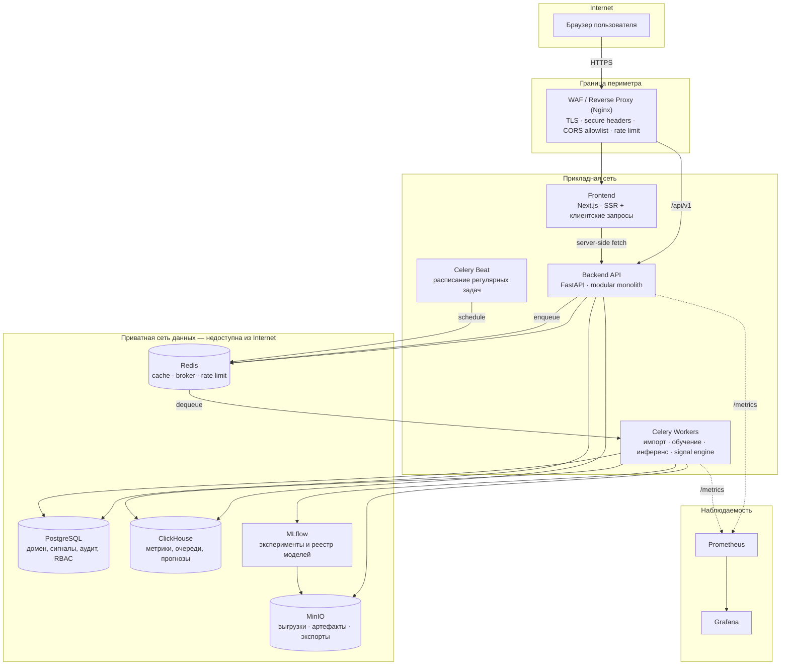
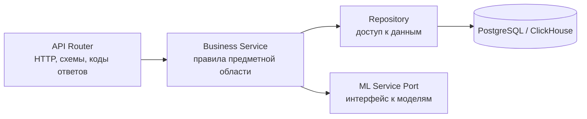
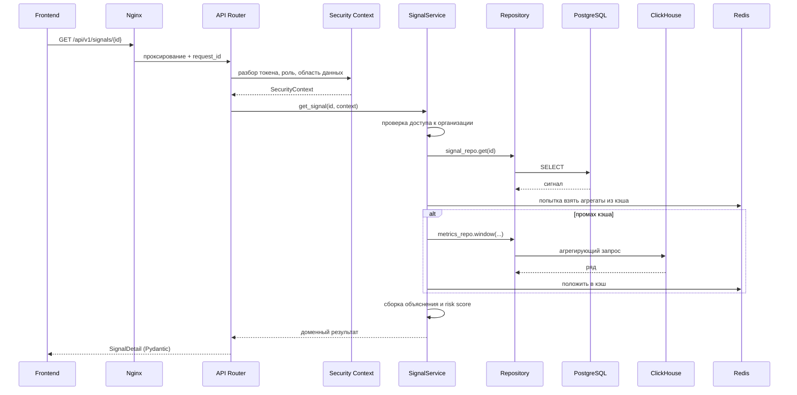
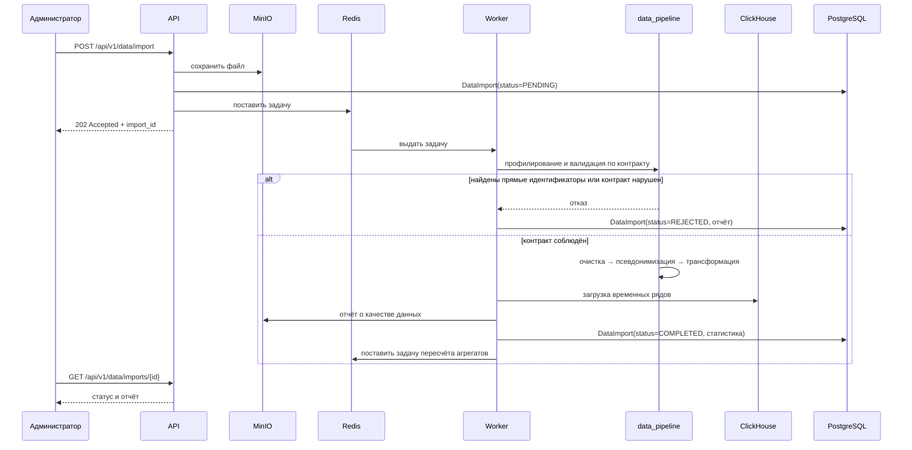
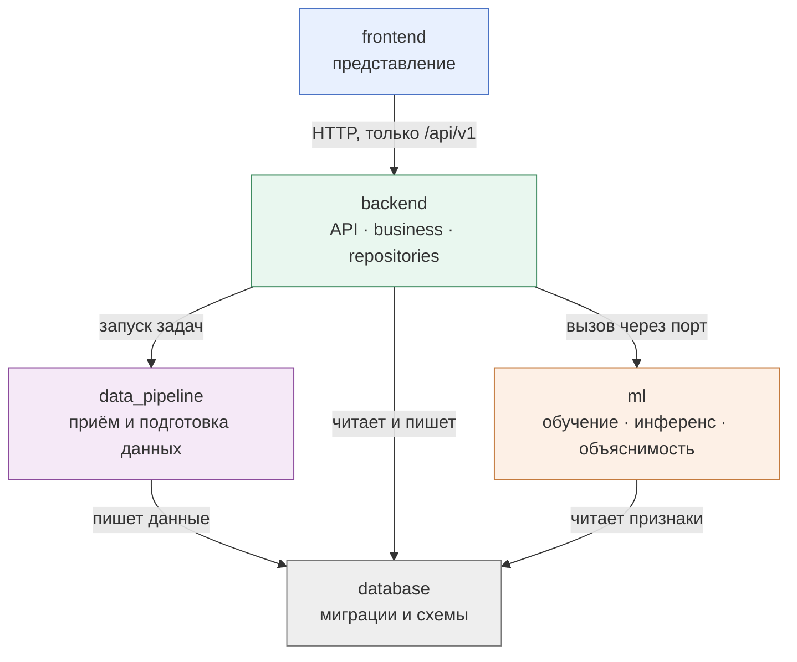
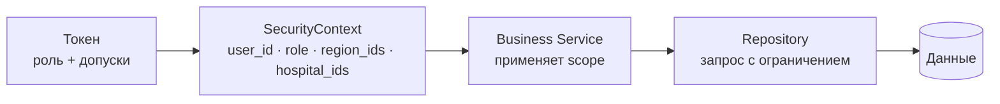

# ARCHITECTURE — архитектура системы MedSignal

## 1. Архитектурные принципы

| Принцип | Что он означает на практике |
|---|---|
| Модульный монолит | Одно развёртываемое приложение с явными внутренними границами. Микросервисы не создаются до появления реальной причины. |
| Бизнес-логика в одном слое | Правила живут только в business-сервисах. Ни контроллеры, ни репозитории, ни React-компоненты, ни ML-скрипты их не содержат. |
| Разделение нагрузок | Операционные транзакции — в PostgreSQL, аналитика временных рядов — в ClickHouse. |
| Тяжёлое — в фон | Импорт, обучение, инференс и симуляции не выполняются внутри HTTP-запроса. |
| Stateless-приложение | Состояние только во внешних хранилищах, что позволяет горизонтальное масштабирование. |
| Безопасность на границе домена | Область данных пользователя применяется в business-слое, а не в UI и не в SQL вручную. |
| AI не источник истины | Любой прогноз сопровождается версией модели, ошибкой, горизонтом и допущениями. |

## 2. Общая схема системы



## 3. Ответственность компонентов

### 3.1 Nginx — граница периметра

Терминирует TLS, применяет заголовки безопасности, ограничивает размер тела запроса, выполняет базовый rate limiting и маршрутизирует трафик. Это единственный компонент, доступный из Internet. Ни одна база данных, ни MinIO, ни MLflow наружу не публикуются.

### 3.2 Frontend — представление

Отвечает за отображение, навигацию, состояние UI и работу с кэшем запросов через TanStack Query. Валидирует пользовательский ввод через Zod — но только как удобство для пользователя: **серверная валидация остаётся обязательной и независимой**.

Frontend не вычисляет риск, не агрегирует показатели, не принимает решений о видимости данных. Он отображает то, что отдал API. Скрытие элементов по роли — вопрос эргономики, а не безопасности; настоящее ограничение доступа выполняется на сервере.

### 3.3 Backend API — модульный монолит

Единое приложение FastAPI, разделённое на слои:



| Слой | Отвечает | Не отвечает |
|---|---|---|
| `api/` | Маршруты, разбор запроса, сериализация ответа, HTTP-коды, аутентификация запроса | Правила домена, запросы к БД |
| `business/` | Правила, инварианты, оркестрация, применение области данных, интерпретация результатов ML | SQL, HTTP, формат ответа |
| `repositories/` | Запросы к PostgreSQL и ClickHouse, маппинг в доменные объекты | Правила, ветвление по ролям |
| `models/` | Таблицы SQLAlchemy | Логика |
| `schemas/` | Pydantic-контракты входа и выхода | Доступ к данным |
| `security/` | Аутентификация, RBAC, разрешение области данных, контекст запроса | Правила домена |
| `workers/` | Определения задач Celery, повторные попытки, идемпотентность | Правила — задача вызывает business-сервис |
| `core/` | Конфигурация, логирование, ошибки, request_id, метрики, зависимости | Домен |

### 3.4 Celery Workers — фоновая обработка

Выполняют всё, что не укладывается в бюджет HTTP-запроса: разбор и загрузка выгрузок, пересчёт агрегатов, обучение и инференс моделей, проход Signal Engine, расчёт симуляций, формирование экспортов.

Задача воркера не содержит бизнес-правил. Она получает контекст, вызывает тот же business-сервис, что и API, и сохраняет результат. Это исключает расхождение правил между синхронным и фоновым путями.

### 3.5 PostgreSQL — операционное хранилище

Хранит то, что требует транзакций, связей и изменения состояния: справочники регионов и организаций, пользователей, роли, разрешения и области данных, сигналы, инциденты, действия, метаданные симуляций, метаданные моделей, журнал импортов, конфигурацию системы и Audit Log.

### 3.6 ClickHouse — аналитическое хранилище

Хранит объёмные временные ряды: снимки очередей, направления, отказы, пролеченные случаи, производные метрики, историю прогнозов. Обслуживает агрегации по периодам и срезам. Тяжёлые исторические выборки в PostgreSQL не выполняются.

### 3.7 Redis

Три независимых назначения на разных логических базах: кэш агрегатов и справочников, брокер и backend результатов Celery, счётчики rate limiting. Разделение баз упрощает диагностику и позволяет разные политики вытеснения.

### 3.8 MinIO

Хранит исходные выгрузки, артефакты моделей, отчёты о качестве данных и экспорты. Сырые файлы не хранятся в базах данных.

### 3.9 MLflow

Журнал экспериментов и реестр моделей. Backend обращается к реестру за метаданными версии модели, но сам не обучает модели.

## 4. Потоки выполнения

### 4.1 Синхронный запрос: карточка сигнала



### 4.2 Асинхронный поток: импорт данных



### 4.3 Асинхронный поток: прогноз и сигнал

```mermaid
sequenceDiagram
    participant BEAT as Celery Beat
    participant W as Worker
    participant FS as ForecastService
    participant MLS as ML Service Port
    participant MLF as MLflow
    participant CH as ClickHouse
    participant SE as SignalEngine
    participant PG as PostgreSQL

    BEAT->>W: ежедневный прогон
    W->>FS: run_forecasts(scope)
    FS->>CH: выборка признаков
    FS->>MLS: predict(features)
    MLS->>MLF: получить активную версию модели
    MLS-->>FS: прогноз + неопределённость + вклад признаков
    FS->>FS: проверка: модель лучше baseline?
    alt модель не лучше baseline
        FS->>PG: пометить прогноз как ненадёжный
    else модель валидна
        FS->>CH: сохранить прогноз
    end
    W->>SE: evaluate(scope)
    SE->>SE: RULE_BASED → STATISTICAL → ML_BASED
    SE->>PG: создать или обновить Signal + Explanation
    Note over SE,PG: Дедупликация: exact replay пропускается;<br/>новый watermark создаёт новую evidence record
```

## 5. Границы модулей

### 5.1 Границы верхнего уровня



Запрещённые направления:

- `frontend` → любое хранилище напрямую
- `ml` → HTTP-слой или бизнес-сервисы backend
- `data_pipeline` → бизнес-сервисы backend
- `repositories` → бизнес-сервисы (обратная зависимость)
- любой модуль `business/*` → внутренности другого `business/*` в обход его публичного сервиса

### 5.2 Модули домена в backend

| Модуль | Отвечает | Публичный интерфейс |
|---|---|---|
| `business/regions` | Справочник регионов, агрегаты по региону | `RegionService` |
| `business/hospitals` | Организации, профили, нормализация показателей | `HospitalService` |
| `business/queues` | Очереди, направления, отказы, ожидание | `QueueService` |
| `business/analytics` | Сводка Situation Center, сравнение организаций | `AnalyticsService` |
| `business/forecasting` | Запуск прогноза, валидность, интерпретация | `ForecastService` |
| `business/risk` | Risk Score, уровни риска | `RiskService` |
| `business/signals` | Signal Engine, жизненный цикл сигнала, объяснение | `SignalService`, `SignalEngine`, `ExplanationService` |
| `business/incidents` | Группировка связанных сигналов | `IncidentService` |
| `business/simulation` | What-if сценарии, базовое сравнение, допущения | `SimulationService` |
| `business/actions` | Действия пользователя, ответственные | `ActionService` |
| `business/audit` | Запись и чтение событий аудита | `AuditService` |
| `business/data_import` | Жизненный цикл импорта, качество данных | `DataImportService` |
| `business/system` | Технический модуль: жизненный цикл долгих операций, служебные задачи | `OperationService` |

Правило взаимодействия: модуль вызывает **только публичный сервис** соседнего модуля. Общие типы выносятся в `business/shared`. Циклические зависимости между модулями запрещены; при возникновении цикла общая часть поднимается в `shared` либо оркестрация переносится уровнем выше.

### 5.3 Правила зависимостей внутри backend

Разрешённое направление — строго сверху вниз:

```
api  →  business  →  repositories  →  models  →  database
         ↓
    ml (через порт)
```

| Правило | Проверка |
|---|---|
| `api` не импортирует `repositories` и `models` | статический контракт импортов |
| `business` не импортирует `fastapi` | статический контракт импортов |
| `repositories` не импортирует `business` | статический контракт импортов |
| `models` не импортирует ничего из `business` и `api` | статический контракт импортов |
| `ml` не импортирует `backend.app` | статический контракт импортов |
| `data_pipeline` не импортирует `backend.app.business` | статический контракт импортов |

Правила закрепляются конфигурацией `import-linter` в PHASE 1 и проверяются в CI. Нарушение ломает сборку — это осознанное решение: границы, которые не проверяются автоматически, разрушаются за несколько недель.

### 5.4 Порт к ML

Backend не импортирует `ml` напрямую. Взаимодействие идёт через интерфейс, объявленный в `business/forecasting/ports.py`:

```
ForecastPort
  .predict(series, horizon, context) -> ForecastResult
  .explain(prediction_id) -> FeatureContribution[]
  .active_model(target) -> ModelVersion
```

Порт объявляет и немедленные формы вызова, и формы, возвращающие описатель фоновой операции ([ADR-0011](ADR/0011-forecast-port-sync-and-async.md)):

```
ForecastPort
  .predict(series, horizon, context) -> ForecastResult
  .predict_batch(requests, context)  -> BatchHandle
  .explain(prediction_id)            -> FeatureContribution[]
  .explain_deep(prediction_id)       -> ExplanationHandle
  .active_model(target)              -> ModelVersion
```

Вызывающая сторона всегда знает, получит она результат или идентификатор операции: способ выполнения не меняется скрыто.

Это даёт три вещи: возможность подставить заглушку в тестах, независимое развитие ML-кода и возможность вынести инференс в отдельный сервис позже без изменения бизнес-слоя.

## 6. Модель безопасности в архитектуре

Область данных пользователя (`data scope`) разрешается один раз, при аутентификации, и передаётся вниз как часть `SecurityContext`. Бизнес-сервис обязан применить её к любому запросу данных.



Ключевое решение: ограничение применяется в бизнес-слое, а не в контроллере и не вручную в каждом SQL-запросе. Репозиторий принимает scope явным параметром, а не «догадывается» о нём. Отсутствие scope в запросе данных, привязанных к организации, считается ошибкой и отклоняется.

Подробно: [SECURITY.md](SECURITY.md).

## 7. Стратегия масштабирования

| Узкое место | Реакция |
|---|---|
| Рост числа одновременных пользователей | Больше экземпляров API за балансировщиком; приложение stateless |
| Долгие расчёты | Больше воркеров Celery, разделение очередей по типу задач |
| Тяжёлая аналитика | Предагрегаты в ClickHouse, материализованные представления, кэш в Redis |
| Рост объёма истории | Партиционирование по времени в ClickHouse, TTL для детальных слоёв |
| Пиковые импорты | Отдельная очередь импорта с ограниченным параллелизмом |
| Инференс становится тяжёлым | Вынос ML-инференса в отдельный сервис за портом `ForecastPort` — без изменения бизнес-кода |

Порядок эволюции: сначала индексы и предагрегаты, затем кэш, затем горизонтальное масштабирование, и только затем выделение сервисов. Переход на Kubernetes возможен без переписывания приложения, поскольку конфигурация внешняя, состояние вынесено, а сервисы контейнеризованы.

## 8. Наблюдаемость

Каждый входящий запрос получает `request_id`, который проходит через логи API, попадает в задачу Celery и возвращается клиенту в заголовке ответа. Это позволяет восстановить полный путь операции, включая фоновую часть.

| Уровень | Что собирается |
|---|---|
| Приложение | Структурированные JSON-логи, latency, error rate, количество запросов |
| Очереди | Длина очереди, время ожидания задачи, время выполнения, число повторов и отказов |
| Данные | Свежесть данных, доля отклонённых строк, результаты проверок качества |
| ML | Версия модели, число предсказаний, latency инференса, ошибки, хуки под drift и деградацию качества |
| Здоровье | `/health` (liveness), `/ready` (readiness с проверкой зависимостей) |

В логи запрещено писать персональные и медицинские данные. Логгер настраивается с фильтром, отсекающим поля из списка чувствительных.

## 9. Спорные решения

Решения, принятые без полной определённости, зафиксированы отдельно вместе с условиями пересмотра:

| Решение | Альтернатива | Почему выбрано | Когда пересмотреть |
|---|---|---|---|
| ClickHouse рядом с PostgreSQL | Только PostgreSQL с TimescaleDB | Аналитические срезы по всем организациям региона — профиль нагрузки колоночной СУБД | Если объём данных окажется малым, ClickHouse становится избыточной сложностью |
| Celery + Redis | RQ, Arq, Dramatiq | Зрелость, расписание через Beat, наблюдаемость | При потере задач как классе проблем — переход на брокер с долговременным хранением |
| Keycloak с первого дня | Собственный JWT на MVP | Отказ от хранения паролей важнее скорости старта ([ADR-0009](ADR/0009-keycloak-oidc-authentication.md)) | Не пересматривается в сторону собственной аутентификации |
| Модульный монолит | Микросервисы | Границы предметной области ещё не проверены практикой | При расхождении циклов релиза или профилей нагрузки |

Полный перечень рисков — в отчёте PHASE 0 и в [ROADMAP.md](ROADMAP.md).

## 10. Связанные документы

- [ADR/0001 — модульный монолит](ADR/0001-modular-monolith.md)
- [ADR/0002 — PostgreSQL + ClickHouse](ADR/0002-postgresql-clickhouse-split.md)
- [ADR/0003 — Redis](ADR/0003-redis-cache-broker-ratelimit.md)
- [ADR/0004 — фоновые воркеры](ADR/0004-background-workers-celery.md)
- [ADR/0005 — отделение ML](ADR/0005-ml-separation.md)
- [ADR/0006 — архитектура безопасности](ADR/0006-security-architecture.md)
- [ADR/0007 — Data Audit до выбора цели ML](ADR/0007-data-audit-before-ml-target.md)
- [ADR/0008 — три источника Signal Engine](ADR/0008-signal-engine-three-sources.md)
- [ADR/0017 — окна оценки, GLOBAL scope и deduplication](ADR/0017-signal-evaluation-and-deduplication.md)
