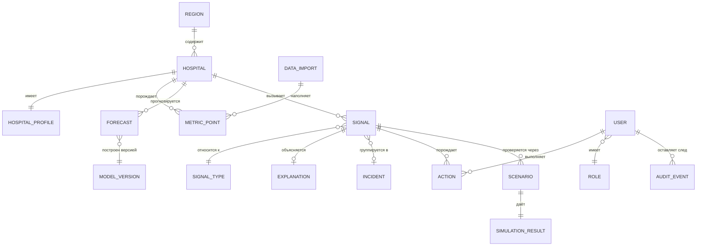
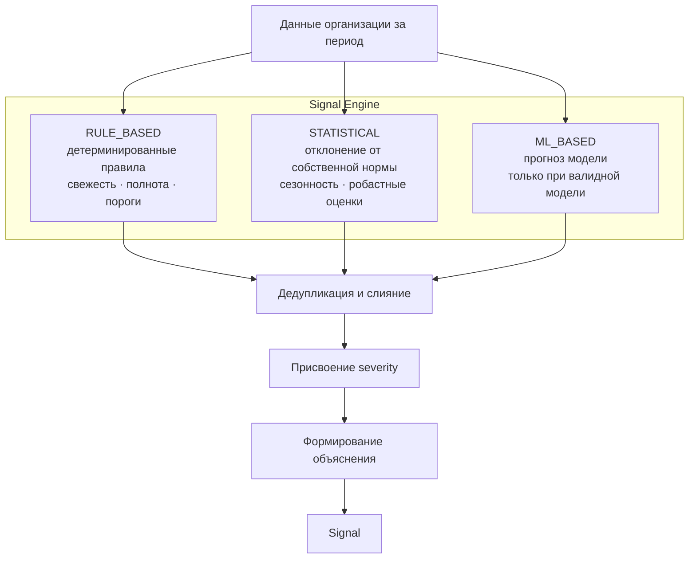
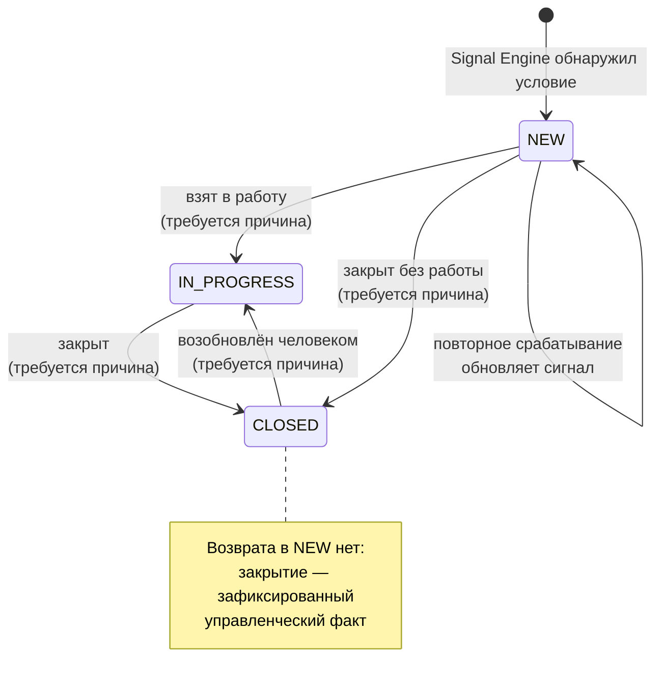
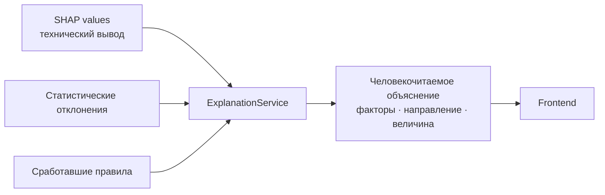
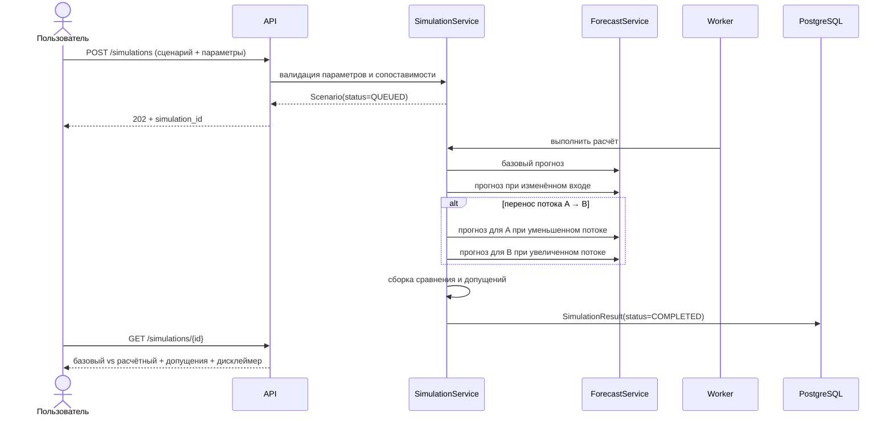

# BUSINESS_LOGIC — предметная область и правила

Документ описывает смысл сущностей и правила, по которым система переходит из состояния в состояние. Всё описанное здесь реализуется в слое `backend/app/business/` и нигде более.

## 1. Карта предметной области



## 2. Базовые сущности

### 2.1 Region

Административная единица, объединяющая медицинские организации. Единица области видимости для роли регионального аналитика и единица агрегации в Situation Center.

### 2.2 Hospital и HospitalProfile

`Hospital` — медицинская организация. `HospitalProfile` отделён намеренно: он хранит характеристики, влияющие на **сопоставимость** организаций — тип, уровень, профиль коек, плановая мощность.

Правило сопоставимости: две организации считаются сопоставимыми, если совпадают тип и профиль и мощности различаются не более чем в заданное число раз. Несопоставимые организации нельзя сравнивать абсолютными значениями и нельзя связывать в сценарии перераспределения потока.

### 2.3 Metric и MetricPoint

`Metric` — определение показателя: код, единица измерения, направление «хорошо/плохо», способ агрегации, допустимость нормализации.

`MetricPoint` — значение показателя для организации на момент времени. Это основной объём данных, он живёт в ClickHouse.

Обязательное разделение: **сырой показатель** и **нормализованный показатель**. Абсолютное число ожидающих не сравнимо между организациями разной мощности; нормализованное — сравнимо. В интерфейсе всегда указывается, какая величина показана.

### 2.4 QueueSnapshot, Referral, Refusal, TreatedCase

Четыре наблюдаемых процесса:

| Сущность | Что описывает | Роль в модели нагрузки |
|---|---|---|
| `Referral` | Направление на плановую госпитализацию | Входящий поток |
| `QueueSnapshot` | Состояние очереди ожидающих на момент времени | Накопленный запас |
| `TreatedCase` | Завершённый случай лечения | Исходящий поток |
| `Refusal` | Отказ в госпитализации | Потеря и признак напряжения |

Управляющее соотношение, на котором строится вся логика риска:

```
очередь(t) ≈ очередь(t−1) + входящий поток − исходящий поток − отказы − выбытие
```

Устойчивое превышение входящего потока над исходящим означает рост очереди независимо от текущего её размера. Именно поэтому система смотрит на потоки, а не только на размер очереди.

## 3. Risk

`Risk` — не отдельная таблица, а вычисляемая характеристика организации на момент времени.

### 3.1 Risk Score

Композитная оценка от 0 до 100, собираемая из нормализованных компонентов:

| Компонент | Смысл |
|---|---|
| Динамика очереди | Скорость роста очереди относительно собственной истории |
| Баланс потоков | Соотношение входящего и исходящего потоков |
| Давление отказов | Доля отказов относительно базового уровня организации |
| Прогнозная нагрузка | Ожидаемое значение цели на горизонте, если прогноз признан валидным |
| Штраф за качество данных | Понижение уверенности при устаревших или неполных данных |

Два обязательных правила:

**Веса компонентов — конфигурация, а не константа в коде.** Они хранятся в системной конфигурации и версионируются: изменение весов меняет историю оценок, поэтому каждая оценка хранит версию конфигурации, по которой рассчитана.

**Прогнозный компонент исключается, если прогноз невалиден.** При этом Risk Score не становится «меньше» — он пересчитывается по оставшимся компонентам, а факт исключения отражается в объяснении. Система не маскирует незнание.

### 3.2 Уровни риска

| Уровень | Условие | Смысл для пользователя |
|---|---|---|
| `LOW` | Score < 30 | Наблюдение в обычном режиме |
| `MEDIUM` | 30 ≤ Score < 60 | Требуется внимание аналитика |
| `HIGH` | 60 ≤ Score < 80 | Требуется решение руководителя |
| `CRITICAL` | Score ≥ 80 | Требуется немедленная реакция |

Пороги также конфигурируемы. Уровень всегда сопровождается перечнем факторов — уровень без объяснения бесполезен.

## 4. Signal

Центральная сущность продукта. Сигнал — это зафиксированное системой наблюдение, требующее внимания человека.

### 4.1 Типы сигналов

| Тип | Источник | Что означает |
|---|---|---|
| `QUEUE_GROWTH` | STATISTICAL | Очередь растёт существенно быстрее собственного базового уровня |
| `HIGH_REFUSAL_RATE` | STATISTICAL | Доля отказов аномально высока |
| `OVERLOAD_FORECAST` | ML_BASED | Модель прогнозирует существенный рост нагрузки на горизонте |
| `DATA_STALE` | RULE_BASED | Данные по организации не обновлялись дольше допустимого |
| `ANOMALY_DETECTED` | STATISTICAL | Обнаружено отклонение в показателях без заранее заданного правила |

`DATA_STALE` отделён от содержательных сигналов сознательно: проблема с данными не должна выглядеть как проблема с нагрузкой. Пока по организации активен `DATA_STALE`, её содержательные сигналы помечаются как построенные на неполных данных.

### 4.2 Три источника сигнала



Источники независимы и выполняются в фиксированном порядке. Правила выполняются первыми, потому что их результат влияет на доверие к остальным: если данные устарели, статистический и ML-источник помечают свои сигналы соответствующим флагом достоверности.

Обоснование трёх источников — в [ADR-0008](ADR/0008-signal-engine-three-sources.md).

### 4.3 Правила формирования

**Дедупликация.** Повторное срабатывание того же правила по той же организации не создаёт новый сигнал, а обновляет существующий активный: увеличивает счётчик срабатываний, обновляет значения метрик и время последнего подтверждения. Лента предупреждений, состоящая из ста копий одного сигнала, бесполезна.

**Минимальная длительность.** Сигнал создаётся, если условие удерживается заданное число последовательных наблюдений. Единичный всплеск не является сигналом.

**Достаточность данных.** Статистический и ML-источник не срабатывают, если истории меньше минимально необходимой. Вместо этого создаётся `DATA_STALE` или сигнал не создаётся вовсе.

**Автоматическое закрытие запрещено.** Система может пометить сигнал как «условие более не выполняется», но перевести его в `CLOSED` может только человек. Это прямое следствие принципа human-in-the-loop.

### 4.4 Severity

| Severity | Когда назначается |
|---|---|
| `INFO` | Наблюдение, не требующее действия |
| `WARNING` | Требуется анализ |
| `CRITICAL` | Требуется управленческое решение |

Severity определяется правилом-источником и текущим Risk Score организации, а не только величиной отклонения.

### 4.5 Одновременное изменение

Карточка сигнала хранит версию. Изменение выполняется условием
`WHERE id = ? AND version = ?`, и расхождение версии даёт конфликт,
а не молчаливую перезапись.

Правило существует ради конкретной ситуации: два сотрудника открыли
одну карточку, первый перевёл сигнал в работу, второй закрывает его
по устаревшему представлению. Без проверки версии решение первого
исчезло бы бесследно.

Клиент обязан передавать версию в каждой изменяющей операции. Ответ
на конфликт — `409`, и он означает «обновите карточку», а не «повторите
запрос».

### 4.6 Жизненный цикл



Реализация: `backend/app/business/signals/state_machine.py`. Это единственное место, где описаны допустимые переходы. Перечень переходов, доступных конкретному пользователю, вычисляет сервер и возвращает в поле `available_transitions` карточки сигнала: решать это на стороне клиента нельзя.

Правила переходов:

| Правило | Обоснование |
|---|---|
| Переход в `IN_PROGRESS` требует назначенного ответственного | Сигнал без владельца не обрабатывается |
| Переход в `CLOSED` требует указания причины | Закрытие — управленческий факт, он должен быть объясним |
| Любой переход порождает запись в Audit Log | Прослеживаемость обязательна |
| Переход выполняется только ролью с соответствующим правом | Аналитик анализирует, решение принимает руководитель |
| Система не выполняет переходы сама | Human-in-the-loop |

Матрица прав на переходы — в [SECURITY.md](SECURITY.md#5-матрица-ролей-и-прав).

Правила реализованы в `SignalService`: проверка права, проверка перехода, условное обновление по версии, запись действия и записи аудита — всё в одной транзакции.

## 5. Explanation

Объяснение — обязательная часть сигнала и прогноза. Без него сигнал не отображается как готовый.

### 5.1 Состав объяснения

| Элемент | Пример |
|---|---|
| Утверждение | «Риск высокий» |
| Факторы с направлением и величиной | «↑ направления +14%», «↓ выписки −7%», «↑ очередь +21%» |
| Период сравнения | «за 14 дней относительно предыдущих 14 дней» |
| Оговорки | «модель не учитывает изменения порядка маршрутизации» |
| Достоверность | «данные актуальны на 09.09», «ошибка модели MAE 4.2» |

### 5.2 Слой преобразования



Сырой вывод SHAP пользователю не показывается. `ExplanationService` отбирает значимые факторы, переводит их в показатели предметной области, отбрасывает шум и формирует текст. Это отдельный сервис, а не форматирование внутри ML-кода: правила подачи объяснения относятся к продукту, а не к модели.

Правило честности: если модель не даёт устойчивого объяснения, `ExplanationService` сообщает об этом, а не подставляет правдоподобный текст.

**Происхождение обязательно.** Хранимое объяснение содержит источник: чем оно построено (правило, статистика, разложение вклада признаков), версия построившего кода, версия модели и период входных данных. Свободный текст языковой модели не хранится: утверждение, происхождение которого нельзя восстановить, непроверяемо и потому бесполезно для принятия решения.

## 6. Forecast

### 6.1 Обязательные атрибуты

Прогноз без любого из этих полей считается неполным и не отображается:

| Поле | Назначение |
|---|---|
| `predicted_value` | Значение |
| `horizon` | Горизонт прогноза |
| `model_version` | Версия модели из реестра |
| `uncertainty` | Интервал или мера неопределённости, где применимо |
| `error_metric` | Ошибка модели на валидации с указанием метрики |
| `baseline_error_metric` | Ошибка baseline на том же разбиении |
| `explanation` | Объяснение |
| `generated_at` | Момент расчёта |
| `input_period` | Период входных данных |
| `assumptions` | Допущения и ограничения |

### 6.2 Правило валидности

Прогноз признаётся валидным, если модель не хуже baseline на одном и том же временном разбиении и истории достаточно. Невалидный прогноз не удаляется — он сохраняется с признаком невалидности, исключается из Risk Score и из ML-источника сигналов, а пользователю показывается причина.

Это принципиальный момент: система, которая молча показывает плохой прогноз, опаснее системы, которая не показывает прогноз вовсе.

## 7. Scenario и SimulationResult

### 7.1 Сценарий MVP

Изменение входящего потока для организации: −20%, −10%, +10%, +20% или произвольное значение в допустимом диапазоне. Опционально — перенос доли потока из организации A в организацию B.

### 7.2 Правила симуляции

| Правило | Обоснование |
|---|---|
| Всегда рассчитывается пара «базовый прогноз — расчётный сценарий» | Сценарий без базы неинтерпретируем |
| При переносе потока последствия считаются для обеих организаций | Разгрузка одной больницы за счёт перегрузки другой не является решением |
| Перенос возможен только между сопоставимыми организациями | Иначе сравнение бессмысленно |
| Допущения сохраняются вместе с результатом | Результат без допущений нельзя перепроверить позже |
| Изменение потока ограничено разумным диапазоном | Экстраполяция далеко за пределы наблюдавшихся значений недостоверна |
| Результат маркируется как «Расчётный сценарий» | Не «рекомендация», не «прогноз последствий решения» |
| Симуляция не изменяет операционные данные | Это расчёт, а не действие |

### 7.3 Поток симуляции



## 8. Action

Зафиксированное действие человека: смена статуса, назначение ответственного, запуск сценария, комментарий, фиксация принятого решения.

Action — это то, что делает систему управленческим инструментом, а не витриной. Он связывает сигнал, пользователя, время и суть решения. Каждое действие порождает событие аудита.

Правило: система никогда не создаёт Action от своего имени. Записи, порождённые автоматикой, — это события Signal Engine, они имеют иной тип и не выдаются за решение человека.

## 9. Incident

Группа связанных сигналов, рассматриваемых как одна ситуация: несколько типов сигналов по одной организации в одном окне времени либо однотипные сигналы по нескольким организациям региона.

Инцидент нужен, чтобы пользователь работал с ситуацией, а не с потоком разрозненных уведомлений. На MVP группировка простая — по организации и окну времени; более сложная корреляция отложена.

## 10. AuditEvent

Неизменяемая запись факта. Содержит: кто, что, над каким объектом, когда, с какого адреса, с каким `request_id`, предыдущее и новое состояние.

| Правило | Обоснование |
|---|---|
| Записи не изменяются и не удаляются | Смысл журнала в неизменности |
| Запись не содержит персональных медицинских данных | Минимизация |
| Журнал ведётся для действий человека и значимых системных операций | Импорт и прогон Signal Engine тоже должны быть восстановимы |
| Чтение журнала ограничено ролью | Журнал сам является чувствительным объектом |

## 11. DataImport

Жизненный цикл загрузки: `PENDING → VALIDATING → PROCESSING → COMPLETED` либо `REJECTED` / `FAILED`.

Хранит источник, период данных, контрольную сумму файла, статистику принятых и отклонённых строк, ссылку на отчёт о качестве. Импорт идемпотентен: повторная загрузка того же файла не дублирует данные.

## 12. Сводка бизнес-правил

| № | Правило |
|---|---|
| BR-01 | Система не выполняет управленческих действий автоматически |
| BR-02 | Сигнал не закрывается автоматически |
| BR-03 | Переход в `IN_PROGRESS` требует ответственного |
| BR-04 | Переход в `CLOSED` требует причины |
| BR-05 | Каждый переход и действие попадают в Audit Log |
| BR-06 | Прогноз без обязательных атрибутов не отображается |
| BR-07 | Прогноз хуже baseline помечается невалидным и не используется в Risk Score и сигналах |
| BR-08 | Сигнал без объяснения не отображается как готовый |
| BR-09 | Повторное срабатывание обновляет сигнал, а не создаёт новый |
| BR-10 | Сигнал требует удержания условия минимальное число наблюдений |
| BR-11 | При устаревших данных содержательные сигналы помечаются флагом достоверности |
| BR-12 | Сравнение организаций выполняется по нормализованным показателям |
| BR-13 | Перенос потока допустим только между сопоставимыми организациями |
| BR-14 | Симуляция всегда возвращает пару «базовый — расчётный» |
| BR-15 | При переносе потока считаются последствия для обеих организаций |
| BR-16 | Результат симуляции маркируется как расчётный сценарий |
| BR-17 | Допущения сохраняются вместе с результатом расчёта |
| BR-18 | Область данных применяется в бизнес-слое к каждому запросу |
| BR-19 | Прямые персональные идентификаторы не попадают в хранилище |
| BR-20 | Веса и пороги риска версионируются вместе с рассчитанными оценками |
| BR-21 | Изменение сигнала проверяется по версии; расхождение даёт конфликт |
| BR-22 | Перечень доступных переходов вычисляет сервер с учётом роли |
| BR-23 | Ответственный обязан иметь доступ к организации сигнала |
| BR-24 | Бизнес-операция и запись аудита фиксируются одной транзакцией |
| BR-25 | Объяснение хранится только со сведениями о происхождении |
