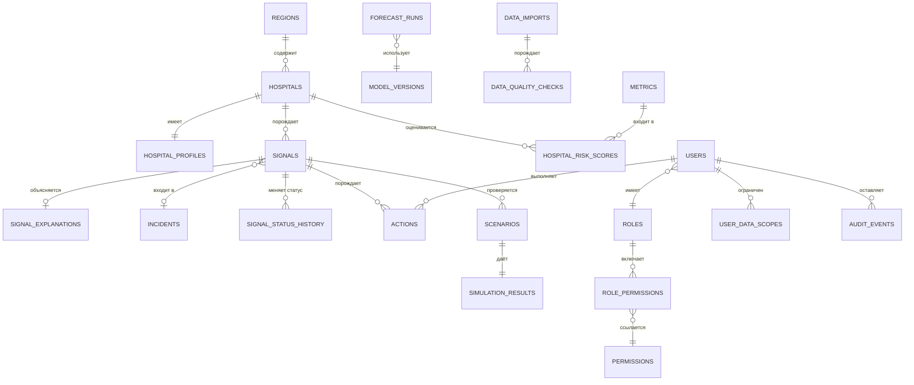

# DATABASE — модель данных

> **Статус.** Модель операционных сущностей устойчива и следует из предметной области. Схемы аналитических таблиц зависят от фактической структуры выгрузок и уточняются после Data Audit ([ADR-0007](ADR/0007-data-audit-before-ml-target.md)).

## 1. Разделение хранилищ

| Критерий | PostgreSQL | ClickHouse |
|---|---|---|
| Характер данных | Состояние, связи, справочники | Факты во времени |
| Операции | Вставка, изменение, транзакции | Массовая вставка, агрегация |
| Объём | Тысячи — сотни тысяч записей | Миллионы и более |
| Типичный запрос | Найти объект, изменить состояние | Свернуть период по срезу |
| Изменяемость | Записи изменяются | Записи не изменяются |

Обоснование разделения — [ADR-0002](ADR/0002-postgresql-clickhouse-split.md).

## 2. ER-модель операционной БД

## 3. Таблицы PostgreSQL

### 3.1 Справочники

| Таблица | Назначение | Ключевые поля |
|---|---|---|
| `regions` | Регионы | `id`, `code`, `name`, `is_active` |
| `hospitals` | Медицинские организации | `id`, `region_id`, `external_code`, `name`, `is_active` |
| `hospital_profiles` | Характеристики для сопоставимости | `hospital_id`, `facility_type`, `care_level`, `bed_profile`, `planned_capacity`, `valid_from`, `valid_to` |
| `hospital_code_mappings` | Соответствие кодов между источниками | `hospital_id`, `source_system`, `source_code` |
| `metrics` | Определения показателей | `code`, `name`, `unit`, `direction`, `aggregation`, `normalizable` |

`hospital_profiles` версионируется полями `valid_from` и `valid_to`: мощность организации меняется со временем, и прошлые расчёты должны опираться на значение, действовавшее на момент наблюдения.

`hospital_code_mappings` существует потому, что общий устойчивый код организации между ИС БГ и ЭРСБ не подтверждён. Сопоставление ведётся явно, а не выводится из наименований.

### 3.2 Пользователи и доступ

| Таблица | Назначение | Ключевые поля |
|---|---|---|
| `users` | Пользователи | `id`, `external_subject`, `email`, `full_name`, `role_id`, `is_active` |
| `roles` | Роли | `id`, `code`, `name` |
| `permissions` | Атомарные права | `id`, `code`, `description` |
| `role_permissions` | Права роли | `role_id`, `permission_id` |
| `user_data_scopes` | Область данных | `user_id`, `scope_type`, `scope_id` |

`user_data_scopes` хранит область видимости строками вида «регион X» или «организация Y». Это позволяет задавать нестандартные комбинации без изменения кода: координатор может получить доступ к нескольким организациям из разных регионов.

`external_subject` — идентификатор субъекта из OIDC-провайдера. Поле присутствует с самого начала, чтобы переход с локальной аутентификации на Keycloak не требовал миграции модели пользователей.

### 3.3 Сигналы и работа с ними

| Таблица | Назначение | Ключевые поля |
|---|---|---|
| `signals` | Сигналы | `id`, `hospital_id`, `signal_type`, `source`, `severity`, `status`, `detected_at`, `last_confirmed_at`, `occurrence_count`, `assignee_id`, `confidence_flag`, `is_condition_active` |
| `signal_explanations` | Объяснения | `signal_id`, `summary`, `factors`, `comparison_period`, `caveats` |
| `signal_metrics` | Значения метрик на момент сигнала | `signal_id`, `metric_code`, `value`, `baseline_value`, `change_pct` |
| `signal_status_history` | История статусов | `signal_id`, `from_status`, `to_status`, `reason`, `changed_by`, `changed_at` |
| `incidents` | Группы сигналов | `id`, `region_id`, `hospital_id`, `title`, `status`, `opened_at` |
| `actions` | Действия человека | `id`, `signal_id`, `user_id`, `action_type`, `payload`, `created_at` |

`occurrence_count` и `last_confirmed_at` реализуют дедупликацию: повторное срабатывание обновляет существующий сигнал вместо создания нового.

`is_condition_active` отделяет «условие больше не выполняется» от «сигнал закрыт человеком». Система может обновить первое, но не второе.

### 3.4 Прогнозы и модели

| Таблица | Назначение | Ключевые поля |
|---|---|---|
| `model_versions` | Версии моделей | `id`, `target`, `algorithm`, `mlflow_run_id`, `feature_set_version`, `trained_at`, `training_period`, `metrics`, `baseline_metrics`, `status` |
| `forecast_runs` | Запуски прогнозирования | `id`, `model_version_id`, `scope`, `started_at`, `finished_at`, `status`, `hospitals_covered`, `hospitals_skipped` |
| `forecast_summaries` | Ссылка на актуальный прогноз | `hospital_id`, `target`, `forecast_run_id`, `is_valid`, `invalidity_reason`, `generated_at` |

Точки прогноза хранятся в ClickHouse; PostgreSQL хранит метаданные и указатель на актуальный прогноз. Это разделение соответствует характеру данных: метаданные изменяются, точки — нет.

### 3.5 Сценарии и симуляции

| Таблица | Назначение | Ключевые поля |
|---|---|---|
| `scenarios` | Заданные сценарии | `id`, `created_by`, `signal_id`, `scenario_type`, `parameters`, `horizon_days`, `status`, `created_at` |
| `simulation_results` | Результаты | `scenario_id`, `baseline_forecast`, `simulated_forecast`, `affected_hospitals`, `assumptions`, `limitations`, `computed_at` |

`assumptions` хранится вместе с результатом, а не восстанавливается при показе. Допущения зависят от состояния данных и модели на момент расчёта и позже невоспроизводимы.

### 3.6 Импорт и качество данных

| Таблица | Назначение | Ключевые поля |
|---|---|---|
| `data_imports` | Импорты | `id`, `dataset_type`, `source`, `file_name`, `file_hash`, `status`, `created_at`, `started_at`, `completed_at`, `error_summary` — обязательный минимум по [ADR-0010](ADR/0010-persistent-operation-state.md); дополнительно `contract_version`, `object_key`, `period_from`, `period_to`, `rows_total`, `rows_accepted`, `rows_rejected`, `created_by` |
| `data_quality_checks` | Результаты проверок | `import_id`, `check_code`, `severity`, `passed`, `details` |
| `data_freshness` | Свежесть по организации и набору | `hospital_id`, `dataset_code`, `last_observed_at`, `last_loaded_at` |

`file_hash` вычисляется по содержимому файла, а не по имени: переименованный файл с тем же содержимым — тот же файл. Совпадение `file_hash` и `dataset_type` с ранее завершённым импортом распознаётся до начала обработки, и пользователь получает явный ответ вместо повторной загрузки.

Конкретная стратегия дедупликации в ClickHouse определяется после Data Audit: для событий с устойчивым идентификатором — ключ дедупликации, для снимков состояния — замена раздела за период, для агрегатов — движок со схлопыванием по ключу. До этого действует страховка: загрузка за период, уже покрытый завершённым импортом, требует подтверждения оператора.

`data_freshness` — источник для сигнала `DATA_STALE`, отдельная таблица нужна для быстрого ответа без сканирования ClickHouse.

### 3.7 Системные таблицы

| Таблица | Назначение | Ключевые поля |
|---|---|---|
| `system_operations` | Состояние долгих операций | `id`, `operation_type`, `status`, `request_id`, `celery_task_id`, `created_at`, `started_at`, `completed_at`, `error_summary`, `result` |

Единственная таблица, создаваемая в PHASE 1. Реализует общий жизненный цикл `PENDING → RUNNING → COMPLETED | FAILED` из [ADR-0010](ADR/0010-persistent-operation-state.md). Специализированные таблицы операций — `data_imports`, `scenarios` — следуют тому же жизненному циклу и появляются в своих фазах.

Поле `request_id` связывает операцию с HTTP-запросом, который её породил, и с записями журнала.

### 3.8 Аудит и конфигурация

| Таблица | Назначение | Ключевые поля |
|---|---|---|
| `audit_events` | Неизменяемый журнал | `id`, `occurred_at`, `actor_id`, `actor_role`, `action`, `object_type`, `object_id`, `before_state`, `after_state`, `ip_address`, `request_id` |
| `system_config` | Конфигурация | `key`, `value`, `version`, `updated_by`, `updated_at` |
| `risk_config_versions` | Версии весов и порогов риска | `version`, `weights`, `thresholds`, `valid_from` |
| `hospital_risk_scores` | Рассчитанные оценки | `hospital_id`, `computed_at`, `score`, `risk_level`, `components`, `risk_config_version` |

`audit_events` — только вставка. Права на `UPDATE` и `DELETE` для прикладной роли БД не выдаются: ограничение обеспечивается на уровне СУБД, а не дисциплиной разработчиков.

`hospital_risk_scores` хранит `risk_config_version`, потому что оценка без версии конфигурации неинтерпретируема: изменение весов меняет смысл числа.

## 4. Таблицы ClickHouse

Точные схемы определяются после Data Audit. Устойчивы принципы организации.

| Таблица | Содержимое | Движок | Ключ сортировки |
|---|---|---|---|
| `metric_points` | Канонические наблюдения показателей | MergeTree | `(hospital_id, metric_code, observed_at)` |
| `queue_snapshots` | Снимки очереди | MergeTree | `(hospital_id, observed_at)` |
| `referrals_daily` | Направления по дням | MergeTree | `(hospital_id, observed_at)` |
| `refusals_daily` | Отказы по дням | MergeTree | `(hospital_id, observed_at)` |
| `treated_cases_daily` | Пролеченные случаи по дням | MergeTree | `(hospital_id, observed_at)` |
| `forecast_points` | Точки прогнозов | MergeTree | `(hospital_id, target, forecast_date, model_version)` |
| `feature_store` | Признаки для обучения и инференса | MergeTree | `(hospital_id, observed_at, feature_set_version)` |
| `metric_daily_agg` | Предагрегаты по дням | AggregatingMergeTree | `(hospital_id, metric_code, observed_date)` |
| `region_daily_agg` | Предагрегаты по регионам | AggregatingMergeTree | `(region_id, metric_code, observed_date)` |

Общие правила:

| Правило | Обоснование |
|---|---|
| Партиционирование по месяцу наблюдения | Быстрое отсечение при выборке по периоду |
| Ключ сортировки начинается с организации | Основной сценарий — выборка по организации за период |
| Предагрегаты для дашборда | Situation Center не сканирует детальный слой |
| Каждая запись хранит `import_id` и `contract_version` | Прослеживаемость |
| TTL на детальный слой при необходимости | Управление объёмом при сохранении агрегатов |
| Ссылочная целостность не обеспечивается СУБД | Проверяется конвейером до загрузки |

Последний пункт важен: в ClickHouse нет внешних ключей. Соответствие организаций и справочников проверяется на этапе валидации, а не после загрузки.

## 5. Миграции

| Хранилище | Инструмент | Правила |
|---|---|---|
| PostgreSQL | Alembic | Одна миграция — одно смысловое изменение, обязательный откат, отдельная миграция для наполнения данными |
| ClickHouse | Версионированные SQL-файлы в `database/clickhouse/` | Применяются по порядку, фиксируются в служебной таблице версий |

Правило для production: изменения, требующие блокировки больших таблиц, выполняются отдельным шагом с планом отката. Добавление колонки и её заполнение — разные миграции.

## 6. Индексы и производительность

| Таблица | Индекс | Сценарий |
|---|---|---|
| `signals` | `(status, severity, detected_at)` | Лента предупреждений |
| `signals` | `(hospital_id, status)` | Сигналы организации |
| `signals` | `(assignee_id, status)` | Мои сигналы |
| `hospitals` | `(region_id, is_active)` | Список по региону |
| `audit_events` | `(occurred_at)`, `(actor_id, occurred_at)`, `(object_type, object_id)` | Журнал и история объекта |
| `data_imports` | `(status, created_at)`, `(file_checksum)` | Мониторинг и идемпотентность |
| `user_data_scopes` | `(user_id)` | Разрешение области данных при каждом запросе |
| `hospital_risk_scores` | `(hospital_id, computed_at)` | Текущий и исторический риск |

Дополнительно: ограничение времени выполнения запроса через `POSTGRES_STATEMENT_TIMEOUT_MS` и `CLICKHOUSE_MAX_EXECUTION_TIME_S`, пул соединений с ограничением размера, ограничение числа возвращаемых строк на уровне драйвера ClickHouse.

## 7. Права доступа на уровне БД

| Роль БД | Права | Применение |
|---|---|---|
| `medsignal_app` | `SELECT`, `INSERT`, `UPDATE` по прикладным таблицам; только `INSERT` по `audit_events` | Backend и воркеры |
| `medsignal_migrate` | DDL | Только процесс миграций |
| `medsignal_readonly` | `SELECT` по ограниченному набору | Диагностика, аналитика |

Приложение не работает от суперпользователя. Отсутствие прав на изменение журнала аудита — техническая гарантия, а не соглашение.

## 8. Открытые вопросы

1. Является ли очередь снимком или восстанавливается из событий — определяет наличие `queue_snapshots`.
2. Существует ли справочник плановой мощности — без него нормализация показателей ограничена.
3. Есть ли общий устойчивый код организации между источниками — определяет объём работы по сопоставлению.
4. Какова реальная глубина истории — влияет на политику партиционирования и TTL.
5. Как связать данные ЕИП с организациями — сейчас они доступны только на уровне региона.
