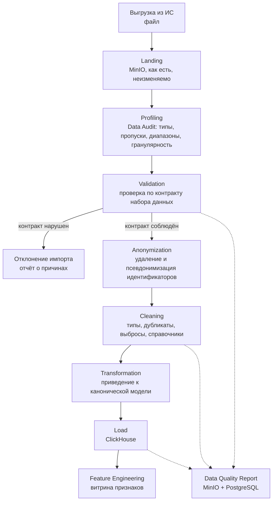
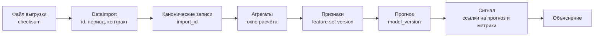

# DATA_ARCHITECTURE — архитектура работы с данными

> **Статус данных.** Реальная структура выгрузок ИС БГ, ЭРСБ и ЕИП на момент PHASE 0 не изучена. Этот документ описывает конвейер и контракты, а не выдуманные схемы таблиц. Все поля, помеченные как `ОЖИДАЕТСЯ`, подтверждаются в ходе Data Audit. См. [ADR-0007](ADR/0007-data-audit-before-ml-target.md).

## 1. Источники данных

| Источник | Предполагаемое содержание | Роль в модели нагрузки |
|---|---|---|
| ИС БГ | Направления на плановую госпитализацию | Входящий поток |
| ИС БГ | Ожидающие госпитализацию | Накопленная очередь |
| ИС БГ | Отказы | Потери и признак напряжения |
| ЭРСБ | Пролеченные случаи по организациям | Исходящий поток |
| ЕИП | Лабораторные исследования по регионам | Косвенный индикатор активности, приоритет ниже |

Лабораторные исследования по регионам находятся на другом уровне агрегации, чем остальные источники, и не привязаны к организации. На MVP они рассматриваются как вспомогательный региональный признак и не участвуют в расчётах по организации без подтверждения связи.

## 2. Конвейер данных

Ключевой порядок: **анонимизация выполняется до очистки и до любой записи в аналитическое хранилище.** Персональные идентификаторы существуют только в оперативной памяти воркера и в landing-объекте, доступ к которому ограничен и который подлежит удалению по регламенту хранения.

## 3. Слои хранения

| Слой | Где | Содержимое | Срок хранения |
|---|---|---|---|
| Landing | MinIO | Исходный файл без изменений, контрольная сумма | Ограниченный, по регламенту |
| Rejected | MinIO | Отклонённые строки с причинами, без прямых идентификаторов | Ограниченный |
| Canonical | ClickHouse | Приведённые к общей модели факты и временные ряды | Долговременный |
| Aggregates | ClickHouse | Предагрегаты по дням, неделям, организациям, регионам | Долговременный |
| Feature store | ClickHouse | Признаки для обучения и инференса | Долговременный |
| Operational | PostgreSQL | Справочники, сигналы, действия, аудит, метаданные импорта | Долговременный |
| Artifacts | MinIO | Модели, отчёты качества, экспорты | Долговременный |

Landing хранится отдельно от канонического слоя, чтобы импорт можно было воспроизвести после исправления логики разбора, не запрашивая выгрузку повторно.

## 4. Data Audit

Data Audit — обязательный первый шаг работы с любым новым источником. Его результат определяет, какие возможности вообще реализуемы.

### 4.1 Что выясняется

| Вопрос | Почему он критичен |
|---|---|
| Какие поля фактически присутствуют | Определяет, какие показатели вычислимы |
| Какова гранулярность записи | Событие, снимок или агрегат — это разные модели |
| Есть ли временная метка и какая | Без времени временные ряды невозможны |
| Какова глубина истории | Определяет возможность прогнозирования и сезонности |
| Какова регулярность обновления | Определяет горизонт прогноза и порог `DATA_STALE` |
| Есть ли устойчивый идентификатор организации | Без него связь между источниками невозможна |
| Доля пропусков по ключевым полям | Определяет применимость показателя |
| Присутствуют ли прямые идентификаторы | Определяет строгость анонимизации |
| Совпадают ли справочники организаций между источниками | Определяет необходимость сопоставления |

### 4.2 Результат

Отчёт Data Audit содержит профиль каждого набора, карту фактических полей, оценку пригодности для каждой из целей MVP и явный вывод о том, какая целевая переменная реализуема. До выхода отчёта целевая переменная не фиксируется, признаки не проектируются, модель не обучается.

### 4.3 Кандидаты целевой переменной

Ни один из вариантов не выбран. Каждый требует подтверждения наличия полей.

| Кандидат | Что должно подтвердиться | Риск |
|---|---|---|
| `queue_size(t+n)` | Регулярные снимки очереди с датой и организацией | Если очередь фиксируется нерегулярно, ряд неполный |
| `incoming_flow(t+n)` | Направления с датой создания и организацией назначения | Наиболее вероятный кандидат: события с датой обычно присутствуют |
| `waiting_time(t+n)` | Пара дат — постановки в очередь и госпитализации | Требует завершённых случаев, доступен с задержкой |

Предварительная оценка: `incoming_flow` наиболее вероятно реализуем, поскольку событийные данные о направлениях обычно содержат дату. Это **гипотеза**, а не решение.

## 5. Контракты наборов данных

Контракт — это машиночитаемое описание ожидаемой структуры набора: обязательные и опциональные поля, типы, допустимые диапазоны, ключ уникальности, гранулярность, правила пропусков и классификация чувствительности.

Контракты живут в `data_pipeline/contracts/` и версионируются. Импорт проверяется против конкретной версии контракта, и её номер сохраняется в записи импорта. Это даёт воспроизводимость: через полгода можно понять, по каким правилам были приняты данные.

Контракт описывает **ожидание**, а не предположение о реальности. Как только Data Audit покажет фактическую структуру, контракт приводится в соответствие, а несоответствия становятся явными изменениями с историей, а не молчаливой правкой кода.

## 6. Валидация

Четыре уровня, выполняемые последовательно:

| Уровень | Что проверяется | Реакция на нарушение |
|---|---|---|
| Структурный | Наличие обязательных полей, разбираемость файла | Отклонение всего импорта |
| Типовой | Типы, форматы дат, кодировки | Отклонение строки |
| Доменный | Диапазоны, ссылочная целостность со справочниками, непротиворечивость дат | Отклонение строки с причиной |
| Конвейерный | Дубликаты, пересечение периодов, аномальный объём относительно предыдущих загрузок | Предупреждение или остановка |

Отклонённые строки не отбрасываются молча. Они попадают в отчёт с указанием причины, чтобы владелец источника мог исправить выгрузку.

Особое правило: резкое изменение объёма загрузки относительно предыдущих импортов — сигнал проблемы выгрузки, а не изменения ситуации в здравоохранении. Такой импорт требует подтверждения администратором.

## 7. Анонимизация и минимизация

### 7.1 Классификация полей

| Класс | Примеры | Обработка |
|---|---|---|
| Прямые идентификаторы | ИИН, ФИО, телефон, адрес, номер документа | Удаление на входе; при `PII_STRICT_MODE` — остановка импорта |
| Квазиидентификаторы | Точная дата рождения, точный адрес, редкая комбинация признаков | Огрубление: возрастная группа вместо даты, район вместо адреса |
| Технические идентификаторы | Идентификатор случая, идентификатор направления | Псевдонимизация с солью, если нужны для связи |
| Операционные показатели | Даты событий, коды организаций, счётчики | Сохраняются |

### 7.2 Псевдонимизация

Устойчивый псевдоним вычисляется как ключевая хеш-функция от идентификатора с секретной солью из `PSEUDONYM_SALT`. Соль не хранится в репозитории и не попадает в логи. Ротация соли разрывает связь между старыми и новыми выгрузками, поэтому выполняется только осознанно и фиксируется.

Псевдонимизация применяется только там, где связь действительно нужна. Если для задачи достаточно агрегата, идентификатор не сохраняется вовсе — это и есть минимизация.

### 7.3 Граница персональных данных

Ни одна возможность MVP не требует персональных данных пациента. Все показатели — агрегаты по организации и времени. Если при Data Audit окажется, что источник содержит персональные данные, конвейер обязан отсечь их на входе, а не «на всякий случай сохранить».

## 8. Трансформация в каноническую модель

Каждый источник приводится к общей модели факта:

| Поле канонической записи | Смысл |
|---|---|
| `hospital_id` | Организация из общего справочника |
| `region_id` | Регион |
| `metric_code` | Код показателя |
| `observed_at` | Момент наблюдения, приведённый к суткам |
| `value` | Значение |
| `value_normalized` | Нормализованное значение, если нормализация применима |
| `source_system` | Источник |
| `import_id` | Импорт, породивший запись |
| `contract_version` | Версия контракта |
| `ingested_at` | Момент загрузки |

Каноническая модель отделяет аналитику от особенностей источников. Появление нового источника означает новый адаптер, а не переделку витрин.

Отдельная задача — **сопоставление справочников организаций** между ИС БГ и ЭРСБ. Если общего устойчивого кода нет, требуется таблица соответствия, ведущаяся явно. Сопоставление по наименованию недопустимо как единственный метод.

## 9. Data Lineage

Требование прослеживаемости: для любого показанного пользователю числа система должна уметь ответить, из какого импорта и по какой версии контракта, признаков и модели оно получено. Поэтому `import_id`, `contract_version`, `feature_set_version` и `model_version` переносятся по всей цепочке, а не теряются на первом агрегате.

## 10. Качество данных

### 10.1 Измерения

| Измерение | Показатель | Связь с продуктом |
|---|---|---|
| Свежесть | Часы с последнего обновления по организации | Порождает `DATA_STALE` |
| Полнота | Доля заполненных обязательных полей | Понижает доверие к сигналу |
| Согласованность | Соответствие справочникам, непротиворечивость дат | Блокирует загрузку строк |
| Объём | Число записей относительно исторической нормы | Требует подтверждения импорта |
| Уникальность | Доля дубликатов по ключу | Блокирует загрузку строк |
| Непрерывность | Пропуски в ряду наблюдений | Ограничивает прогнозирование |

### 10.2 Влияние на систему

Качество данных — не отдельный отчёт «для галочки», а вход бизнес-логики:

- Недостаточная свежесть порождает сигнал `DATA_STALE`
- Недостаточная непрерывность запрещает прогноз
- Низкая полнота понижает компонент уверенности в Risk Score
- Аномальный объём останавливает автоматическую обработку

## 11. Разделение хранилищ

| Данные | Хранилище | Обоснование |
|---|---|---|
| Справочники, пользователи, роли, сигналы, действия, аудит, метаданные | PostgreSQL | Транзакции, связи, изменяемое состояние, небольшой объём |
| Метрики, очереди, направления, отказы, пролеченные случаи, прогнозы, агрегаты | ClickHouse | Большой объём, запросы «по столбцам за период», аналитические агрегации |

Правило: тяжёлая аналитика по историческим рядам не выполняется в PostgreSQL. Обратное правило тоже действует: изменяемое состояние и транзакционные связи не переносятся в ClickHouse. Обоснование — [ADR-0002](ADR/0002-postgresql-clickhouse-split.md).

## 12. Идемпотентность и повторная обработка

Повторный импорт того же файла не создаёт дублей: ключ идемпотентности — контрольная сумма файла и период данных. Пересчёт агрегатов выполняется по окну, а не инкрементально «вслепую», чтобы исправление данных за прошлый период корректно отражалось в витринах.

Порядок восстановления при исправлении данных: повторный импорт → перезапись канонического слоя по окну → пересчёт агрегатов → пересчёт признаков → пересчёт прогнозов → повторный прогон Signal Engine. Сигналы, построенные на исправленных данных, помечаются как пересчитанные, но ранее принятые решения человека остаются в журнале неизменными.

## 13. Открытые вопросы к владельцам источников

Вопросы, ответы на которые определяют состав MVP:

1. Какова фактическая структура и гранулярность каждой выгрузки?
2. Какова глубина доступной истории?
3. С какой периодичностью обновляются данные и какова задержка?
4. Какой идентификатор организации является устойчивым и общим для ИС БГ и ЭРСБ?
5. Фиксируется ли очередь снимками или восстанавливается из событий?
6. Есть ли дата постановки в очередь и дата госпитализации в одной записи?
7. Какие поля содержат персональные данные и могут ли они быть исключены из выгрузки на стороне источника?
8. Существует ли справочник плановой мощности организаций?
9. Как в источнике кодируются отказы и их причины?
10. Каким образом лабораторные данные ЕИП могут быть связаны с организациями, а не только с регионом?

До получения ответов реализуются контракты, адаптеры и заглушки, а не модель.
