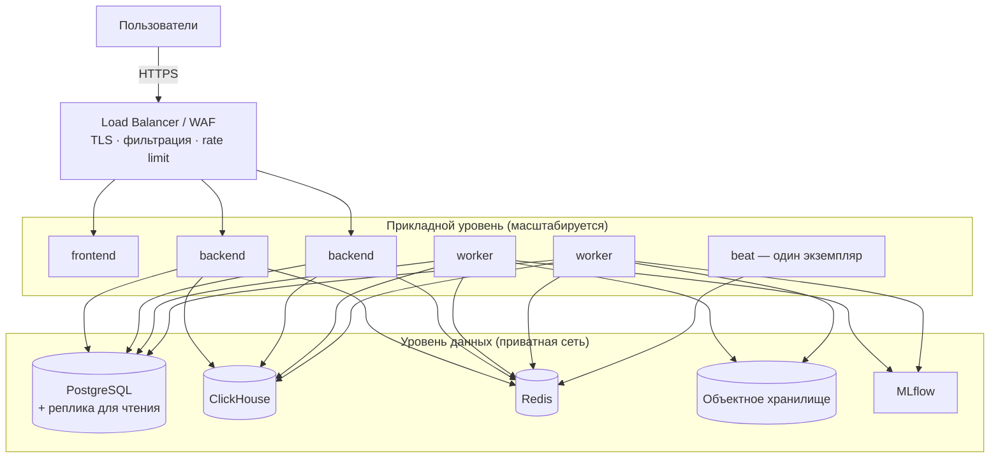

# DEPLOYMENT — развёртывание

> **Статус.** Локальное окружение реализовано в PHASE 1 и запускается командой `docker compose up -d`. Раздел про эксплуатацию описывает целевую схему: сред развёртывания пока нет.

## 1. Локальное окружение

### 1.1 Требования

Docker с Compose v2, не менее 8 ГБ оперативной памяти для полного набора сервисов, свободный порт 80. Прочие порты на хост не публикуются.

### 1.2 Запуск

```bash
cp .env.example .env
```

```bash
docker compose up -d
```

Миграции применяются автоматически одноразовым сервисом `migrate` до старта приложения. Проверить окружение целиком:

```bash
bash scripts/smoke-test.sh
```

### 1.3 Состав сервисов

| Сервис | Назначение | Публикуется наружу |
|---|---|---|
| `nginx` | Обратный прокси, единая точка входа | Да, 80 |
| `frontend` | Next.js | Через nginx |
| `backend` | FastAPI | Через nginx |
| `worker` | Celery worker | Нет |
| `migrate` | Одноразовое применение миграций перед стартом приложения | Нет |
| `keycloak` | Провайдер OIDC. Браузер обращается к нему через прокси по пути `/auth` | Через nginx |
| `postgres` | Операционная БД | Только наложением `dev-ports` |
| `clickhouse` | Аналитическая БД | Только наложением `dev-ports` |
| `redis` | Кэш, брокер, лимиты | Только наложением `dev-ports` |
| `minio` | Объектное хранилище | Только наложением `dev-ports` |
| `mlflow` | Реестр моделей | Только наложением `dev-ports` |

Появляются позже: `beat` с расписанием задач — вместе с регулярными расчётами (PHASE 5), `prometheus` и `grafana` — на этапе наблюдаемости (PHASE 8).

Порты хранилищ открываются явным наложением и слушают только 127.0.0.1:

```bash
docker compose -f docker-compose.yml -f docker-compose.dev-ports.yml up -d
```

### 1.4 Порядок запуска

Зависимости выражены через проверки здоровья, а не через задержки. Backend не стартует до готовности PostgreSQL, worker не стартует до готовности Redis. Миграции выполняются отдельным шагом, а не в точке входа контейнера приложения: это делает запуск предсказуемым при нескольких экземплярах.

## 2. Образы

| Образ | Принцип сборки |
|---|---|
| `backend` | Многоступенчатая сборка, установка зависимостей отдельным слоем, непривилегированный пользователь |
| `frontend` | Сборка Next.js в standalone-режиме, отдельный слой зависимостей, непривилегированный пользователь |
| `worker` | Тот же образ, что и backend, иная команда запуска |

Общий образ для API и воркера гарантирует идентичность бизнес-кода в синхронном и фоновом пути. Расхождение версий между ними — источник трудноуловимых ошибок.

Правила: фиксированные версии базовых образов, отсутствие секретов в слоях, `.dockerignore` исключает исходные данные и окружение, файловая система только для чтения там, где возможно.

## 3. Production

### 3.1 Целевая схема



### 3.2 Правила

| Правило | Обоснование |
|---|---|
| Приложение stateless | Позволяет добавлять экземпляры без координации |
| Beat запускается в одном экземпляре | Иначе задачи по расписанию дублируются |
| Воркеры разделены по очередям | Долгое обучение не блокирует быстрые задачи |
| Задачи идемпотентны | Повтор при сбое не должен искажать данные |
| Миграции — отдельный шаг перед выкаткой | Исключает гонку между экземплярами |
| Секреты из внешнего хранилища | Не файл на диске |
| Порты данных не публикуются | Доступ только из прикладной сети |
| Ограничения ресурсов заданы | Один компонент не потребляет всё |

### 3.3 Разделение очередей

| Очередь | Задачи | Параллелизм |
|---|---|---|
| `default` | Быстрые операции, уведомления | Высокий |
| `ingestion` | Импорт и загрузка данных | Ограниченный |
| `ml` | Обучение и инференс | Ограниченный, отдельные ресурсы |
| `simulation` | Расчёт сценариев | Средний |

## 4. Конфигурация сред

| Параметр | local | staging | production |
|---|---|---|---|
| `APP_DEBUG` | true | false | false |
| `LOG_LEVEL` | INFO | INFO | INFO |
| `CORS_ALLOWED_ORIGINS` | localhost | домен staging | домен production |
| `FORCE_HTTPS` | false | true | true |
| Порты БД | только наложением `dev-ports` на 127.0.0.1 | нет | нет |
| Реальные данные | нет | обезличенные | да |
| Секреты | `.env` | secret manager | secret manager |

Приложение при старте проверяет конфигурацию и отказывается запускаться, если вне локальной среды включён отладочный режим, остались значения-заглушки из `.env.example` или CORS открыт полностью.

## 5. Выкатка

Порядок: сборка и тесты → сканирование зависимостей и образов → публикация образов → применение миграций → выкатка приложения → проверка готовности → наблюдение.

Миграции должны быть совместимы с предыдущей версией кода на время выкатки. Практически это означает разделение: сначала добавление структуры, затем выкатка кода, затем удаление устаревшей структуры отдельным релизом. Откат выполняется возвратом на предыдущий образ; откат миграции — только по подготовленному плану.

## 6. Резервное копирование

| Данные | Способ | Проверка |
|---|---|---|
| PostgreSQL | Регулярная выгрузка и журналы для восстановления на момент | Периодическая пробная развёртка копии |
| ClickHouse | Копирование разделов | Проверка целостности |
| MinIO | Репликация или копирование бакетов | Проверка доступности объектов |
| Конфигурация | В системе контроля версий, без секретов | — |

Резервная копия, которую ни разу не восстанавливали, не является резервной копией. Проверка восстановления входит в регламент.

## 7. Наблюдаемость в эксплуатации

| Что отслеживается | Порог внимания |
|---|---|
| Доля ошибочных ответов | Рост относительно базового уровня |
| Задержка ответа API | Превышение целевого значения на перцентилях |
| Длина очереди задач | Устойчивый рост |
| Отказы задач | Любые повторяющиеся |
| Свежесть данных | Превышение `SIGNAL_DATA_STALE_HOURS` |
| Ошибка модели на свежих данных | Рост относительно валидации |
| Доступность зависимостей | Отказ проверки готовности |

Проверка `/health` отвечает без обращения к зависимостям и служит признаком живости процесса. Проверка `/ready` обращается к PostgreSQL, ClickHouse и Redis и определяет, можно ли направлять трафик.

## 8. Переход к Kubernetes

Kubernetes не требуется для MVP. Архитектура совместима с ним изначально: приложение stateless, конфигурация внешняя, состояние в сервисах данных, компоненты контейнеризованы, есть проверки живости и готовности.

При переходе Compose-сервисы отображаются на Deployment для приложения и воркеров, Service и Ingress вместо nginx, StatefulSet или управляемые сервисы для данных, CronJob для регулярных задач, Secret и ConfigMap для конфигурации. Прикладной код при этом не изменяется — это и есть проверка корректности архитектурных границ.

## 9. Phase 8 production overlay

`docker-compose.production.yml` накладывается на local/demo stack, выбирает
production build stages, удаляет source mounts и включает non-local
configuration gate:

```bash
docker compose -f docker-compose.yml -f docker-compose.production.yml config --quiet
docker compose -f docker-compose.yml -f docker-compose.production.yml build
```

Development realm не монтируется. До запуска нужны external secrets, HTTPS
issuer, TLS/DNS, firewall/VPN и provisioned Keycloak/corporate IdP. Эти
внешние зависимости не симулируются.

Clean acceptance использовал отдельный project `phase8-clean` с новыми
volumes и подтвердил PostgreSQL `0001–0006`, ClickHouse `001–005`, controlled
import, analytics и human workflow. Инструкции: [operator
runbook](runbooks/OPERATOR.md) и [backup/restore](runbooks/BACKUP_RESTORE.md).

Это исторический acceptance для прежнего commit. Текущая ветка применяет
PostgreSQL `0001–0008` и ClickHouse `001–006`. Отдельный синтетический
`phase8-p3-drill-20260925` подтвердил `alembic check` и восстановление
трёх хранилищ; результаты и ограничения находятся в
[runbook восстановления](runbooks/BACKUP_RESTORE.md). Этот drill не заменяет
controlled import, полноценный production E2E или нагрузочный тест на реальных
данных текущего commit.

CI собирает и сканирует текущие production images pinned Trivy. CRITICAL
блокируют всегда, HIGH блокируют без отдельного решения для точного image ID
и vulnerability ID. Локальный прогон нашёл нерешённые HIGH; см.
[image security](security/IMAGE_RISK_ACCEPTANCE.md). До устранения этих
находок и provisioning TLS/WAF/corporate IdP deployment не принимается как
production-ready.
