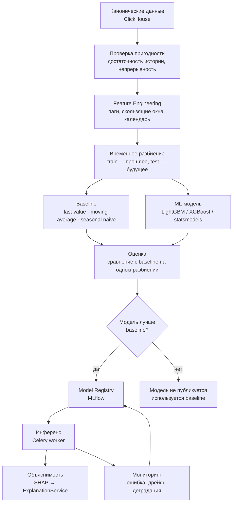
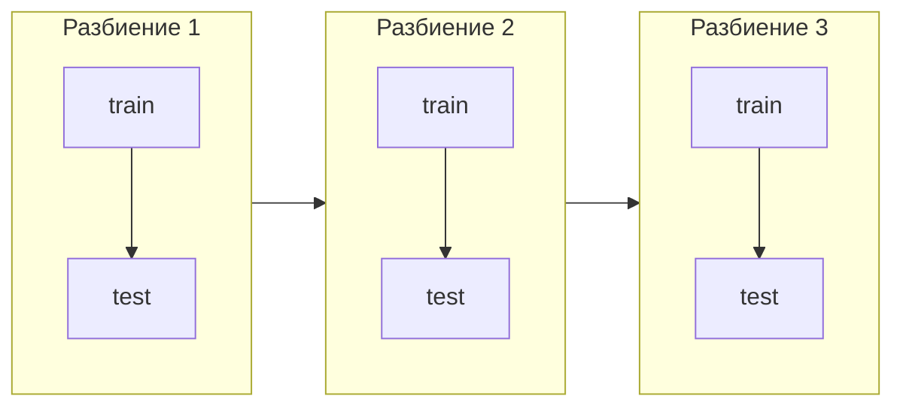

# ML_ARCHITECTURE — архитектура машинного обучения

> **Целевая переменная не выбрана.** До завершения Data Audit модель не проектируется и не обучается. Этот документ описывает метод, контракты и правила, по которым цель будет выбрана и модель будет принята. См. [ADR-0007](ADR/0007-data-audit-before-ml-target.md).

## 1. Роль ML в системе

ML в MedSignal решает три задачи и ни одной больше:

| Задача | Назначение |
|---|---|
| Прогнозирование | Оценить значение целевого показателя на горизонте |
| Обнаружение аномалий | Найти отклонения, не описываемые заранее заданным правилом |
| Объяснимость | Показать, какие факторы определили результат |

ML не принимает решений, не назначает severity сигнала напрямую и не является единственным источником сигналов. Он один из трёх источников Signal Engine и подчиняется правилу валидности из [BUSINESS_LOGIC.md](BUSINESS_LOGIC.md#62-правило-валидности).

## 2. Конвейер

## 3. Выбор целевой переменной

### 3.1 Критерии

Цель может быть выбрана только если выполнены все условия:

| Критерий | Проверка |
|---|---|
| Поля существуют | Подтверждено Data Audit, а не предположением |
| Ряд регулярен | Наблюдения с постоянным шагом, пропуски объяснимы |
| История достаточна | Не менее `FORECAST_MIN_HISTORY_DAYS` на организацию |
| Значение наблюдаемо постфактум | Иначе прогноз невозможно проверить |
| Задержка приемлема | Факт становится известен до истечения горизонта |
| Цель управляема | Изменение цели связано с управленческим действием |

Последний критерий часто упускают: прогнозировать имеет смысл то, на что можно повлиять. Прогноз величины, которой нельзя управлять, не порождает действия и не приносит пользы.

### 3.2 Кандидаты

| Цель | Условие реализуемости | Как проверяется постфактум |
|---|---|---|
| `incoming_flow(t+n)` — число направлений | Событие направления с датой и организацией | Прямой подсчёт за период |
| `queue_size(t+n)` — размер очереди | Регулярные снимки либо восстановимость из событий | Сравнение со снимком |
| `waiting_time(t+n)` — время ожидания | Дата постановки и дата госпитализации в одной записи | По завершённым случаям, с задержкой |

Решение фиксируется отдельным ADR после Data Audit и записывается в `FORECAST_TARGET`.

### 3.3 Что запрещено

Не выбирать целью величину, которую невозможно проверить на исторических данных. Не конструировать цель из производных показателей, содержащих будущую информацию. Не переопределять цель после того, как модель показала плохой результат, — это подгонка задачи под метод.

## 4. Feature Engineering

### 4.1 Группы признаков

| Группа | Примеры | Ограничение |
|---|---|---|
| Лаги цели | Значение 1, 7, 14 дней назад | Только прошлые значения |
| Скользящие статистики | Среднее, медиана, робастный разброс за окно | Окно закрывается до момента прогноза |
| Динамика | Прирост, темп изменения, направление тренда | Рассчитывается на закрытом окне |
| Сопутствующие потоки | Направления, выписки, отказы с лагами | Учитывается задержка поступления данных |
| Календарь | День недели, месяц, праздники, рабочие и выходные дни | Известны заранее |
| Характеристики организации | Тип, уровень, профиль, мощность | Меняются редко, фиксируются на момент наблюдения |
| Качество данных | Свежесть, полнота | Позволяет модели учитывать неопределённость входа |

### 4.2 Правило отсутствия утечки

Признак допустим, только если его значение было бы доступно в момент прогноза в реальной эксплуатации. Это строже, чем «не использовать будущее»: признак, рассчитанный по данным, которые физически поступают с задержкой в три дня, нельзя использовать так, как будто он доступен немедленно.

Каждый признак сопровождается объявленной задержкой доступности, и конвейер признаков её соблюдает. Нарушение этого правила даёт отличные метрики на валидации и бесполезную модель в эксплуатации.

Отдельно запрещены: нормализация по статистикам всей выборки до разбиения, заполнение пропусков значениями из будущего, отбор признаков по полному набору данных.

## 5. Разбиение и валидация

Случайное разбиение для временных рядов запрещено.

Применяется расширяющееся окно: обучение на прошлом, проверка на следующем отрезке, затем окно сдвигается вперёд. Между обучающей и тестовой частью выдерживается разрыв, равный горизонту прогноза, чтобы исключить перетекание информации.

Дополнительное правило для панельных данных: если модель обучается сразу по многим организациям, разбиение всё равно выполняется по времени, а не по организациям. Проверка обобщения на новые организации — отдельный эксперимент с отдельным разбиением.

## 6. Baseline

Baseline обязателен и рассчитывается всегда, до обучения ML-модели.

| Baseline | Описание | Когда силён |
|---|---|---|
| Last value | Значение переносится вперёд | Медленно меняющиеся ряды |
| Moving average | Среднее за окно | Шумные ряды без тренда |
| Seasonal naive | Значение из того же дня прошлой недели | Выраженная недельная сезонность |

Baseline — не формальность. В операционных медицинских рядах seasonal naive часто оказывается сильным конкурентом. Если ML-модель не превосходит его устойчиво на нескольких разбиениях, публикуется baseline, а не модель. Это честнее и дешевле в эксплуатации.

## 7. Модели

Порядок усложнения: baseline → регуляризованная линейная модель или statsmodels → градиентный бустинг. Переход к следующему уровню оправдан только измеренным приростом качества.

| Семейство | Применение | Замечание |
|---|---|---|
| statsmodels | Один ряд с выраженной сезонностью | Даёт интервалы неопределённости |
| LightGBM / XGBoost | Панель из многих организаций с признаками | Не экстраполирует тренд за пределы обучающих значений |
| scikit-learn | Линейные модели, компоненты конвейера | Прозрачны и служат сильным ориентиром |

Важное ограничение бустинга: он не экстраполирует. Если ряд имеет устойчивый растущий тренд, прогноз будет занижен. Решение — прогнозировать приращение или использовать декомпозицию тренда, а не игнорировать проблему.

## 8. Метрики

Метрика выбирается после фиксации цели, исходя из смысла ошибки.

| Метрика | Когда уместна | Ограничение |
|---|---|---|
| MAE | Значения одного порядка, ошибка интерпретируется в единицах цели | Не учитывает относительный масштаб |
| RMSE | Крупные ошибки критичны | Чувствительна к выбросам |
| WAPE | Сравнение организаций разного масштаба | Требует ненулевой суммы факта |
| MAPE | Только при заведомо ненулевых значениях | **Неприменима при нулях и малых значениях** |

Прямое требование: MAPE не используется по умолчанию. В очередях и отказах нули встречаются регулярно, и MAPE в этом случае либо не определена, либо даёт бессмысленно большие значения. Для сравнения организаций разного масштаба используется WAPE.

Обязательный набор отчёта по модели: метрика на каждом разбиении, та же метрика для каждого baseline, разброс между разбиениями, ошибка по горизонтам, ошибка по группам организаций.

## 9. Реестр моделей

MLflow хранит эксперименты и версии моделей. Артефакты — в MinIO.

Обязательные метаданные версии: цель, горизонт, версия набора признаков, период обучающих данных, схема разбиения, метрики модели и baseline, хеш кода обучения, ссылка на артефакт, автор запуска, момент обучения.

Публикация версии в активное использование — отдельный явный шаг. Модель не становится активной автоматически по факту лучшей метрики: требуется прохождение критериев приёмки и решение человека.

### 9.1 Критерии приёмки

| Критерий | Требование |
|---|---|
| Превосходство над baseline | Устойчиво на всех разбиениях, а не в среднем |
| Стабильность | Разброс метрики между разбиениями в допустимых пределах |
| Отсутствие утечки | Пройдена проверка доступности признаков во времени |
| Покрытие | Достаточная доля организаций с валидным прогнозом |
| Объяснимость | Факторы интерпретируемы в терминах предметной области |
| Воспроизводимость | Повторный запуск даёт тот же результат |

## 10. Инференс

Backend обращается к ML через порт `ForecastPort` и не импортирует код `ml` напрямую ([ADR-0005](ADR/0005-ml-separation.md)).

Способ выполнения зависит от характера операции, а не от архитектурного запрета ([ADR-0011](ADR/0011-forecast-port-sync-and-async.md)):

| Операция | Способ |
|---|---|
| Обучение модели | Только фоновый |
| Массовый прогноз по многим организациям | Только фоновый |
| Регулярный прогноз по расписанию | Только фоновый |
| Тяжёлое объяснение с пересчётом вкладов по выборке | Только фоновый |
| Единичный быстрый прогноз | Может быть синхронным при соблюдении бюджета времени ответа |

Синхронный путь обязан иметь жёсткий предел времени, мягкую деградацию при недоступности модели, отдельный лимит частоты и собственную метрику времени выполнения. Отказ модели не должен превращаться в отказ эндпоинта: прогноз дополняет карточку организации, а не определяет её отображение.

Контракт результата:

| Поле | Обязательность |
|---|---|
| `predicted_value` | Да |
| `horizon` | Да |
| `model_version` | Да |
| `uncertainty` | Да, где применимо |
| `error_metric` и `baseline_error_metric` | Да |
| `feature_contributions` | Да, для объяснения |
| `generated_at` | Да |
| `input_period` | Да |
| `assumptions` | Да |
| `is_valid` и `invalidity_reason` | Да |

Прогноз с `is_valid = false` сохраняется, но не участвует в Risk Score и не порождает `OVERLOAD_FORECAST`.

## 11. Объяснимость

SHAP применяется к древесным моделям. Его вывод — технический: десятки признаков вида «лаг цели 7 дней». Пользователю нужен другой уровень: «направления выросли на 14%».

`ExplanationService` выполняет переход: группирует признаки в показатели, суммирует вклады внутри группы, отбирает значимые, определяет направление влияния и формирует формулировку. Сырой SHAP в интерфейс не попадает.

Правило честности: при неустойчивом объяснении сервис сообщает об этом явно и не подставляет правдоподобный текст.

## 12. Обнаружение аномалий

На MVP предпочтение отдаётся статистическим методам, а не обучаемым: робастная оценка отклонения от собственной нормы организации с учётом сезонности. Причины две — интерпретируемость и работоспособность на коротких рядах.

Аномалия определяется относительно **собственной истории организации**, а не относительно других организаций. Крупная больница всегда будет «выбросом» на фоне малых, и такое сравнение порождает ложные сигналы.

Обучаемые методы вводятся позже, при подтверждённой нехватке статистического подхода.

## 13. Мониторинг моделей

| Наблюдение | Действие |
|---|---|
| Ошибка на свежих данных растёт | Пометить модель как деградирующую, запланировать переобучение |
| Распределение признаков сместилось | Зафиксировать дрейф, проверить причину — данные или реальность |
| Доля невалидных прогнозов растёт | Проверить качество данных |
| Модель давно не переобучалась | Предупреждение по `MODEL_STALENESS_WARNING_DAYS` |
| Ошибка инференса | Метрика ошибок, без падения основного сценария |

Важно отличать дрейф данных от изменения реальности. Смещение распределения может означать проблему в выгрузке, а может — реальное изменение потока. Система фиксирует факт, интерпретирует человек.

## 14. Ограничения метода

Ограничения перечисляются в интерфейсе рядом с прогнозом, а не прячутся в документации.

| Ограничение | Следствие для пользователя |
|---|---|
| Модель обобщает прошлое | Структурные изменения не предсказываются |
| Горизонт ограничен | Чем дальше, тем шире неопределённость |
| Качество ограничено качеством данных | При устаревших данных прогноз не строится |
| Короткая история | Часть организаций останется без прогноза |
| Бустинг не экстраполирует | Сильный тренд требует иной постановки |
| Корреляция не причинность | Факторы объяснения не являются доказанными причинами |

Последний пункт критичен для интерфейса: объяснение отвечает на вопрос «что повлияло на расчёт», а не «что вызвало ситуацию».

## 15. Что делает система при невозможности прогноза

Отсутствие прогноза — допустимый и правильный результат. Система обязана:

- сообщить, что прогноз не построен, и назвать причину;
- не заменять прогноз baseline без явной маркировки;
- продолжить работу правил и статистических сигналов;
- исключить прогнозный компонент из Risk Score с отражением в объяснении.

Система без прогноза остаётся полезной: мониторинг, правила и статистические сигналы работают независимо от ML.
