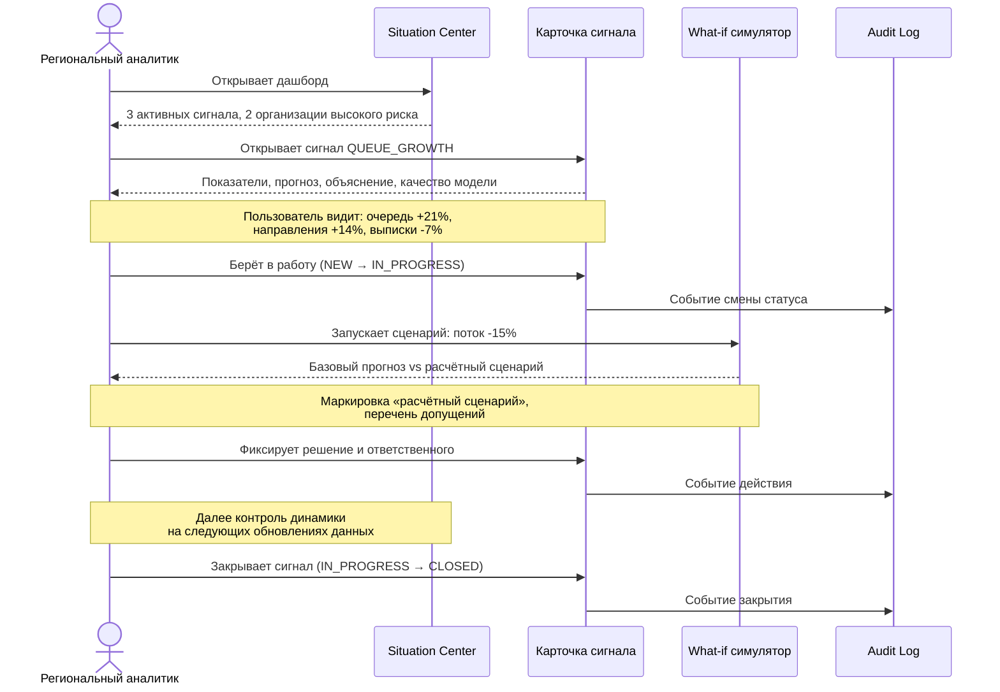

# PROJECT — продуктовое описание MedSignal

## 1. Постановка проблемы

Плановая госпитализация в регионе управляется на основе данных, которые физически находятся в разных информационных системах и приходят с разной периодичностью.

| Что происходит сейчас | Следствие |
|---|---|
| Направления, ожидающие, отказы и пролеченные случаи живут в разных ИС | Нет единой картины нагрузки |
| Сводка собирается вручную и с задержкой | Реакция наступает после того, как очередь уже выросла |
| Нет общей меры «напряжённости» организации | Сравнение больниц субъективно |
| Причина роста очереди не отделена от следствия | Управленческое действие выбирается наугад |
| Последствия решения не просчитываются заранее | Перераспределение потока может перегрузить принимающую организацию |

Проблема не в отсутствии данных, а в отсутствии **своевременной интерпретации** данных.

## 2. Продуктовое видение

MedSignal — система раннего предупреждения, которая непрерывно наблюдает за операционными показателями стационаров, обнаруживает признаки роста очереди и риска перегрузки, объясняет причину сигнала и позволяет проверить управленческий сценарий расчётом до его применения.

Три принципа:

**Раннее предупреждение важнее отчёта.** Ценность в том, чтобы увидеть проблему до её реализации, а не описать её после.

**Объяснение важнее точности.** Сигнал без причины не приводит к действию. Пользователь должен понимать, какие показатели вызвали тревогу и насколько модели можно доверять.

**Решение остаётся за человеком.** Система готовит расчёт, ответственность несёт уполномоченный сотрудник. Автоматических управленческих действий нет.

### Чем MedSignal не является

- Не медицинская информационная система и не электронная медкарта
- Не система принятия клинических решений
- Не система автоматического распределения пациентов
- Не замена региональному управлению здравоохранения

## 3. Пользователи и их задачи

### 3.1 Сотрудник регионального управления здравоохранения

Отвечает за нагрузку по региону в целом. Нужен обзор всех организаций, ранжирование по риску, возможность сравнить организации и просчитать перераспределение потока. Область видимости — закреплённые регионы.

**Ключевой вопрос:** «Где у меня завтра будет проблема и что я могу сделать сегодня?»

### 3.2 Руководитель медицинской организации

Отвечает за свою организацию. Нужны сигналы по ней, объяснение причин, история динамики и возможность зафиксировать принятое решение. Область видимости — свои организации.

**Ключевой вопрос:** «Почему по моей больнице сигнал и что от меня требуется?»

### 3.3 Аналитик медицинской организации

Разбирает показатели вглубь, проверяет корректность данных, готовит обоснование для руководителя. Нужны исторические ряды, детализация метрик, качество данных, качество модели. Прав на изменение статуса сигнала не имеет.

**Ключевой вопрос:** «Сигнал реален или это артефакт данных?»

### 3.4 Координатор плановой госпитализации

Работает с очередью и направлениями в операционном режиме. Нужен список организаций с растущей очередью и результат симуляции перераспределения.

**Ключевой вопрос:** «Куда можно направить поток без создания новой проблемы?»

### 3.5 Системный администратор

Управляет пользователями, ролями, областями данных, импортами и конфигурацией правил. Доступа к смысловой интерпретации не требует, но отвечает за корректность настроек.

**Ключевой вопрос:** «Кто и что видит, и всё ли загрузилось?»

## 4. Пользовательские сценарии

### 4.1 Основной сценарий: от сигнала до контроля

### 4.2 Сценарий: загрузка новой выгрузки

Администратор загружает файл выгрузки. Система принимает файл, ставит фоновую задачу и немедленно возвращает идентификатор импорта. Воркер профилирует файл, проверяет по контракту набора данных, псевдонимизирует, очищает, загружает в ClickHouse и формирует отчёт о качестве. Администратор видит статус импорта, количество принятых и отклонённых строк и перечень проблем. Если обнаружены прямые персональные идентификаторы, импорт останавливается со строгой ошибкой.

### 4.3 Сценарий: проверка достоверности сигнала

Аналитик получает сигнал, открывает карточку, смотрит блок качества данных и качества модели. Если сигнал вызван устаревшими данными, он видит это явно: тип `DATA_STALE` отделён от содержательных сигналов. Если модель показывает ошибку выше baseline, прогнозный блок помечается как ненадёжный, и сигнал типа `OVERLOAD_FORECAST` не формируется.

### 4.4 Сценарий: перераспределение потока между организациями

Координатор выбирает организацию-источник и организацию-приёмник, задаёт долю переносимого потока. Система рассчитывает последствия **для обеих** организаций и показывает два сравнения. Сценарий недоступен, если организации несопоставимы по профилю, — об этом сообщается явно, а не скрывается.

## 5. Состав MVP

| № | Возможность | Фаза |
|---|---|---|
| 1 | Загрузка исторических данных | 3 |
| 2 | Валидация данных | 3 |
| 3 | Мониторинг качества данных | 3 |
| 4 | Просмотр регионов | 2, 4 |
| 5 | Просмотр медицинских организаций | 2, 4 |
| 6 | Аналитика очередей | 4 |
| 7 | Аналитика направлений | 4 |
| 8 | Аналитика отказов | 4 |
| 9 | Аналитика пролеченных случаев | 4 |
| 10 | Историческая динамика показателей | 4 |
| 11 | Прогноз очереди или входящего потока | 5 |
| 12 | Risk detection | 5, 6 |
| 13 | Anomaly detection | 5, 6 |
| 14 | Signal Engine | 6 |
| 15 | Лента предупреждений | 6 |
| 16 | Карточка ситуации | 6 |
| 17 | Объяснимость | 5, 6 |
| 18 | Risk Score | 6 |
| 19 | What-if симулятор | 7 |
| 20 | Сценарий изменения входящего потока | 7 |
| 21 | Сравнение базового и расчётного прогноза | 7 |
| 22 | Статусы сигналов NEW / IN_PROGRESS / CLOSED | 2, 6 |
| 23 | Назначение ответственного | 2, 6 |
| 24 | Audit Log | 2, 8 |
| 25 | RBAC | 2, 8 |
| 26 | Situation Center | 4 |

## 6. За пределами MVP

Каждый пункт исключён по конкретной причине, а не «на потом». Архитектура оставляет точку расширения.

| Возможность | Причина исключения | Точка расширения |
|---|---|---|
| Прогноз индивидуальной даты выписки | Требует клинических данных пациента, которых нет в согласованном контуре | Отдельный домен `clinical`, изолированный контур данных |
| Медицинские диагнозы | Вне назначения системы, требует регуляторной оценки | Не планируется |
| Рекомендации пациентам | Система обращена к управленцу, не к пациенту | Не планируется |
| Прогноз освобождения конкретной койки | Требует коечного фонда в реальном времени | Новая сущность `BedState`, новый источник |
| Эпидемиологическое прогнозирование | Требует внешних эпидданных и иной методологии | Отдельный модуль прогнозирования |
| Финансовый эффект | Требует тарифной модели и данных оплаты | Новый домен `economics` поверх сценариев |
| Автоматическое перенаправление пациентов | Нарушает принцип human-in-the-loop | Только как исполнение уже утверждённого решения человека |
| Автоматическое принятие управленческих решений | Неприемлемо в медицинском контексте | Не планируется |

## 7. Метрики успеха MVP

Успех MVP измеряется не точностью модели, а прохождением полного цикла.

| Метрика | Проверка |
|---|---|
| Воспроизводимость запуска | Другой разработчик поднимает систему по README |
| Прозрачность прогноза | Каждый прогноз показывает горизонт, версию модели, ошибку и период данных |
| Превосходство над baseline | ML-модель сравнивается с naive-baseline на одном и том же временном разбиении |
| Действенность сигнала | Сигнал содержит объяснение, достаточное для выбора действия |
| Прослеживаемость | Любая смена статуса и действие восстанавливаются из Audit Log |
| Изоляция данных | Пользователь не видит данные вне своей области |

## 8. Ограничения и допущения

### 8.1 Ограничения данных

**Структура выгрузок не подтверждена.** На момент PHASE 0 реальные поля ИС БГ, ЭРСБ и ЕИП не изучены. Поэтому целевая переменная модели не зафиксирована: система построена вокруг контрактов наборов данных, а конкретная цель выбирается после Data Audit (см. [ADR-0007](ADR/0007-data-audit-before-ml-target.md)).

**Глубина истории неизвестна.** Прогнозирование временных рядов требует достаточной истории. Если её нет, корректное поведение — отказ от прогноза с явным сообщением, а не выдача числа.

**Сопоставимость организаций не гарантирована.** Больницы различаются профилем и мощностью. Прямое сравнение абсолютных значений может вводить в заблуждение, поэтому нормализация показателей — обязательная часть аналитики.

### 8.2 Ограничения метода

Модель улавливает закономерности прошлого. Структурные изменения — новые правила маршрутизации, открытие отделения, изменение порядка направления — модель не предсказывает и предсказывать не должна. Это фиксируется в допущениях прогноза.

What-if симуляция не является экспериментом. Она показывает, как изменился бы расчёт при иных входных данных, при перечисленных допущениях. Сценарий не гарантирует результат.

### 8.3 Ограничения по персональным данным

Система проектируется под принцип минимизации: ИИН, ФИО, телефон, адрес и прочие прямые идентификаторы не хранятся, если не требуются задаче. На текущем понимании задачи они не требуются ни для одной возможности MVP. Псевдонимизация выполняется на входе конвейера, до попадания данных в аналитическое хранилище.

## 9. Связанные документы

- Архитектура: [ARCHITECTURE.md](ARCHITECTURE.md)
- Бизнес-правила: [BUSINESS_LOGIC.md](BUSINESS_LOGIC.md)
- Работа с данными: [DATA_ARCHITECTURE.md](DATA_ARCHITECTURE.md)
- Машинное обучение: [ML_ARCHITECTURE.md](ML_ARCHITECTURE.md)
- Безопасность: [SECURITY.md](SECURITY.md)
- План развития: [ROADMAP.md](ROADMAP.md)
