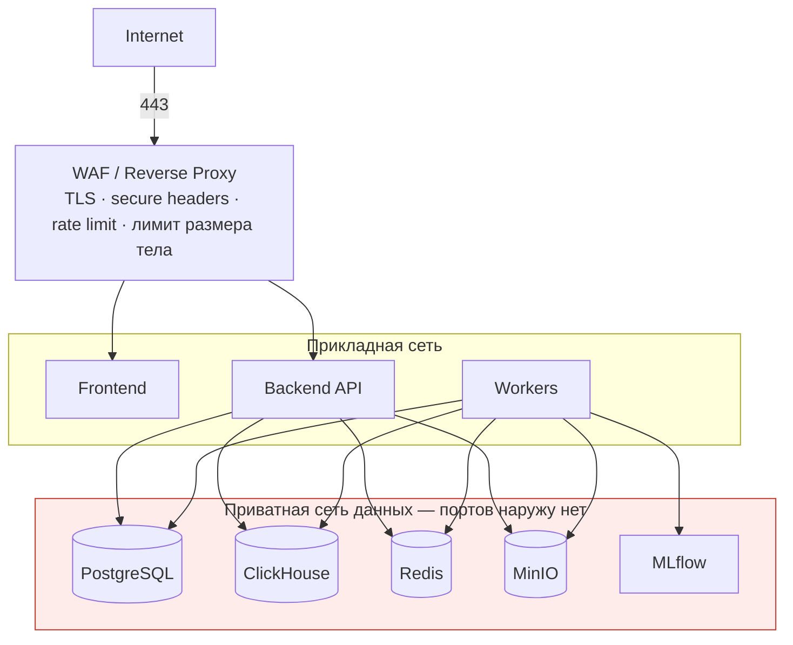
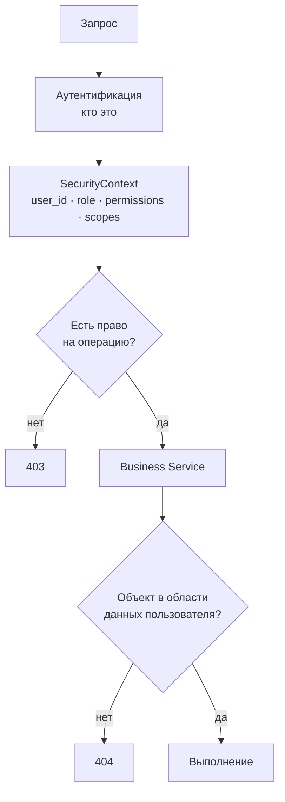

# SECURITY — архитектура безопасности

MedSignal работает в чувствительном контексте здравоохранения. Безопасность закладывается в архитектуру с первого дня, а не добавляется на PHASE 8. Отдельная фаза нужна для проверки и усиления, а не для первоначальной реализации.

Phase 8 фактически проверил signed tokens для GLOBAL/REGION/HOSPITAL, 404 IDOR,
единственный public nginx port, закрытый public `/metrics`, security headers,
отсутствие token/header/raw identifier patterns в application logs и
privacy-at-rest в ClickHouse.

Gitleaks 8.30.1 проверил Git history и 537 release-candidate files. Узкий
allowlist содержит только точные synthetic test fixtures. Trivy 0.58.2 не
обнаружил CRITICAL и fixable HIGH; unfixed HIGH зафиксированы в
[acceptance report](PHASE_8_ACCEPTANCE.md) и требуют periodic rescan.

Application images работают non-root. Vendor defaults: nginx master остаётся
root, workers непривилегированны; MinIO в проверенной конфигурации работает
root и требует vendor-supported hardening. Небезопасный override не применялся.
TLS/DNS/firewall/VPN и corporate SSO остаются внешними зависимостями.

## 1. Модель угроз

### 1.1 Защищаемые активы

| Актив | Почему ценен | Основная угроза |
|---|---|---|
| Операционные показатели организаций | Отражают состояние системы здравоохранения региона | Несанкционированный доступ, искажение |
| Область данных пользователей | Определяет границу видимости | Обход ограничения, повышение привилегий |
| Журнал аудита | Основа прослеживаемости решений | Подделка, удаление |
| Учётные данные и токены | Доступ ко всему остальному | Кража, повторное использование |
| Артефакты моделей | Определяют поведение системы | Подмена модели |
| Загруженные выгрузки | Могут содержать персональные данные до очистки | Утечка landing-слоя |
| Конфигурация правил и весов | Определяет, какие сигналы возникают | Скрытое изменение поведения |

### 1.2 Модель нарушителя

| Нарушитель | Возможности | Основной контроль |
|---|---|---|
| Внешний анонимный | Доступ к публичному адресу | TLS, ограничение частоты, аутентификация, закрытый периметр данных |
| Аутентифицированный пользователь с ограниченной областью | Валидный токен, знание API | Применение области данных в бизнес-слое, `404` вместо `403` |
| Пользователь, пытающийся повысить права | Понимание ролевой модели | Проверка прав на сервере, аудит |
| Скомпрометированный компонент приложения | Доступ к внутренней сети | Сегментация, минимальные права БД, отдельные учётные записи сервисов |
| Инсайдер с правами администратора | Управление пользователями и конфигурацией | Аудит действий администратора, версионирование конфигурации |
| Злонамеренная выгрузка данных | Загрузка вредоносного файла | Проверка типа по содержимому, ограничение размера, разбор в изолированном воркере |

### 1.3 Анализ по STRIDE

| Категория | Риск | Контроль |
|---|---|---|
| Spoofing | Подделка личности | Подписанные токены, проверка подписи и срока, короткий срок жизни |
| Tampering | Изменение данных или журнала | Отсутствие прав на изменение аудита, контрольные суммы файлов, версионирование конфигурации |
| Repudiation | Отрицание действия | Полный журнал с `request_id`, актором и состояниями до и после |
| Information Disclosure | Утечка за пределы области данных | Применение scope в бизнес-слое, схемы ответа, сообщения об ошибках без деталей |
| Denial of Service | Перегрузка запросами или импортом | Ограничение частоты, размера тела, времени выполнения запросов, очередь для тяжёлых задач |
| Elevation of Privilege | Получение чужих прав | Проверка прав на сервере, отсутствие доверия к клиенту, разделение ролей БД |

## 2. Сетевая архитектура



Правила сегментации:

| Правило | Реализация |
|---|---|
| Публичен только обратный прокси | Публикуются только порты 80 и 443 |
| Хранилища недоступны извне | Отдельная docker-сеть без публикации портов |
| MLflow недоступен извне | Внутренняя сеть; доступ администратора через защищённый канал |
| Консоль MinIO недоступна извне | Публикуется только в локальной разработке |
| `/metrics` недоступен извне | Запрет на уровне обратного прокси |
| Frontend не обращается к БД | Только через `/api/v1` |

В локальной разработке часть портов публикуется для удобства. Конфигурация production отличается и не наследует эти публикации — это отдельный набор файлов, а не переключатель.

## 3. Аутентификация

Аутентификацию выполняет исключительно внешний провайдер OIDC — Keycloak. MedSignal не хранит пароли, не выпускает токены и не управляет сессиями провайдера ([ADR-0009](ADR/0009-keycloak-oidc-authentication.md)).

```
Браузер → Keycloak → Frontend (Bearer) → FastAPI → SecurityContext
```

| Аспект | Решение |
|---|---|
| Формат | Подписанный JWT, выпущенный Keycloak |
| Проверка | Подпись по JWKS, издатель, аудитория, срок действия — все четыре |
| Ключи | Загружаются по внутреннему адресу провайдера и кэшируются с ограниченным сроком |
| Алгоритмы | Явный список разрешённых; `none` и симметричные алгоритмы отклоняются |
| Роли | Из claim'ов токена, отображаются на роли системы |
| Пароли | В MedSignal не хранятся ни в каком виде |
| Хранение на клиенте | В памяти приложения, без записи в localStorage |
| Локальная таблица пользователей | Проекция: идентификатор субъекта, отображаемое имя, область данных. Учётных данных не содержит |

**Раздельные адреса провайдера.** Токен содержит издателя в том виде, в каком его видит браузер, а backend обращается к провайдеру по внутреннему имени сети. Поэтому `OIDC_ISSUER` используется для сверки claim `iss`, а `OIDC_INTERNAL_BASE_URL` — для загрузки ключей. Смешение этих адресов даёт либо неработающую проверку, либо приём токена с чужим издателем.

**Область данных не берётся из токена.** Роли приходят от провайдера, область разрешается на стороне MedSignal по `user_data_scopes` при каждом запросе. Причина: изменение области администратором должно действовать немедленно, а не после перевыпуска токена.

**Подставной адаптер для тестов.** Допускается адаптер, реализующий тот же интерфейс проверки, чтобы тесты не требовали работающего Keycloak. Он включается только явной переменной окружения, приложение отказывается стартовать с ним вне тестовой среды, и он никогда не срабатывает как запасной вариант при недоступности провайдера.

## 4. Авторизация

Двухуровневая модель: право на операцию и область данных.



Два разных вопроса решаются в двух разных местах. «Может ли эта роль менять статус сигнала» — вопрос права, проверяется до вызова сервиса. «Относится ли этот сигнал к организации, доступной пользователю» — вопрос области данных, проверяется внутри сервиса, где известен объект.

Ответ `404` для объекта вне области данных выбран сознательно: `403` подтверждает существование объекта.

## 5. Матрица ролей и прав

| Право | ADMIN | HEALTH_AUTHORITY | REGIONAL_ANALYST | HOSPITAL_MANAGER | HOSPITAL_ANALYST |
|---|:--:|:--:|:--:|:--:|:--:|
| Просмотр дашборда | ✔ | ✔ | ✔ | ✔ | ✔ |
| Просмотр регионов | ✔ | ✔ | ✔ | — | — |
| Просмотр организаций | ✔ | ✔ | ✔ | ✔ | ✔ |
| Просмотр метрик и истории | ✔ | ✔ | ✔ | ✔ | ✔ |
| Просмотр прогнозов | ✔ | ✔ | ✔ | ✔ | ✔ |
| Просмотр сигналов | ✔ | ✔ | ✔ | ✔ | ✔ |
| Взять сигнал в работу | ✔ | ✔ | ✔ | ✔ | — |
| Закрыть сигнал | ✔ | ✔ | ✔ | ✔ | — |
| Назначить ответственного | ✔ | ✔ | ✔ | ✔ | — |
| Preview/save Scenario в разрешённом scope | ✔ | ✔ | ✔ | ✔ | ✔ |
| Зафиксировать решение | ✔ | ✔ | ✔ | ✔ | — |
| Импорт данных | ✔ | ✔ | — | — | — |
| Просмотр журнала аудита | ✔ | ✔ | Своя область | Своя область | — |
| Управление пользователями | ✔ | — | — | — | — |
| Изменение конфигурации правил | ✔ | — | — | — | — |
| Управление моделями | ✔ | — | — | — | — |

Матрица выше описывает намерение. Реализация выражает её через права, а не через сравнение с ролью: код проверяет разрешение, а сопоставление ролей и разрешений задано в одном месте (`backend/app/security/permissions.py`).

| Разрешение | ADMIN | HEALTH_AUTHORITY | REGIONAL_ANALYST | HOSPITAL_MANAGER | HOSPITAL_ANALYST |
|---|:--:|:--:|:--:|:--:|:--:|
| `region.read` | ✔ | ✔ | ✔ | — | — |
| `hospital.read` | ✔ | ✔ | ✔ | ✔ | ✔ |
| `signal.read` | ✔ | ✔ | ✔ | ✔ | ✔ |
| `signal.update_status` | ✔ | ✔ | ✔ | ✔ | — |
| `signal.assign` | ✔ | ✔ | ✔ | ✔ | — |
| `incident.read` | ✔ | ✔ | ✔ | ✔ | ✔ |
| `incident.manage` | ✔ | ✔ | ✔ | ✔ | — |
| `action.create` | ✔ | ✔ | ✔ | ✔ | — |
| `forecast.read` | ✔ | ✔ | ✔ | ✔ | ✔ |
| `scenario.read` | ✔ | ✔ | ✔ | ✔ | ✔ |
| `scenario.create` | ✔ | ✔ | ✔ | ✔ | ✔ |
| `data_import.create` | ✔ | ✔ | — | — | — |
| `data_import.read` | ✔ | ✔ | — | — | — |

Загрузка данных не открыта через HTTP. Она читает файлы с диска сервера,
и приём пути в теле запроса означал бы чтение произвольного файла от
имени приложения. Импорт запускается командой `python -m app.cli.data`;
через API доступен только просмотр истории поставок и отчётов о качестве.
Приём файлов от пользователя, когда он появится, будет работать через
объектное хранилище, а не через путь в запросе.
| `audit.read` | ✔ | ✔ | ✔ | ✔ | — |
| `admin.manage` | ✔ | — | — | — | — |

Разделение аналитика и руководителя видно здесь прямо: аналитик организации не имеет ни одного права на изменение. Это ограничение держится правами, а не оформлением интерфейса.

Область данных по умолчанию:

| Роль | Область |
|---|---|
| `ADMIN` | Вся система |
| `HEALTH_AUTHORITY` | Назначенные регионы |
| `REGIONAL_ANALYST` | Назначенные регионы |
| `HOSPITAL_MANAGER` | Назначенные организации |
| `HOSPITAL_ANALYST` | Назначенные организации |

### 5.1 GLOBAL Signals

Phase 6 не создаёт фиктивные Hospital для агрегированных реальных данных.
`scope_type=GLOBAL` является отдельной областью и доступен только
`SecurityContext` с фактически разрешённым global scope. Региональные и
организационные пользователи не получают GLOBAL Signal ни в списках, ни по ID;
object lookup возвращает `404`. Роль сама по себе не повышает scope: кроме
ADMIN, область берётся из `user_data_scopes`.

Разделение аналитика и руководителя намеренное: аналитик исследует и объясняет, решение фиксирует руководитель. Это отражает реальное распределение ответственности и обеспечивается правами, а не инструкцией.

## 6. Защита от типовых атак

| Угроза | Контроль |
|---|---|
| SQL-инъекция | Только параметризованные запросы через SQLAlchemy и драйвер ClickHouse; конкатенация SQL из пользовательского ввода запрещена и проверяется линтером |
| XSS | React экранирует по умолчанию; `dangerouslySetInnerHTML` запрещён; заголовок Content-Security-Policy |
| CSRF | Токен в заголовке `Authorization` вместо cookie для API; при переходе на cookie — `SameSite=Strict` и CSRF-токен для изменяющих операций |
| Небезопасное перенаправление | Белый список адресов перенаправления |
| Массовое присвоение полей | Явные Pydantic-схемы входа; приём произвольных полей запрещён |
| Утечка через ответ | Явные схемы ответа; модели SQLAlchemy не сериализуются напрямую |
| Обход авторизации по идентификатору | Область данных применяется к каждому запросу объекта |
| Загрузка вредоносного файла | Проверка типа по содержимому, ограничение размера, разбор в воркере, отсутствие исполнения |
| Отказ в обслуживании | Ограничение частоты, размера тела, времени выполнения запроса, отдельные очереди |
| Перечисление объектов | `404` вне области данных, ограничение частоты |
| Логирование чувствительных данных | Фильтр логгера по списку полей |

### 6.1 Заголовки безопасности

Устанавливаются на обратном прокси и проверяются тестом безопасности:

| Заголовок | Значение |
|---|---|
| `Strict-Transport-Security` | Пока не включён: требуется реальный HTTPS на внешнем периметре |
| `Content-Security-Policy` | Пока не включён: требует проверки Next.js и OIDC flow |
| `X-Content-Type-Options` | `nosniff` |
| `X-Frame-Options` | `DENY` |
| `Referrer-Policy` | `strict-origin-when-cross-origin` |
| `Permissions-Policy` | Отключение неиспользуемых возможностей браузера |

На edge Nginx `limit_req` возвращает `429` с `Retry-After`, JSON-контрактом
и `X-Request-ID`; заголовки безопасности повторяются и на этом ответе.
Локальные бюджеты по IP: обычный API и аналитика по 20 r/s с отдельными
burst 40, Keycloak 5 r/s burst 20, импорт 5 r/s burst 5. Они не являются
медицинскими нормативами или production SLA. За внешним WAF/LB адрес клиента
нужно разрешать только через заранее утверждённые trusted proxy CIDR;
произвольный `X-Forwarded-For` не даёт права изменить identity клиента.

### 6.2 CORS

Явный белый список источников из `CORS_ALLOWED_ORIGINS`. Значение `*` запрещено во всех средах, кроме локальной разработки. Разрешаются только используемые методы и заголовки.

## 7. Секреты

| Правило | Реализация |
|---|---|
| Секретов нет в репозитории | `.env` в `.gitignore`, только `.env.example` с заглушками |
| Секреты передаются через окружение | Переменные окружения контейнера |
| В production — внешнее хранилище | Docker/Kubernetes secrets или secret manager, не файл на диске |
| Секреты не попадают в логи | Фильтр логгера, запрет вывода конфигурации целиком |
| Секреты не попадают в сообщения об ошибках | Обработчик ошибок не раскрывает конфигурацию |
| Ротация возможна без пересборки | Значения читаются при старте, перезапуск достаточен |
| Проверка утечек в CI | Сканирование репозитория на секреты при каждом изменении |

Отдельно: `PSEUDONYM_SALT` имеет повышенную критичность. Её компрометация делает возможным сопоставление псевдонимов с исходными идентификаторами; её потеря делает невозможным связывание новых выгрузок со старыми.

## 8. Защита данных

### 8.1 Минимизация

Система не хранит ИИН, ФИО, телефон, адрес и иные прямые идентификаторы. Ни одна возможность MVP их не требует. Если выгрузка содержит такие поля, конвейер удаляет их на входе; при `PII_STRICT_MODE=true` импорт останавливается, чтобы проблема была исправлена на стороне источника.

### 8.2 Псевдонимизация

Технические идентификаторы, необходимые для связывания записей, заменяются устойчивыми псевдонимами на основе ключевой хеш-функции с секретной солью. Обратное преобразование в системе не реализовано.

### 8.3 Шифрование

| Канал | Защита |
|---|---|
| Пользователь — система | TLS |
| Внутри приватной сети | Изоляция сети; TLS для PostgreSQL и ClickHouse в production |
| Данные на диске | Шифрование тома на уровне инфраструктуры |
| Объектное хранилище | TLS при `MINIO_SECURE=true`, шифрование на стороне сервера |
| Резервные копии | Шифрование и отдельный контроль доступа |

### 8.4 Хранение и удаление

Landing-слой с исходными файлами хранится ограниченное время и удаляется по регламенту. Отчёты об отклонённых строках не содержат прямых идентификаторов. Регламент сроков согласуется с владельцами источников до работы с реальными данными.

## 9. Аудит и логирование

### 9.1 Что фиксируется в аудите

Вход и выход из системы, неудачные попытки входа, просмотр журнала аудита, смена статуса сигнала, назначение ответственного, фиксация решения, запуск симуляции, импорт данных, изменение пользователя, роли или области данных, изменение конфигурации правил и весов, публикация версии модели.

Запись содержит: момент, актора, роль, действие, тип и идентификатор объекта, состояние до и после, адрес источника, `request_id`.

### 9.2 Правила логирования

| Правило | Обоснование |
|---|---|
| Логи структурированные, в JSON | Пригодность для машинной обработки и Loki |
| Каждая запись содержит `request_id` | Восстановление полного пути операции |
| Персональные и медицинские данные не логируются | Минимизация |
| Токены, пароли, ключи не логируются | Фильтр по списку полей |
| Уровень `DEBUG` запрещён вне локальной среды | Риск избыточного раскрытия |
| Ошибки логируются полностью, пользователю отдаётся краткое сообщение | Диагностируемость без раскрытия устройства |

## 10. Безопасность цепочки поставки

| Контроль | Реализация |
|---|---|
| Фиксация версий зависимостей | Файлы блокировки для Python и Node |
| Сканирование уязвимостей | Проверка зависимостей в CI |
| Сканирование образов | Анализ контейнеров перед публикацией |
| Статический анализ | Линтеры безопасности для Python и TypeScript |
| Поиск секретов | Сканирование при каждом изменении |
| Базовые образы | Официальные, минимальные, с фиксированной версией |
| Непривилегированный пользователь | Контейнеры не работают от root |
| Только чтение файловой системы | Где возможно, с явными томами для записи |
| Ограничение ресурсов | Лимиты CPU и памяти для контейнеров |

### 10.1 Исключения по непривилегированному запуску

Собственные образы проекта работают от непривилегированного пользователя. Часть сторонних образов использует настройки поставщика; они зафиксированы здесь как осознанные исключения, а не как недосмотр.

| Контейнер | Владелец процессов | Статус |
|---|---|---|
| `backend`, `worker` | uid 1001 `medsignal` | Собственный образ, непривилегированный |
| `frontend` | uid 1000 `node` | Собственный образ, непривилегированный |
| `mlflow` | uid 1001 `mlflow` | Собственный образ, непривилегированный |
| `keycloak` | uid 1000 | Настройка поставщика, непривилегированный |
| `postgres` | uid 70 | Сбрасывает права после инициализации |
| `clickhouse` | uid 101 | Сбрасывает права после инициализации |
| `redis` | uid 999 | Сбрасывает права после инициализации |
| `nginx` | root у мастера, непривилегированный у рабочих | **Исключение** |
| `minio` | root | **Исключение** |

**Nginx.** Мастер-процесс работает от root, поскольку связывается с портом 80; рабочие процессы, обрабатывающие запросы, привилегий не имеют. Это штатная модель образа. Устранение потребовало бы либо непривилегированного образа с портом выше 1024, либо разрешения `CAP_NET_BIND_SERVICE`. В целевой схеме эксплуатации внешний трафик принимает балансировщик, а не этот контейнер.

**MinIO.** Работает от root по умолчанию поставщика. Запуск от заданного пользователя требует, чтобы том данных принадлежал тому же идентификатору, то есть дополнительного шага смены владельца при создании тома. Обходной приём ради формального соответствия здесь не применяется. MinIO присутствует только в локальном окружении: в эксплуатации его заменяет управляемое объектное хранилище ([DEPLOYMENT.md](DEPLOYMENT.md#31-целевая-схема)), и исключение исчезает вместе с контейнером.

Оба контейнера находятся в сети без публикации портов наружу, поэтому влияние исключения ограничено уже скомпрометированным хостом.

## 11. Безопасное развёртывание

| Требование | Проверка |
|---|---|
| `APP_DEBUG=false` вне локальной среды | Проверка конфигурации при старте, отказ запуска при нарушении |
| Значения по умолчанию заменены | Отказ запуска при обнаружении заглушек из `.env.example` |
| TLS настроен | Проверка готовности |
| Порты хранилищ не опубликованы | Проверка конфигурации развёртывания |
| Миграции применены | Проверка готовности |
| Роли БД разделены | Проверка при развёртывании |

Отказ запуска при небезопасной конфигурации — сознательное решение. Приложение, молча стартовавшее с заглушкой вместо секрета, опаснее приложения, которое не стартовало.

## 12. Реагирование на инциденты

| Шаг | Действие |
|---|---|
| Обнаружение | Мониторинг ошибок аутентификации, всплесков `403` и `429`, аномалий в аудите |
| Локализация | Восстановление цепочки по `request_id` и журналу аудита |
| Сдерживание | Отзыв токенов, блокировка учётной записи, ограничение доступа |
| Устранение | Ротация секретов, исправление, обновление зависимостей |
| Восстановление | Проверка целостности данных, повторный импорт при необходимости |
| Разбор | Фиксация причины и изменение процесса |

Готовность к реагированию требует двух вещей на уровне архитектуры: сквозного `request_id` и неизменяемого журнала аудита. Оба заложены с PHASE 1.

## 13. Контрольный список безопасности MVP

| № | Проверка | Фаза |
|---|---|---|
| 1 | Секретов нет в репозитории, есть только `.env.example` | 0 |
| 2 | Хранилища не публикуются наружу | 1 |
| 3 | Структурированные логи с `request_id`, без чувствительных данных | 1 |
| 4 | Приложение отказывается стартовать с небезопасной конфигурацией | 1 |
| 5 | Роли БД разделены, аудит только на вставку | 2 |
| 6 | Область данных применяется в бизнес-слое | 2 |
| 7 | Журнал аудита неизменяем | 2 |
| 8 | Персональные идентификаторы отсекаются на входе конвейера | 3 |
| 9 | Загрузка файлов ограничена по типу, размеру и частоте | 3 |
| 10 | Все списки постраничные, запросы ограничены по времени | 4 |
| 11 | Роли и права проверяются на сервере | 8 |
| 12 | Ограничение частоты запросов включено | 8 |
| 13 | Заголовки безопасности установлены | 8 |
| 14 | CORS — белый список без `*` | 8 |
| 15 | Сканирование зависимостей и образов в CI | 8 |
| 16 | Тесты RBAC и области данных проходят | 9 |
| 17 | Проведён отдельный обзор безопасности | 8, 9 |
