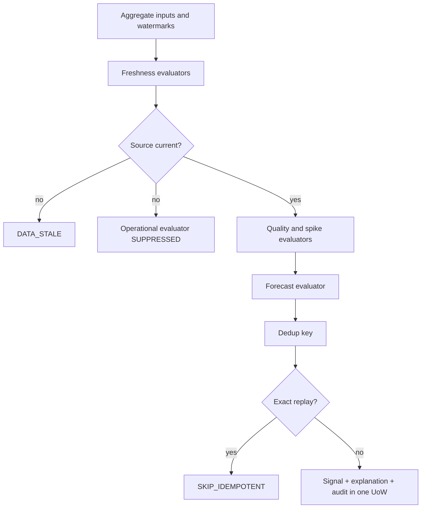
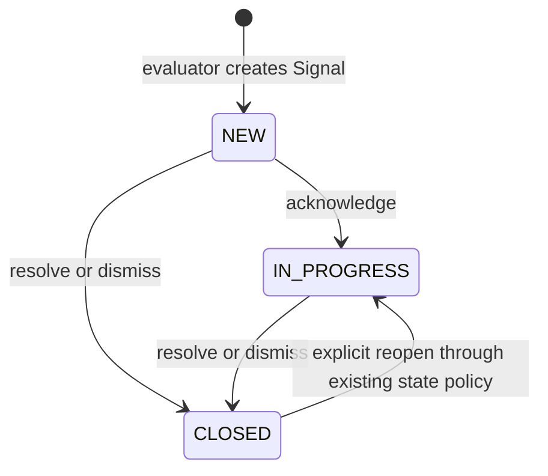

# Signal Engine — Phase 6

Signal Engine transforms validated aggregate evidence into reviewable Signals.
It does not make a medical or managerial decision. A person acknowledges,
resolves or dismisses each Signal and may create an Incident.

## Evaluation order



Each evaluator returns one of `FIRED`, `NO_SIGNAL`, `SUPPRESSED`,
`INSUFFICIENT_DATA` or `FAILED`. One evaluator failure does not erase the
results of the others.

## Initial analytical policy

| Setting | Initial value |
|---|---:|
| Referrals max age | 72 hours |
| Refusals max age | 72 hours |
| Waiting max age | 168 hours |
| Treated max age | disabled: reporting period not confirmed |
| Evaluation window | 7 complete days |
| Reference windows | 8 non-overlapping windows |
| Warning / high / critical | 20% / 35% / 50% |
| Quality warning / high / critical | 1% / 5% / 10% |

These are configurable initial analytical-policy values. They are not medical
standards or an operational SLA. Every Signal persists the full policy snapshot
and `rule_version` used to create it.

## Evaluators

- `DATA_STALE`: event timestamp is older than the configured maximum age.
- `DATA_QUALITY_DEGRADED`: only when numerator and eligible denominator are
  explicitly available. Existing chronology findings without their rule-level
  denominator are `INSUFFICIENT_DATA`.
- `REFERRAL_SPIKE` and `REFUSAL_SPIKE`: compare the sum of the last 7 complete
  days with the median sum of 8 preceding windows. Sixty-three complete days
  are required. There is no leakage between evaluation and reference periods.
- `FORECAST_INFLOW_GROWTH`: only a `VALID`, non-stale Forecast may fire. A
  statistical baseline produces a `STATISTICAL` source; a future selected ML
  model would produce `ML_BASED`.

`BASELINE_DEVIATION` is deliberately absent because it duplicates the spike
rules. `WAITING_AGE_SPIKE` is unavailable until real historical queue snapshots
exist.

## Scope and security

Current real evaluations are `GLOBAL`: organization mappings cannot support a
truthful hospital scope. No placeholder Hospital is created. Repository scope
predicates expose global Signals only to a global `SecurityContext`; restricted
users receive `404` for object access.

## Human workflow



`resolve` stores disposition `RESOLVED`; `dismiss` stores `DISMISSED`. Every
transition creates an Action and AuditEvent transactionally. Incident creation
is explicit and human-triggered; it copies the Signal scope and links the Signal
using optimistic concurrency.

## Running

```bash
python -m app.cli.signals evaluate
```

The Celery task is named `signals.evaluate`. Both CLI and task create a
persistent `SystemOperation`; Redis transports work but is not the source of
truth for execution status.
