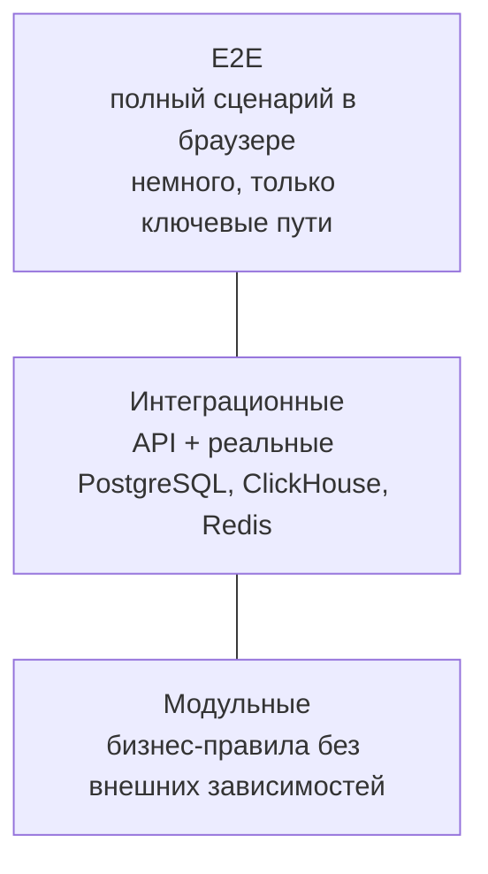

# TESTING — стратегия тестирования

## 1. Принцип

Тесты пишутся для критических бизнес-сценариев, а не ради процента покрытия. Покрытие — следствие осмысленного тестирования, а не цель. Тест, который повторяет реализацию, создаёт иллюзию защиты и мешает рефакторингу.

Проверенный baseline 18.09.2026: backend 407 tests (405 passed, 2 skipped),
root data/security/operations 166 tests (165 passed, 1 skipped), ML 18 passed,
frontend 17 passed. Отдельный real-Keycloak acceptance проверил подписанные
токены HEALTH_AUTHORITY, REGIONAL_ANALYST и HOSPITAL_MANAGER. Ruff, mypy,
ESLint, TypeScript, production Next.js build и 12 import-linter contracts
прошли. Real-data performance details находятся в
[PRESENTATION_METRICS.md](PRESENTATION_METRICS.md).

Приоритет определяется ценой ошибки:

| Область | Цена ошибки | Приоритет |
|---|---|---|
| RBAC и область данных | Утечка данных между организациями | Наивысший |
| Правила Signal Engine | Ложные или пропущенные предупреждения | Наивысший |

### Signal Engine Phase 6

Критические проверки охватывают границы freshness, 20/35/50%, ровно девять
полных семидневных окон, строгую непересекаемость evaluation/reference,
игнорирование частичного дня, подавление spike при stale source и запрет stale
forecast signal. Quality evaluator обязан вернуть `INSUFFICIENT_DATA`, если
numerator нельзя разделить на явно определённый eligible denominator.

Orchestration tests проверяют отказоустойчивость evaluator families,
`SKIP_IDEMPOTENT` при повторе watermark и новый Signal при изменении watermark.
Workflow tests проверяют acknowledge/resolve/dismiss, optimistic conflict,
создание и назначение Incident, атомарный AuditEvent и недоступность GLOBAL
Signals региональному scope.
| Расчёт симуляции | Неверное управленческое решение | Наивысший |
| Валидация данных | Загрузка недостоверных данных | Высокий |
| Оценка модели | Публикация неработающей модели | Высокий |
| Валидация API | Некорректный ввод в системе | Высокий |
| Агрегация показателей | Искажённая картина | Средний |
| Отображение | Неудобство | Низкий |

## 2. Уровни

Основная масса — модульные тесты бизнес-правил. Они быстрые и точно указывают на причину сбоя. Интеграционные проверяют то, что нельзя проверить в изоляции: запросы, транзакции, миграции, применение области данных на реальном запросе. E2E проверяют, что система собирается в работающий продукт.

## 3. Модульные тесты backend

Инструмент — pytest. Тестируются бизнес-сервисы с подставленными репозиториями и портами ML.

Что обязательно покрывается:

| Область | Проверяемые сценарии |
|---|---|
| Жизненный цикл сигнала | Допустимые и недопустимые переходы, требование ответственного, требование причины, запрет автозакрытия |
| Дедупликация | Exact replay возвращает `SKIP_IDEMPOTENT`; новый watermark создаёт отдельный Signal |
| Минимальная длительность | Единичный всплеск не порождает сигнал |
| Risk Score | Расчёт компонентов, исключение невалидного прогноза, применение версии конфигурации |
| Валидность прогноза | Прогноз хуже baseline помечается невалидным и не используется |
| Scenario Analysis | 4 фиксированных допущения, Decimal rounding, authoritative baseline, stale Forecast marker, scope, immutability, retry idempotency, audit |
| Сопоставимость организаций | Правила допустимости сравнения |
| Объяснение | Формирование факторов, поведение при неустойчивом объяснении |

Правило: тест формулируется на языке правила, а не реализации. «Сигнал нельзя закрыть без причины» — тест. «Метод вызывает репозиторий один раз» — не тест, а фиксация текущего кода.

## 4. Интеграционные тесты

Выполняются на реальных сервисах данных в контейнерах, а не на заменителях. SQLite вместо PostgreSQL не проверяет то, что ломается в реальности: типы, ограничения, поведение транзакций.

| Область | Проверяемые сценарии |
|---|---|
| Область данных | Пользователь не получает объекты вне своей области ни в списке, ни по прямому идентификатору |
| Права | Роль без права получает отказ на изменяющей операции |
| Пагинация | Неограниченная выдача невозможна, предел размера страницы соблюдается |
| Валидация входа | Некорректные тела запроса отклоняются с понятной ошибкой |
| Схемы ответа | Внутренние поля не попадают в ответ |
| Аудит | Каждое значимое действие порождает запись |
| Неизменяемость аудита | Попытка изменения записи отклоняется на уровне прав БД |
| Идемпотентность импорта | Повторная загрузка того же файла не создаёт дублей |
| Миграции | Применение и откат на чистой базе |
| Запросы ClickHouse | Корректность агрегатов и соблюдение ограничений времени |

Тест области данных — самый важный интеграционный тест в системе. Он выполняется для каждого читающего эндпоинта, а не выборочно.

## 5. Тесты данных

| Проверка | Смысл |
|---|---|
| Соответствие контракту | Набор с недостающим обязательным полем отклоняется |
| Отклонение строк | Некорректная строка отклоняется с причиной, остальные принимаются |
| Отсечение идентификаторов | Прямые идентификаторы не попадают в хранилище |
| Строгий режим | При `PII_STRICT_MODE` импорт останавливается |
| Устойчивость псевдонима | Один идентификатор даёт один псевдоним при неизменной соли |
| Аномальный объём | Резкое отклонение объёма требует подтверждения |
| Расчёт свежести | Корректное определение устаревших данных |

Проверка отсечения персональных данных выполняется на синтетических данных, намеренно содержащих поля, похожие на идентификаторы.

## 6. Тесты ML

ML тестируется иначе: проверяется не значение предсказания, а корректность метода.

| Проверка | Смысл |
|---|---|
| Отсутствие утечки | Признак не использует данные позже момента прогноза |
| Задержка доступности | Признак с объявленной задержкой не применяется раньше срока |
| Временное разбиение | Тестовая часть строго позже обучающей, разрыв соблюдён |
| Расчёт baseline | Каждый baseline вычисляется корректно на известном ряду |
| Ворота качества | Модель хуже baseline не публикуется |
| Метрики | Выбор метрики соответствует цели, MAPE не применяется при нулях |
| Контракт результата | Все обязательные поля присутствуют |
| Поведение при нехватке истории | Прогноз не строится, причина указана |
| Воспроизводимость | Повторный запуск с той же конфигурацией даёт тот же результат |

Отдельная проверка честности: искусственно созданный ряд, где будущее значение подмешано в признак, должен быть обнаружен тестом на утечку. Тест, который не ловит намеренно внесённую ошибку, бесполезен.

## 7. Тесты frontend

| Уровень | Что проверяется |
|---|---|
| Компоненты | Отображение состояний: загрузка, пустое состояние, ошибка, данные |
| Обязательные атрибуты | Прогноз не отображается без горизонта, версии модели и ошибки |
| Дисклеймеры | Блоки прогноза и сценария содержат маркировку с сервера |
| Формы | Валидация ввода и обработка ошибок сервера |
| Доступность | Навигация с клавиатуры, контраст, подписи элементов |

Правило маркировки проверяется тестом, потому что это требование безопасности продукта, а не оформление. Отсутствие дисклеймера — дефект.

## 8. E2E

Инструмент — Playwright. Сценариев немного, они соответствуют ключевым путям.

| Сценарий | Шаги |
|---|---|
| Полный демонстрационный путь | Вход → дашборд → сигнал → объяснение → симуляция → смена статуса → запись в аудите |
| Изоляция данных | Вход под ограниченной ролью → отсутствие чужих организаций в списке → отказ по прямой ссылке |
| Импорт данных | Загрузка → статус обработки → отчёт о качестве |
| Отсутствие прогноза | Организация без достаточной истории → явное сообщение вместо числа |

## 9. Тесты безопасности

| Проверка | Ожидание |
|---|---|
| Доступ без токена | Отказ на всех защищённых эндпоинтах |
| Истёкший или подделанный токен | Отказ |
| Чужой объект по прямому идентификатору | `404`, а не `403` |
| Операция без права | `403` |
| Превышение частоты запросов | `429` с `Retry-After` |
| Заголовки безопасности | Присутствуют в ответе |
| CORS | Запрос с постороннего источника отклоняется |
| Инъекция в параметры | Не приводит к изменению запроса |
| Загрузка файла неверного типа | Отклонение по содержимому, а не по расширению |
| Сообщение об ошибке | Не содержит трассировки и внутренних имён |
| Логи | Не содержат токенов и персональных данных |

## 10. Нагрузочные тесты

Выполняются на синтетическом наборе, сопоставимом с ожидаемым объёмом.

| Сценарий | Критерий |
|---|---|
| Загрузка дашборда | Время ответа в пределах целевого значения при ожидаемом числе пользователей |
| Список организаций с фильтрами | Пагинация и индексы работают, время ответа стабильно |
| Исторические ряды за длительный период | Агрегация в ClickHouse укладывается в ограничение времени |
| Массовый импорт | Не влияет на время ответа API |
| Одновременные симуляции | Очередь не блокирует быстрые задачи |

Цель — не рекордные показатели, а обнаружение мест, где отсутствует пагинация, индекс или предагрегат.

## 11. Тесты в CI

| Этап | Состав | Блокирует слияние | Состояние |
|---|---|---|---|
| Линтеры и форматирование | ruff, eslint | Да | Работает с PHASE 1 |
| Типы | mypy, tsc | Да | Работает с PHASE 1 |
| Границы модулей | import-linter | Да | Работает с PHASE 1 |
| Модульные тесты | pytest, vitest | Да | Работает с PHASE 1 |
| Конфигурация окружения | docker compose config, проверка публикации портов | Да | Работает с PHASE 1 |
| Интеграционные тесты | pytest с контейнерами данных | Да | PHASE 2 |
| Тесты безопасности | Набор проверок доступа | Да | PHASE 8 |
| Сканирование зависимостей и секретов | Проверка уязвимостей и утечек | Да | PHASE 8 |
| E2E | Playwright | Да для основного пути | PHASE 9 |
| Нагрузочные | По расписанию | Нет | PHASE 9 |

## 12. Тестовые данные

Только синтетические наборы, генерируемые по контракту. Реальные выгрузки не попадают в репозиторий ни в каком виде, включая «пару строк для примера».

Генератор создаёт правдоподобные ряды: недельная сезонность, тренды, пропуски, аномалии, организации разного масштаба. Это позволяет проверять и статистические правила, и поведение при неполных данных.

## 13. Definition of Done для тестов

| № | Условие |
|---|---|
| 1 | Каждое бизнес-правило из сводки [BUSINESS_LOGIC.md](BUSINESS_LOGIC.md#12-сводка-бизнес-правил) имеет тест |
| 2 | Каждый читающий эндпоинт имеет тест области данных |
| 3 | Каждая изменяющая операция имеет тест прав и тест записи в аудит |
| 4 | Конвейер данных имеет тест отсечения идентификаторов |
| 5 | ML имеет тест на утечку и тест ворот качества |
| 6 | Основной демонстрационный путь покрыт E2E |
| 7 | Тесты проходят на чистой машине по README |
