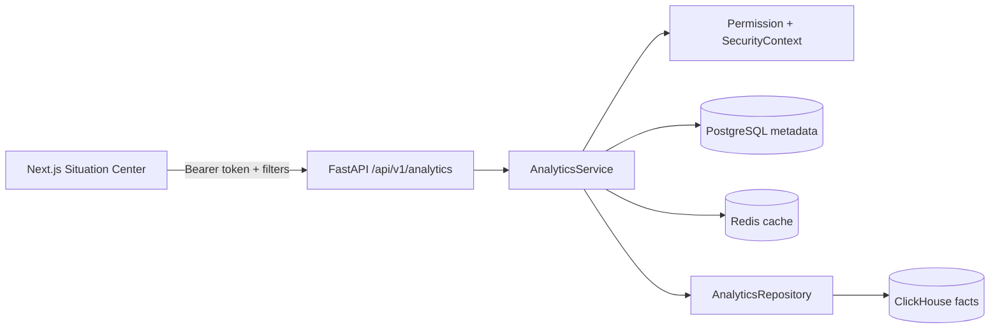

# Архитектура описательной аналитики

## Назначение

PHASE 4 даёт пользователю агрегированное представление загруженных данных. Этот слой не прогнозирует нагрузку, не рассчитывает коечную занятость и не формирует рекомендации.

API выполняет аутентификацию, проверяет форму запроса и сериализует ответ. `AnalyticsService` применяет permission и data scope, формирует metadata/limitations и изолированный cache key. Репозиторий выполняет только агрегирующие параметризованные запросы. Frontend не получает строки событий.

## Идентичность организаций

Каноническая организация имеет ссылку `canonical:<uuid>`. Несопоставленное значение имеет непрозрачную ссылку `source:<sha256>`, рассчитанную из пространства источника и нормализованного значения. Пространства `REFERRALS:RECEIVING`, `WAITING:DESTINATION`, `REFUSALS:INCOMING` и `TREATED:ORGANIZATION` не объединяются автоматически.

Несопоставленные организации доступны только `ADMIN` и `HEALTH_AUTHORITY`. Региональные и госпитальные роли видят только факты с подтверждённым `hospital_id` в своей области.

## Ограничения запросов

- период ограничен `ANALYTICS_MAX_DATE_RANGE_DAYS`, по умолчанию 366;
- временной ряд возвращает максимум 400 агрегированных точек;
- список организаций постраничный, максимум 100 строк;
- granularity ограничена `DAY` и `WEEK`;
- profile, region и organization передаются как параметры; SQL-поля выбираются из закрытых allowlist;
- ошибки ClickHouse наружу не возвращаются.

Список организаций сначала агрегирует опубликованные строки по `(source_system, source_organization)` внутри каждого из трёх подтверждённых источников и только после этого присоединяет активную версию `mapping_projection`. Так стоимость mapping join зависит от числа исходных организаций, а не от числа событий. `import_id` фильтруется до агрегации: ошибочные и неопубликованные поставки не становятся видимыми. Источники остаются в отдельных identity namespaces, даже когда их строковые коды совпадают. Карточка `source:<digest>` отправляет digest-фильтр в ClickHouse с `LIMIT 1`; перебора 20 000 организаций в Python больше нет. Внешний page/page_size контракт сохранён.

## Наблюдаемость

Prometheus получает число и latency агрегатных операций, а также cache hit/miss/error. Метки содержат только низкокардинальные имена операций и исходы.
