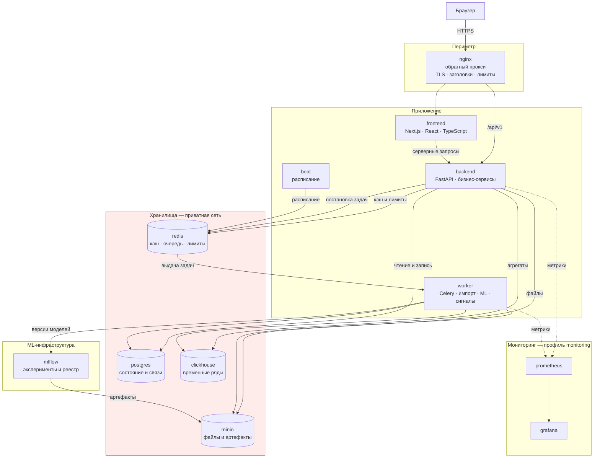

# Контейнеры и взаимодействие

Процессы и хранилища системы, их назначение и связи.

## Назначение контейнеров

| Контейнер | Ответственность | Масштабирование |
|---|---|---|
| `nginx` | Единственная публичная точка входа | Горизонтально, за балансировщиком |
| `frontend` | Отображение и навигация | Горизонтально |
| `backend` | API и бизнес-логика, stateless | Горизонтально |
| `worker` | Фоновая обработка | Горизонтально, по очередям |
| `beat` | Запуск задач по расписанию | **Только один экземпляр** |
| `postgres` | Состояние, связи, транзакции | Вертикально, реплика для чтения |
| `clickhouse` | Аналитические ряды | Вертикально, далее кластер |
| `redis` | Кэш, брокер, счётчики | Вертикально |
| `minio` | Объектное хранилище | Горизонтально |
| `mlflow` | Реестр моделей | Один экземпляр |

Единственный контейнер, который нельзя запускать в нескольких экземплярах, — `beat`: дублирование приводит к повторному запуску регулярных задач.

Образ `worker` совпадает с образом `backend`. Это гарантирует, что бизнес-правила в синхронном и фоновом пути идентичны.
