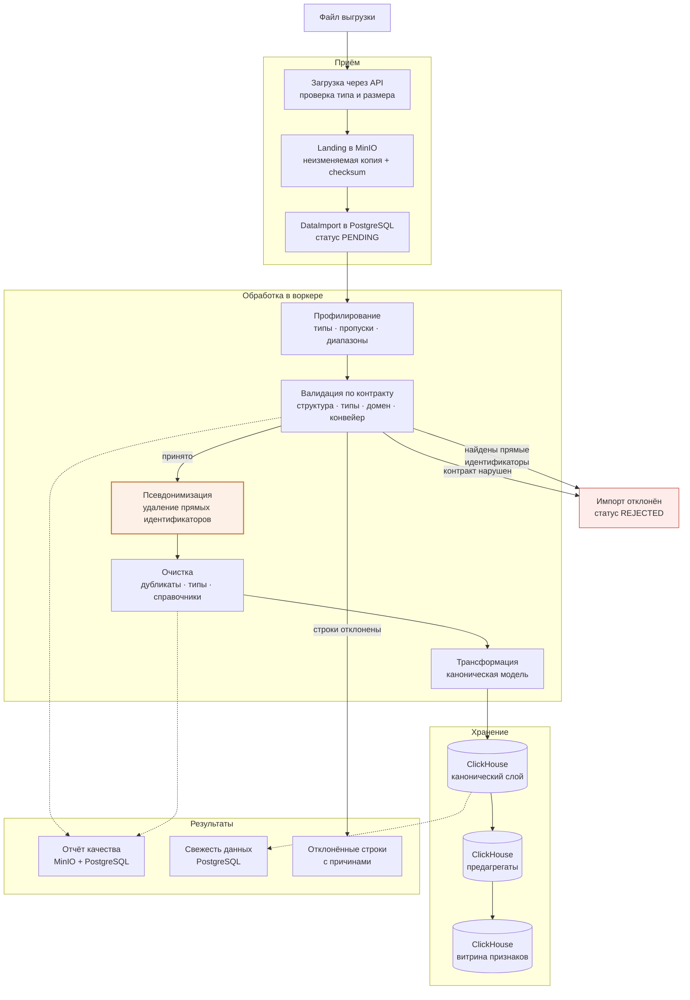
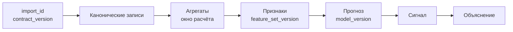

# Поток данных

От файла выгрузки до витрины признаков, с точками отказа и точками прослеживаемости.

## Ключевой порядок

Псевдонимизация выполняется **до** очистки и до любой записи в аналитическое хранилище. Прямые идентификаторы существуют только в оперативной памяти воркера и в landing-копии с ограниченным сроком хранения.

Обратный порядок — сначала загрузить, потом обезличить — означает, что персональные данные хотя бы кратковременно оказываются в аналитическом хранилище, откуда они попадут в резервные копии и реплики.

## Прослеживаемость

Требование: для любого числа, показанного пользователю, система должна назвать импорт, версию контракта, версию набора признаков и версию модели. Поэтому идентификаторы переносятся по всей цепочке, а не теряются на первом агрегате.

## Точки отказа и реакция

| Точка | Условие | Реакция |
|---|---|---|
| Приём | Неверный тип или превышен размер | Отказ до сохранения |
| Валидация структуры | Нет обязательного поля | Отклонение всего импорта |
| Валидация строки | Неверный тип или домен | Отклонение строки с причиной |
| Обнаружение идентификаторов | Найдены прямые идентификаторы | Остановка при строгом режиме |
| Конвейерная проверка | Аномальный объём | Требуется подтверждение администратора |
| Идемпотентность | Тот же файл и период | Повторная загрузка не создаёт дублей |
