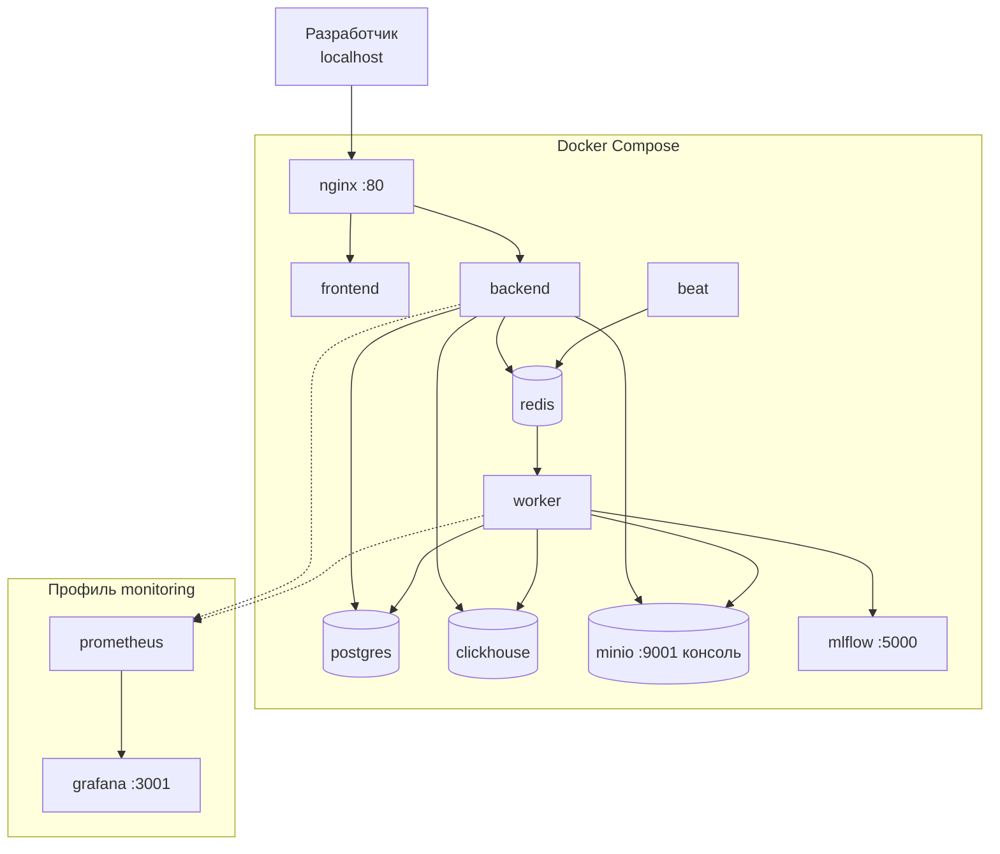
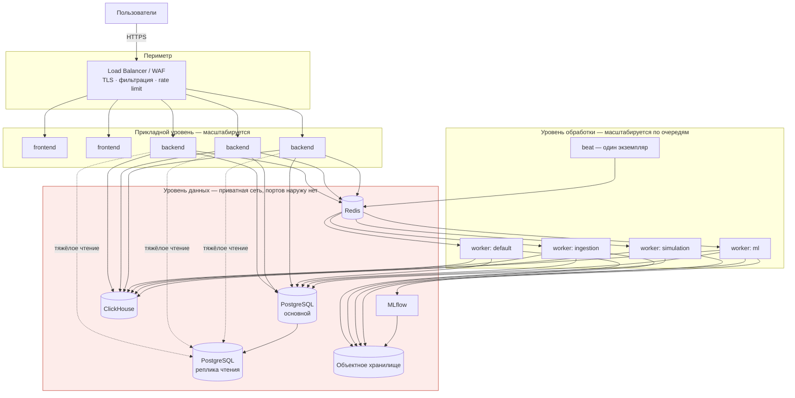

# Топология развёртывания

## Локальное окружение

В локальном окружении часть портов публикуется для удобства диагностики. Конфигурация production эти публикации не наследует — это отдельный набор файлов, а не переключатель режима.

## Целевая production-топология

## Правила топологии

| Правило | Причина |
|---|---|
| Публичен только балансировщик | Минимальная поверхность атаки |
| Уровень данных без публикации портов | Хранилища недоступны из Internet |
| `beat` в одном экземпляре | Иначе регулярные задачи дублируются |
| Воркеры разделены по очередям | Обучение модели не блокирует импорт и быстрые задачи |
| Миграции — отдельный шаг перед выкаткой | Исключает гонку между экземплярами |
| Приложение stateless | Экземпляры добавляются без координации |
| Ограничения ресурсов заданы | Один компонент не потребляет всё |
| Секреты из внешнего хранилища | Не файл на диске |

## Совместимость с Kubernetes

Переход не требует изменения прикладного кода:

| Compose | Kubernetes |
|---|---|
| `frontend`, `backend` | Deployment + Service + Ingress |
| `worker` | Deployment по очередям, отдельные ресурсы |
| `beat` | Deployment с одной репликой либо CronJob |
| `postgres`, `clickhouse`, `redis` | StatefulSet или управляемые сервисы |
| `minio` | Управляемое объектное хранилище |
| `nginx` | Ingress Controller |
| `.env` | Secret и ConfigMap |
| Проверки Compose | Liveness и Readiness Probe |

То, что переход не затрагивает код, — проверка корректности архитектурных границ, а не удобство инфраструктуры.
