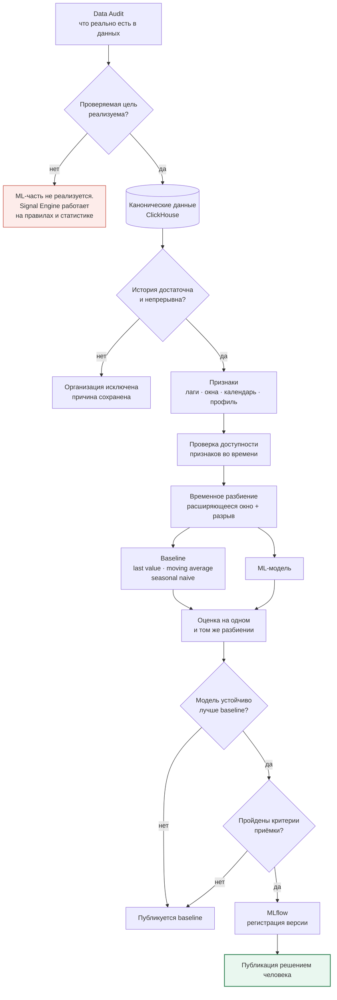
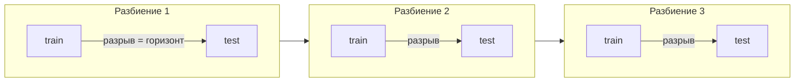
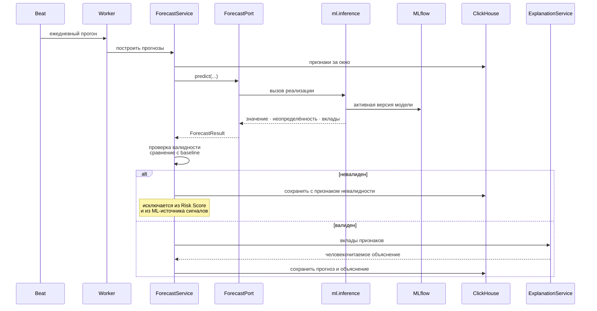

# Конвейер машинного обучения

> Целевая переменная не выбрана до завершения Data Audit ([ADR-0007](../ADR/0007-data-audit-before-ml-target.md)). Диаграмма описывает метод, а не конкретную модель.

## Обучение и приёмка

Публикация модели — явное решение человека, а не следствие лучшей метрики. Автоматическая публикация означала бы, что поведение системы меняется без чьего-либо ведома.

## Временное разбиение

Случайное разбиение запрещено. Разрыв между обучением и проверкой равен горизонту прогноза и исключает перетекание информации. Для панельных данных разбиение выполняется по времени, а не по организациям.

## Инференс и объяснение

Бизнес-слой обращается к ML только через `ForecastPort` и не импортирует код `ml` ([ADR-0005](../ADR/0005-ml-separation.md)). Сырой вывод SHAP преобразуется `ExplanationService` и в интерфейс не попадает.

## Обязательные атрибуты результата

| Поле | Без него прогноз не отображается |
|---|---|
| `predicted_value`, `horizon` | Да |
| `model_version` | Да |
| `uncertainty` | Да, где применимо |
| `error_metric`, `baseline_error_metric` | Да |
| `generated_at`, `input_period` | Да |
| `explanation`, `assumptions` | Да |
| `is_valid`, `invalidity_reason` | Да |
