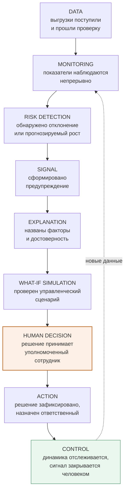

# Продуктовый цикл

Путь пользователя от появления данных до контроля последствий решения. Это главная диаграмма продукта: каждая реализуемая функция должна занимать на ней место.

Шаг `HUMAN DECISION` выделен намеренно: это единственный шаг, который система не выполняет и не может выполнить. Всё до него — подготовка расчёта, всё после — фиксация и контроль.

## Соответствие функций и шагов

| Шаг | Функции системы | Фаза |
|---|---|---|
| DATA | Импорт, валидация, псевдонимизация, отчёт качества | 3 |
| MONITORING | Situation Center, метрики организаций, историческая динамика | 4 |
| RISK DETECTION | Risk Score, обнаружение аномалий, прогноз | 5, 6 |
| SIGNAL | Signal Engine, лента предупреждений, карточка ситуации | 6 |
| EXPLANATION | Объяснение факторов, качество данных и модели | 5, 6 |
| WHAT-IF | Симулятор, сравнение базового и расчётного сценария | 7 |
| HUMAN DECISION | Права на решение, назначение ответственного | 2, 8 |
| ACTION | Фиксация действия, смена статуса, аудит | 2, 6 |
| CONTROL | Повторное наблюдение, закрытие сигнала человеком | 6 |

## Точки, где система обязана остановиться

| Точка | Поведение |
|---|---|
| Данные устарели | Сигнал `DATA_STALE`, содержательные сигналы помечаются флагом достоверности |
| Истории недостаточно | Прогноз не строится, причина показывается явно |
| Модель хуже baseline | Прогноз помечается невалидным, исключается из Risk Score и сигналов |
| Объяснение неустойчиво | Сообщается прямо, вместо подстановки правдоподобного текста |
| Организации несопоставимы | Сценарий переноса потока недоступен, причина названа |
| Сигнал не закрыт человеком | Остаётся открытым; автоматическое закрытие запрещено |

Каждая из этих остановок — функция, а не ограничение. Система, которая молчит о своём незнании, опаснее системы, которая ничего не считает.
