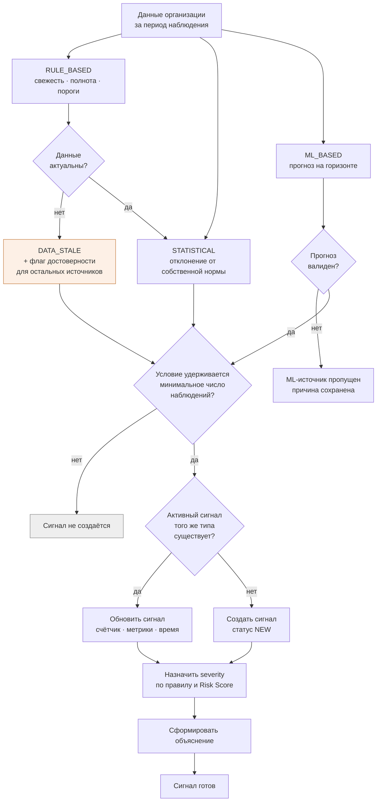
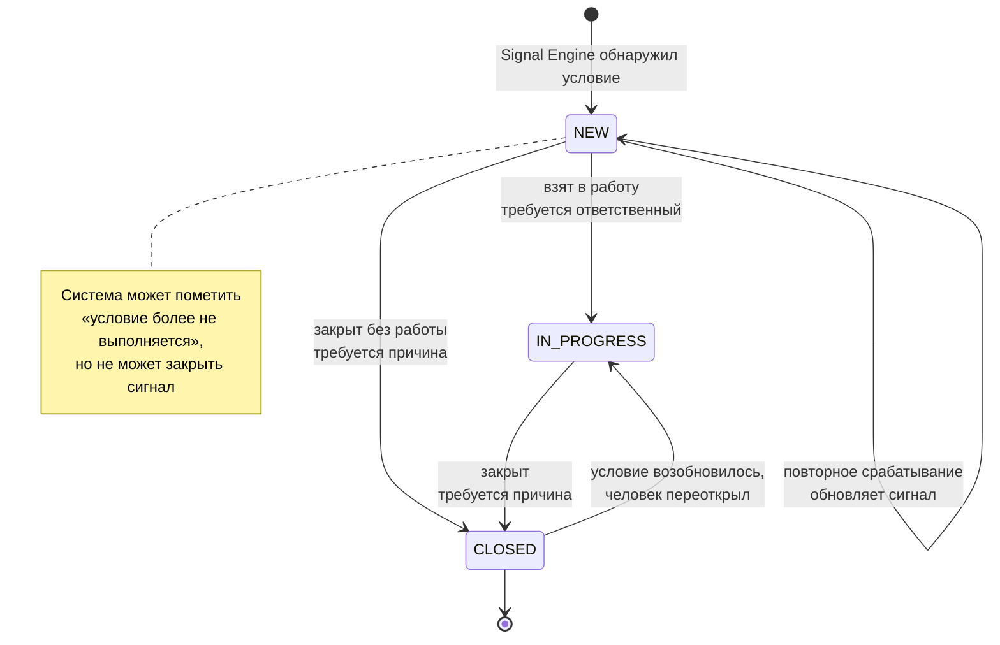

# Сигнал: формирование и жизненный цикл

## Формирование

Порядок источников не случаен: правила выполняются первыми, потому что устаревшие данные меняют доверие к статистическим и прогнозным сигналам. Обоснование — [ADR-0008](../ADR/0008-signal-engine-three-sources.md).

## Жизненный цикл

## Правила переходов

| Переход | Требование | Кто может |
|---|---|---|
| `NEW → IN_PROGRESS` | Назначен ответственный | Роли с правом работы с сигналом |
| `NEW → CLOSED` | Указана причина | Роли с правом закрытия |
| `IN_PROGRESS → CLOSED` | Указана причина | Роли с правом закрытия |
| `CLOSED → IN_PROGRESS` | Условие активно, указана причина | Роли с правом работы с сигналом |
| Любой | Запись в Audit Log | — |

Аналитик организации сигналы просматривает и анализирует, но не переводит между статусами. Матрица прав — в [SECURITY.md](../SECURITY.md#5-матрица-ролей-и-прав).

## Что система не делает

| Действие | Почему запрещено |
|---|---|
| Закрыть сигнал автоматически | Human-in-the-loop: закрытие — управленческий факт |
| Создать дубль при повторном срабатывании | Лента из копий одного сигнала бесполезна |
| Создать сигнал по единичному всплеску | Шум вытесняет содержательные предупреждения |
| Создать ML-сигнал при невалидном прогнозе | Недостоверное предупреждение хуже отсутствия предупреждения |
| Выдать проблему данных за проблему нагрузки | `DATA_STALE` существует отдельным типом |
