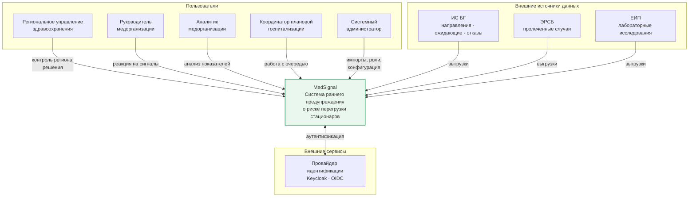

# Контекст системы

Кто пользуется MedSignal, с чем система граничит и что находится за её пределами.

## Границы

**Внутри системы:** приём и подготовка данных, аналитика показателей, обнаружение риска, формирование и объяснение сигналов, расчёт сценариев, фиксация решений человека, аудит.

**Вне системы:** ведение медицинской документации, клинические решения, маршрутизация пациентов, исполнение управленческих решений. MedSignal готовит расчёт — действие выполняется в других системах и людьми.

**Направление потоков:** данные поступают в систему односторонне, выгрузками. Обратной записи в источники нет. Это сознательное ограничение: система наблюдает, но не изменяет состояние информационных систем здравоохранения.
